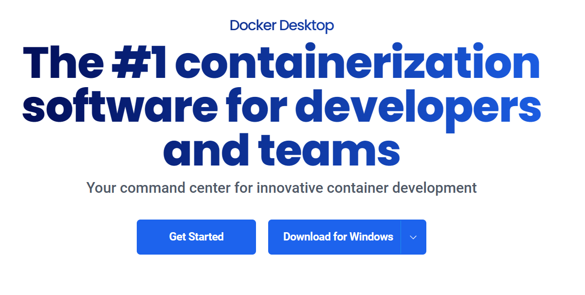

# Actividad de Instalacion de Docker y Kubernetes

> Estos procedimientos de instalacion estan elavorados para el SO de **Windows**
> 

# Instalacion de Docker

Ingresamos a la pagina oficial de Docker y hacemos click en Download for Windows.



Hacemos doble click en el .exe


Le damos Ok a todas las ventanas y al finalizar damos en Close.


Ahora abrimos la aplicacion


Abrimos una consola de windows y escribimos los siguientes comandos para conprobar que docker esta instalado y funciona correctamente


# Instalacion de Kubernetes

Docker Desktop viene con soporte integrado para Kubernetes. Para lo cual tenemos que activar kubernetes en docker.

1. Vamos configuracion en el Docket Desktop 
2. En el lado izquierdo, selecciona la pestaña Kubernetes y luego marca la casilla Enable
Kubernetes
3. Haz clic en el botón Apply & restart.


> Para la Instalacion de Minikube y Kubectl primero se debe seguir estos pasos
> 

1. Ir a los sitios oficiales de cada uno y descargar el .exe
2. Almacenarlos en una carperta unica que contenga a los 2
3. Acceder a las variables de entorno del sistema y configurar el PATH pegando la direccion de la carpeta. 


Ahora si continuamos con la instalacion de cada uno de forma independiente

# Instalacion de Minikube

1. Abrimos una terminal y pegamos el siguiente comando para iniciar el MiniKube, esto demora unos minutos.
2. Ir al docker desktop para poner Stop al contenedor de MiniKube.
3. Volvemos a ejecuatar el mismo comando en la terminal y tener la salida que se ve en la imagen.


# Instalacion de Kubectl

1. Descargamos la ultima version de kubectl usando el siguiente comando
    
    
    
2. Agregamos la carpeta kubectl a la variable de entorno PATH
    
    
    
3.  Probamos para asegurarnos que se añadio correctamente 
    
    
    

## Probamos minikube y kubectl

1. Intentamos acceder al cluster usando kubectl, usamos los siguientes comandos:
    
    
    
2. Veamos cuantos nodos tiene el cluster con este comando
    
    
    
3. Creamos un archivo con nombre nginx.yaml y le ponemos el siguiente contenido:
    
    ```yaml
    apiVersion: v1
    kind: Pod
    metadata:
      name: nginx
      labels:
        app.kubernetes.io/name: proxy
    spec:
      containers:
      - name: nginx
        image: nginx:stable
        ports:
        - containerPort: 80
          name: http-web-svc
    ```
    
4. Creamos un pod que ejecute Nginx con el siguiente comando
    
    
    
5. Podemos verificar si el pod se esta ejecutando con kubectl
    
    
    
6. Para acceder al Servidor Nginx, necesitamos exponer la aplicacion que se ejecuta en el pod con el siguiente comando:
    
    
    
7. Podemos usar kubectl para enumerar todos los servicios definidos en el cluster:
    
    
    
8. Ahora, podemos usar minikube para crear un tunel hacia el cluster y abrir un navegador con la URL correcta para acceder al servidor web Nginx. Usamos el siguiente comando
    
    
    
    
    
    El resultado anterior muestra que minikube creo un tunel para el servicio de nginx que escucha en el puerto del nodo 32149 que esta en nuestra computadora portatil.
    

Ahora que terminamos, lo podemos detener

1. Detenemos el tunel hacia el cluster precionando Ctrl + C dentro de la ventana de Terminal.
    
    
    
2. Eliminamos el servicio nginx y el pod en el cluster para eso usamos el siguiente comando:
    
    
    
3. Detener el cluster con el siguiente comando:
    
    
    

## Ejercicios

1. Si queremos trabajar con un clúster que consta de varios nodos en minikube, podemos usar este comando:
    
    
    
    
    
2. Detenemos el cluster
    
    
    
3. Eliminamos todos los clústeres del sistema con este comando
    
    ```yaml
    minikube delete –all
    ```
    
    Esto eliminará el clúster predeterminado (llamado minikube) y el clúster demo en nuestro caso.
    Con esto, pasaremos a la siguiente herramienta interesante y útil a la hora de trabajar con contenedores y Kubernetes. 
    

# Kind

1. En nuestra maquina podemos descargarlo desde la pagina oficial y guardarlo en nuestra carpeta ya configurada.
    
    
    
2. Ahora, intentemos crear un clúster de Kubernetes simple que consta de un nodo maestro y dos nodos trabajadores. Utiliza este comando para lograr esto:
    
    
    
3. Para verificar que se ha creado un clúster, utilizamos este comando
    
    
    
4. Podemos crear un clúster adicional con un nombre diferente usando el parámetro --name, así:
    
    
    
5. Enumeramos los clústeres
    
    
    
6. Ahora podemos usar kubectl para acceder y trabajar con los clústeres que acabamos de crear. Mientras creaba un clúster, Kind también actualizó el archivo de configuración del kubectl. Podemos verificar esto con el siguiente comando:
    
    
    
7. Utiliza el siguiente comando para convertir el clúster de demo en tu clúster actual si el asterisco indica que hay otro clúster actual:
    
    
    
8. Enumeramos todos los nodos del clúster de muestra
    
    
    
9. Ahora, intenta ejecutar el primer contenedor en este clúster. Usa el servidor web Nginx de confianza, como hicistes antes. Utiliza el siguiente comando para ejecutarlo:
    
    
    
10. Para acceder al servidor Nginx, necesitamos realizar el reenvío de puertos usando kubectl. Utiliza este comando para hacerlo:
    
    
    
    
    
11. Podemos usa este comando para eliminar el pod del clúster
    
    
    
12. Limpiemos y eliminemos los dos clústeres que acabamos de crear
    
    
    

# Preguntas

1. En tus propias palabras, usando analogías, explica qué es un contenedor.
    
    Un contenedor es como un contenedor de envío estándar utilizado en el transporte marítimo. Al igual que estos contenedores son uniformes y pueden transportar una variedad de mercancías sin importar el puerto o el método de transporte, un contenedor informático encapsula una aplicación junto con todas sus dependencias y configuraciones necesarias. Esto permite que la aplicación funcione de manera consistente y sin cambios significativos, independientemente del entorno de computación donde se despliegue, ya sea en un servidor local, en la nube o en un centro de datos. Así como un contenedor de envío protege su contenido de los elementos externos, un contenedor informático aisla la aplicación de su entorno subyacente, proporcionando portabilidad y consistencia en el ciclo de vida del software.
    
2. ¿Por qué se considera que los contenedores cambian las reglas del juego en IT? Menciona tres o cuatro razones
    - **Consistencia y portabilidad**: Los contenedores encapsulan no solo la aplicación, sino también todas las dependencias y configuraciones necesarias para ejecutarse de manera consistente en cualquier entorno. Esto elimina los problemas de "funciona en mi máquina" al asegurar que la aplicación se comporte de la misma manera en desarrollo, pruebas y producción.
    - **Eficiencia en el despliegue y escalabilidad**: Los contenedores permiten desplegar aplicaciones de forma rápida y reproducible. Con herramientas de orquestación como Kubernetes, es posible gestionar y escalar automáticamente contenedores en entornos de nube o locales, optimizando los recursos y mejorando la disponibilidad de las aplicaciones.
    - **Aislamiento y seguridad**: Cada contenedor corre en su propio espacio aislado, compartiendo recursos con otros contenedores pero sin interferir entre sí. Esto mejora la seguridad al reducir el riesgo de conflictos de dependencias y vulnerabilidades entre aplicaciones, proporcionando un entorno más controlado y predecible.
    - **Facilita la adopción de arquitecturas de microservicios**: Los contenedores son ideales para implementar arquitecturas de microservicios, donde cada servicio puede estar encapsulado en su propio contenedor. Esto facilita la modularidad, el mantenimiento independiente de componentes y la escalabilidad horizontal, permitiendo a las empresas iterar y actualizar más rápidamente sus aplicaciones.
3. ¿Qué significa cuando afirmamos que, si un contenedor se ejecuta en una plataforma determinada, entonces se ejecutará en cualquier lugar? Menciona dos o tres razones por las que esto es cierto.
    - **Independencia del entorno**: Los contenedores encapsulan no solo la aplicación, sino también todas las bibliotecas y dependencias necesarias para su funcionamiento. Esto significa que la aplicación se comportará de la misma manera en cualquier entorno donde se ejecute el contenedor, ya sea en un entorno de desarrollo local, en la nube pública o privada, o incluso en diferentes sistemas operativos como Linux, Windows o MacOS.
    - **Estándares y compatibilidad**: Los contenedores se basan en estándares abiertos como Docker y Kubernetes, lo que asegura que las imágenes de contenedor y las definiciones de servicios sean interoperables entre diferentes plataformas y proveedores de servicios en la nube. Esto facilita la migración de aplicaciones entre diferentes infraestructuras y la adopción de arquitecturas híbridas o multi-nube sin necesidad de modificar la aplicación misma.
    - **Facilidad de despliegue y gestión**: Las herramientas de orquestación de contenedores, como Kubernetes, permiten gestionar de manera eficiente y automatizada la implementación, escalado y gestión de contenedores en entornos distribuidos. Esta capacidad facilita el despliegue consistente y repetible de aplicaciones en diferentes ubicaciones geográficas o en múltiples nubes, asegurando la coherencia operativa y reduciendo la complejidad de la gestión de infraestructuras.
4. ¿Es verdadera o falsa la siguiente afirmación: los contenedores Docker solo son útiles para aplicaciones modernas y totalmente nuevas basadas en microservicios? Por favor justifica tu respuesta.
    
    La afirmación es falsa.Los contenedores Docker pueden encapsular aplicaciones existentes, incluso aquellas que fueron desarrolladas antes de la adopción de microservicios o en arquitecturas monolíticas. Esto facilita la migración gradual hacia arquitecturas más modernas o hacia la nube, sin necesidad de reescribir completamente la aplicación.
    
5. ¿Por qué nos importaría instalar y usar un administrador de paquetes en nuestra computadora local?
    
    Instalar y usar un administrador de paquetes en nuestra computadora local mejora la eficiencia operativa, reduce errores y proporciona un entorno más seguro y controlado para la gestión del software. Esto es fundamental tanto para usuarios individuales como para equipos de desarrollo y administradores de sistemas que buscan optimizar la gestión del software en sus dispositivos y entornos de trabajo.
    
6. ¿Con Docker Desktop, puede desarrollar y ejecutar contenedores de Linux?
    
    Sí, Docker Desktop incluye soporte para ejecutar contenedores Linux en sistemas operativos Windows y macOS. Esto se logra a través de una máquina virtual ligera y optimizada llamada "LinuxKit", que permite a los desarrolladores trabajar con contenedores Linux en sus entornos locales de desarrollo. Esta capacidad es fundamental para garantizar la consistencia entre los entornos de desarrollo y producción, facilitando el desarrollo y las pruebas de aplicaciones en contenedores sin importar el sistema operativo subyacente de la máquina local.
    
7. ¿Por qué son esenciales buenas habilidades de programación (como Bash o PowerShell) para el uso productivo de los contenedores?
    
    Las habilidades de programación en Bash o PowerShell potencian la productividad y eficiencia en el uso de contenedores al permitir la automatización, la personalización avanzada, la resolución de problemas y la integración fluida en flujos de trabajo de desarrollo y operaciones.
    
8. Nombra tres o cuatro distribuciones de Linux en las que Docker esté certificado para ejecutarse.
    
    Ubuntu, CentOS, Debian y Fedora.
    
9. Instalaste minikube en tu sistema. ¿Para qué tipo de tareas utilizarás esta herramienta?
    
    Use para crear y administrar un clúster local de Kubernetes en la máquina. Minikube permite probar los despliegues y la configuración de Kubernetes en un entorno local antes de moverlos a un entorno de producción.