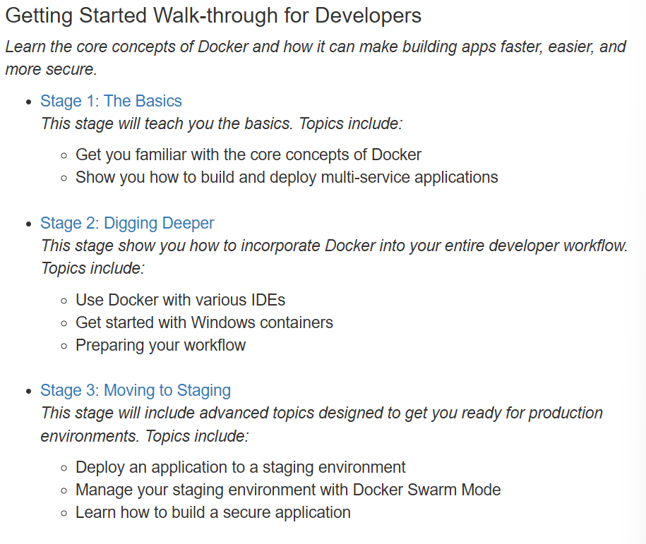

# Actividad Play with Docker

Ingresamos al siguiente link de la plataforma: [https://training.play-with-docker.com/](https://training.play-with-docker.com/) 

Aqui voy a escoger los laboratorios para Desarrolladores



# Stage 1

> ***Docker para principiantes- Linux***
> 

En este laboratorio nos:

- Familiarizaremos con los conceptos básicos de Docker.
- Y mostraremos cómo crear e implementar aplicaciones básicas.

Tendremos el siguiente Laboratorio 


## ✅Tarea 0: Requisitos previos

Recursos:

- Un clon del repositorio de GitHub del laboratorio.
- Un DockerID.

### **Clonar el repositorio de GitHub del laboratorio**

Utilizaremos el siguiente comando para clonar el repositorio del laboratorio desde GitHub. 

```bash
git clone https://github.com/dockersamples/linux_tweet_app
```

Este comando creara una copia del repositorio del laboratorio en un subdirectorio `llamado linux_tweet_app`


### Ingresar nuestro Docker ID

Usamos el siguiente comando para usar nuestra cuenta de Docker Hub


## ✅Tarea 1: Ejecutar **algunos contenedores Docker simples**

Existen distintas formas de utilizar los contenedores, entre ellas:

1. **Para ejecutar una sola tarea:** Podría ser un script de shell o una aplicación personalizada.
2. **Interactivamente:** Esto lo conecta al contenedor de manera similar a como lo hace mediante SSH en un servidor remoto.
3. **En segundo plano:** Para servicios de larga duración, como sitios web y bases de datos.

En esta sección probará cada una de esas opciones y veremos cómo Docker administra la carga de trabajo.

### **Ejecutar una sola tarea en un contenedor Alpine Linux**

Aqui iniciaremos un nuevo contenedor y le indicaremos que ejecute el comando  `hostname` . El contenedor se iniciará, ejecutará el comando  `hostname` y luego saldrá.

1. Ejecutamos el siguiente comando en la consola Linux.
    
    ```bash
     docker container run alpine hostname
    ```
    
    
    
    Tenemos el siguiente resultado donde se muestra que  `alpine:latest`no se pudo encontrar la imagen localmente. Cuando esto sucede, Docker la *obtiene* automáticamente de Docker Hub.
    
    Después de extraer la imagen, se muestra el nombre de host del contenedor ( `ec99f8b99825`).
    
2. Docker mantiene un contenedor en ejecución mientras el proceso que inició dentro del contenedor siga ejecutándose. En este caso, el proceso `hostname` finaliza tan pronto como se escribe la salida. Esto significa que el contenedor se detiene. Sin embargo, Docker no elimina los recursos de forma predeterminada, por lo que el contenedor aún existe en ese estado `Exited`.
    
    Por lo cual vamos a enumerar todos los contenedores con el siguiente comando:
    
    ```bash
    docker container ls --all
    ```
    
    
    
    Tengamos en cuenta que nuestro contenedor Alpine Linux se encuentra en el estado`Exited`.
    
    **Nota:** El ID del contenedor es el nombre de host que muestra el contenedor. En el ejemplo anterior, es `fd3b3dc64ead`.
    

Los contenedores que realizan una tarea y luego salen pueden ser muy útiles. Podemos crear una imagen de Docker que ejecute un script para configurar algo. Cualquiera puede ejecutar esa tarea simplemente ejecutando el contenedor; no se necesitan los scripts reales ni la información de configuración.

### **Ejecutar un contenedor interactivo de Ubuntu**

Podemos ejecutar un contenedor basado en una versión de Linux diferente a la que se ejecuta en nuestro host Docker.

En el siguiente ejemplo, voy a ejecutar un contenedor Ubuntu Linux sobre un host Docker Alpine Linux (Play With Docker usa Alpine Linux para sus nodos).

1. Ejecutamos un contenedor Docker y acceda a su shell para lo cual utilizamos el siguiente comando.
    
    ```bash
    docker container run --interactive --tty --rm ubuntu bash
    ```
    
    En este ejemplo, le damos a Docker tres parámetros:
    
    - `-interactive` :Deseamos una sesión interactiva.
    - `-tty` :asigna una pseudo-tty.
    - `-rm` : Le dice a Docker que siga adelante y elimine el contenedor cuando termine de ejecutarse.
    
    Los dos primeros parámetros nos permiten interactuar con el contenedor Docker.También le indicamos al contenedor que se ejecute `bash`como su proceso principal (PID 1).
    
    
    
    Cuando se inicia el contenedor, nos coloca en el shell bash con el mensaje predeterminado `root@<container id>:/#`. Docker se ha conectado al shell en el contenedor, retransmitiendo la entrada y la salida entre su sesión local y la sesión del shell en el contenedor.
    
2. Ejecutamos los siguientes comandos en el contenedor.
    
    `ls /`listará el contenido del directorio raíz en el contenedor
    
    
    
    `ps aux`mostrará los procesos en ejecución en el contenedor
    
    
    
    `cat /etc/issue`mostrará qué distribución de Linux está ejecutando el contenedor, en este caso Ubuntu 20.04 LTS.
    
    
    
3. Escribimos `exit`para abandonar la sesión de shell. Esto finalizará el  `bash` proceso y hará que el contenedor salga.
    
    
    
    Nota: Como usamos la bandera `--rm` cuando iniciamos el contenedor, Docker eliminó el contenedor cuando se detuvo. Esto significa que si ejecutamos otro, `docker container ls --all`no veremos el contenedor de Ubuntu.
    
4. Para divertirnos, verifiquemos la versión de nuestra máquina virtual host.
    
    
    

Tengamos en cuenta que nuestra máquina virtual host como vemos ejecuta Alpine Linux, pero pudimos ejecutar un contenedor Ubuntu. Como se mencionó anteriormente, la distribución de Linux dentro del contenedor no necesita coincidir con la distribución de Linux que se ejecuta en el host Docker.

### **Ejecutar un contenedor MySQL en segundo plano**

Los contenedores en segundo plano son la forma en la que se ejecutan la mayoría de las aplicaciones. Aquí muestro un ejemplo sencillo con MySQL.

1. Ejecutamos un nuevo contenedor MySQL con el siguiente comando.
    
    ```bash
    docker container run \
    --detach \
    --name mydb \
    -e MYSQL_ROOT_PASSWORD=my-secret-pw \
    mysql:latest
    ```
    
    - `--detach` :ejecutará el contenedor en segundo plano.
    - `--name`: Asigna el nombre del contenedor (**mydb**)
    - `e` :utilizará una variable de entorno para especificar la contraseña de root (NOTA: Esto nunca debe hacerse en producción).
    
    
    
    Como vemos en la imagen MySQL no estaba disponible localmente, Docker la extrajo automáticamente de Docker Hub.
    
    Mientras el proceso MySQL esté ejecutándose, Docker mantendrá el contenedor ejecutándose en segundo plano.
    
2. Enumeramos los contenedores en ejecución para lo cual usaremos el siguiente comando.
    
    ```bash
     docker container ls
    ```
    
    
    
    Podemos ver que el contenedor de mydb esta ejecutandose.
    
3. Podemos comprobar lo que sucede en los contenedores mediante un par de comandos integrados de Docker: `docker container logs`y `docker container top`.
    
    ```bash
    docker container logs mydb
    ```
    
    Este comando muestra los registros del contenedor MySQL Docker.
    
    
    
    ```bash
    docker container top mydb
    ```
    
    Este comando muestra los procesos que se ejecutran dentro del contenedor.
    
    
    
    Vemos que el demonio MySQL ( `mysqld`) se está ejecutando en el contenedor.
    
    Aunque MySQL se está ejecutando, está aislado dentro del contenedor porque no se han publicado puertos de red en el host. El tráfico de red no puede llegar a los contenedores desde el host a menos que se publiquen los puertos explícitamente.
    
4. Enumeramos la versión de MySQL utilizando `docker container exec`.
    
    `docker container exec`permite ejecutar un comando dentro de un contenedor. En este ejemplo, usaremos `docker container exec`para ejecutar el equivalente de línea de comandos `mysql --user=root --password=$MYSQL_ROOT_PASSWORD --version`dentro de nuestro contenedor MySQL.
    
    
    
    Vemos nuestra version de MySQL, asi como una advertensia util.
    
5. También podemos utilizar `docker container exec`para conectarmos a un nuevo proceso de shell dentro de un contenedor que ya se esté ejecutando. Al ejecutar el comando siguiente, obtendremos un shell interactivo ( `sh`) dentro de su contenedor MySQL.
    
    
    
    El indicador de comandos de nuestra shell ha cambiado. Esto se debe a que ahora el shell está conectado al proceso `sh` que se ejecuta dentro del contenedor.
    
6. Verificamos el número de versión ejecutando nuevamente el mismo comando, solo que esta vez desde dentro de la nueva sesión de shell en el contenedor.
    
    ```bash
    mysql --user=root --password=$MYSQL_ROOT_PASSWORD --version
    ```
    
    
    
    Observamos que la salida es la misma que antes.
    
7. Escribimos `exit`para salir de la sesión de shell interactiva.
    
    
    

## ✅**Tarea 2: Empaquetar y ejecutar una aplicación personalizada usando Docker**

En este paso aprenderemos cómo empaquetar nuestras propias aplicaciones como imágenes Docker usando un [Dockerfile](https://docs.docker.com/engine/reference/builder/) .

La sintaxis de Dockerfile es sencilla. En esta tarea, vamos a crear un sitio web NGINX simple a partir de un Dockerfile.

### **Crear una imagen de sitio web sencillo**

Demos un vistazo al Dockerfile que usaremos, que crea un sitio web simple que nos permite enviar un tweet.

1. Tenemos que asegurarnos de estar en el directorio `linux_tweet_app`.
    
    ```bash
    cd ~/linux_tweet_app
    ```
    
    
    
2. Mostrar el contenido del Dockerfile para lo cual usaremos el siguiente comando.
    
    ```bash
    cat Dockerfile
    ```
    
    
    
    Veamos qué hace cada una de estas líneas en el Dockerfile.
    
    - [FROM](https://docs.docker.com/engine/reference/builder/#from): especifica la imagen base que se utilizará como punto de partida para la nueva imagen que estás creando. En este ejemplo, comenzamos desde `nginx:latest`.
    - [COPY](https://docs.docker.com/engine/reference/builder/#copy): copia archivos del host de Docker a la imagen, en una ubicación conocida. En este ejemplo, `COPY` se utiliza para copiar dos archivos a la imagen: `index.html`  y un gráfico que se utilizará en nuestra página web.
    - [EXPOSE](https://docs.docker.com/engine/reference/builder/#expose): documentos que utilizan la aplicación.
    - [CMD](https://docs.docker.com/engine/reference/builder/#cmd): especifica qué comando se debe ejecutar cuando se inicia un contenedor desde la imagen. Observamos que podemos especificar el comando, así como los argumentos de tiempo de ejecución.
3. Para que los siguientes comandos sean más fáciles de copiar y pegar, exportaremos una variable de entorno que contenga nuestro DockerID.
    
    Usaremos el siguiente comando donde pondremos nuestro DockerID unico. 
    
    ```bash
    export DOCKERID=<your docker id>
    ```
    
    
    
4. Repetimos el valor de la variable en la terminal para garantizar que se almacenó correctamente usando el siguiente comando.
    
    ```bash
    echo $DOCKERID
    ```
    
    
    
5. Utilizamos el comando `docker image build` para crear una nueva imagen de Docker siguiendo las instrucciones del Dockerfile.
    - `-tag` :Nos permite darle a la imagen un nombre personalizado. En este caso, está compuesto por nuestro DockerID, el nombre de la aplicación y una versión. Tener el Docker ID adjunto al nombre nos permitirá almacenarlo en Docker Hub en un paso posterior.
    - `.` :Le dice a Docker que use el directorio actual como contexto de compilación
    
    **Nota:** Tenemos que asegurarnos de incluir un punto ( `.`) al final del comando.
    
    ```bash
     docker image build --tag $DOCKERID/linux_tweet_app:1.0 .
    ```
    
    
    
    En la salida se muestra el demonio Docker ejecutando cada linea en el Dockerfile
    
6. Utilizamos el comando `docker container run` para iniciar un nuevo contenedor a partir de la imagen que creó.
    
    Como este contenedor ejecutará un servidor web NGINX, usaremos el `--publish`indicador para publicar el puerto 80 dentro del contenedor en el puerto 80 del host. Esto permitirá que el tráfico que ingresa al host Docker en el puerto 80 se dirija al puerto 80 en el contenedor. El formato del indicador `--publish` es `host_port`: `container_port`.
    
    ```bash
     docker container run \
     --detach \
     --publish 80:80 \
     --name linux_tweet_app \
     $DOCKERID/linux_tweet_app:1.0
    ```
    
    
    
    Cualquier tráfico externo que ingrese al servidor en el puerto 80 ahora se dirigirá al contenedor en el puerto 80.
    
7. [Haga clic aquí para cargar el sitio web](https://training.play-with-docker.com/) que debería estar ejecutándose.
    
    
    
8. Una vez que  accedimos a nuestro sitio web, lo vamos a cerrar y eliminar con el siguiente comando.
    
    ```bash
    docker container rm --force linux_tweet_app
    ```
    
    **Nota:** Usamos el parametro `--force` para eliminar el contenedor en ejecución sin apagarlo. Esto apagará el contenedor sin ningún problema y lo eliminará permanentemente del host de Docker.
    
    
    
    En un entorno de producción, es posible que deseemos utilizar la función `docker container stop`para detener el contenedor de forma ordenada y dejarlo en el host. Luego, puede utilizar la función `docker container rm`para eliminarlo de forma permanente.
    

## ✅**Tarea 3: Modificar un sitio web en ejecución**

Cuando estamos trabajando activamente en una aplicación, resulta incómodo tener que detener el contenedor, reconstruir la imagen y ejecutar una nueva versión cada vez que realizamos un cambio en el código fuente.

Una forma de agilizar este proceso es montar el directorio del código fuente de la máquina local en el contenedor en ejecución. Esto permitirá que cualquier cambio realizado en los archivos del host se refleje inmediatamente en el contenedor.

Hacemos esto usando algo llamado montaje de enlace .

Cuando se utiliza un montaje de enlace, un archivo o directorio en la máquina host se monta en un contenedor que se ejecuta en el mismo host.

### **Iniciamos nuestra aplicación web con un montaje enlazado**

1. Iniciamos la aplicación web y montamos el directorio actual en el contenedor.
    
    En este ejemplo, usaremos la bandera `--mount`para montar el directorio actual en el host `/usr/share/nginx/html`dentro del contenedor.
    
    Tenemos que asegurarnos de ejecutar este comando desde el directorio  `linux_tweet_app` en nuestro host Docker.
    
    ```bash
     docker container run \
     --detach \
     --publish 80:80 \
     --name linux_tweet_app \
     --mount type=bind,source="$(pwd)",target=/usr/share/nginx/html \
     $DOCKERID/linux_tweet_app:1.0
    ```
    
    
    
    Recordemos que el Dockerfile `/usr/share/nginx/html`es donde se almacenan los archivos html para la aplicación web.
    
2. El [sitio web](https://training.play-with-docker.com/) debería estar funcionando.
    
    
    

### **Modificar el sitio web en ejecución**

Los montajes enlazados significan que cualquier cambio realizado en el sistema de archivos local se refleja inmediatamente en el contenedor en ejecución.

1. Copiamos un nuevo `index.html`en el contenedor.
    
    El repositorio de Git que extrajimos anteriormente contiene varias versiones diferentes de un archivo index.html. Podemos ejecutar un `ls`comando manualmente desde el `~/linux_tweet_app`directorio para ver una lista de ellas. En este paso, reemplazaremos `index.html`por `index-new.html` usando el siguiente comando.
    
    ```bash
    cp index-new.html index.html
    ```
    
    
    
2. Vayamos al [sitio web](https://training.play-with-docker.com/) en ejecución y **actualizamos la página** . Observe que el sitio ha cambiado.
    
    
    
    Observamos que el sitio ha cambiado
    

Aunque modificamos el `index.html`sistema de archivos local y lo vimos reflejado en el contenedor en ejecución, en realidad no cambiamos la imagen de Docker desde la que se inició el contenedor.

Para demostrar esto, detenemos el contenedor actual y volvemos a ejecutar la imagen `1.0` sin un montaje de enlace.

1. Detenemos y eliminamos el contenedor que se encuentra actualmente en ejecución para lo cual usamos el siguiente comando.
    
    ```bash
    docker rm --force linux_tweet_app
    ```
    
    
    
2. Volvemos a ejecutar la versión actual sin un montaje de enlace.
    
    ```bash
     docker container run \
     --detach \
     --publish 80:80 \
     --name linux_tweet_app \
     $DOCKERID/linux_tweet_app:1.0
    ```
    
    
    
3. Tenga en cuenta que el [sitio web](https://training.play-with-docker.com/) ha vuelto a la versión original.
    
    
    
4. Detenemos y eliminamos el contenedor actual
    
    ```bash
    docker rm --force linux_tweet_app
    ```
    
    
    

### **Actualizar la imagen**

Para conservar los cambios realizados en el archivo `index.html` en la imagen, debemos crear una nueva versión de la imagen.

1. Creamos una nueva imagen y la etiquétamos como`2.0` 
    
    Recordemos que anteriormente modificamos el archivo  `index.html` en el sistema de archivos local del host Docker. Esto significa que ejecutar otro `docker image build`comando creará una nueva imagen con la versión actualizada.`index.html`
    
    Hay que asegurarnos de incluir el punto ( `.`) al final del comando.
    
    ```bash
    docker image build --tag $DOCKERID/linux_tweet_app:2.0 .
    ```
    
    
    
    Observemos lo rápido que se creó. Esto se debe a que Docker solo modificó la parte de la imagen que cambió en lugar de reconstruir la imagen completa.
    
2. Veamos las imágenes del sistema usando el siguiente comando.
    
    ```bash
     docker image ls
    ```
    
    
    
    Ahora como podemos ver tenemos ambas versiones de la aplicación web en nuestro host.
    

### **Probar la nueva versión**

1. Ejecutamos un nuevo contenedor desde la nueva versión de la imagen.
    
    ```bash
    docker container run \
    --detach \
    --publish 80:80 \
    --name linux_tweet_app \
    $DOCKERID/linux_tweet_app:2.0
    ```
    
    
    
2. Verificamos la nueva versión del [sitio web](https://training.play-with-docker.com/) ( **necesitamos actualizar el navegador para que se cargue la nueva versión** ).
    
    
    
    Como podemos ver la página web tiene un fondo naranja.
    
    Podemos ejecutar ambas versiones en paralelo. Lo único que debemos tener en cuenta es que no podemos tener dos contenedores que utilicen el puerto 80 en el mismo host.
    
    Como ya estamos usando el puerto 80 para el contenedor que se ejecuta desde la `2.0`versión de la imagen, iniciaremos un nuevo contenedor y lo publicaremos en el puerto 8080. Además, debemos darle a nuestro contenedor un nombre único ( `old_linux_tweet_app`)
    
3. Ejecutamos otro contenedor nuevo, esta vez desde la versión anterior de la imagen.
    
    **Nota:** Tengamos en cuenta que este comando asigna el nuevo contenedor al puerto 8080 en el host. Esto se debe a que dos contenedores no pueden asignarse al mismo puerto en un solo host de Docker.
    
    ```bash
     docker container run \
     --detach \
     --publish 8080:80 \
     --name old_linux_tweet_app \
     $DOCKERID/linux_tweet_app:1.0
    ```
    
    
    
4. Vemos la versión antigua del [sitio web](https://training.play-with-docker.com/) .


### **Envíar nuestras imágenes a Docker Hub**

1. Enumeramos las imágenes en nuestro host Docker usando el siguiente comando.
    
    ```bash
     docker image ls -f reference="$DOCKERID/*"
    ```
    
    
    
    Vemos que ahora tenemos dos imagenes `linux_tweet_app`: una etiquetada como `1.0`y la otra como `2.0`.
    
    Estas imágenes solo se almacenan en el repositorio local de nuestro host Docker. Nuestro host Docker se eliminará después del taller. En este paso, enviaremos las imágenes a un repositorio público para que podamos ejecutarlas desde cualquier máquina Linux con Docker.
    
    La distribución está integrada en la plataforma Docker. Podemos crear imágenes localmente y enviarlas a un registro público o privado , lo que las pone a disposición de otros usuarios. Cualquiera con acceso puede extraer esa imagen y ejecutar un contenedor desde ella. El comportamiento de la aplicación en el contenedor será el mismo para todos, porque la imagen contiene la aplicación completamente configurada; los únicos requisitos para ejecutarla son Linux y Docker.
    
    Docker Hub es el registro público predeterminado para imágenes de Docker.
    
2. Antes de poder enviar sus imágenes, deberá iniciar sesión en Docker Hub usando el siguiente comando.
    
    ```bash
    docker login
    ```
    
    Necesitaremos proporcionar nuestras credenciales de ID de Docker cuando se nos solicite.
    
    
    
3. Enviamos la versión `1.0`de nuestra aplicación web usando `docker image push`.
    
    ```bash
    docker image push $DOCKERID/linux_tweet_app:1.0
    ```
    
    
    
    Vemos el progreso a medida que la imagen se envía a Docker Hub.
    
4. Ahora hacemos lo mismo con la versión `2.0`.
    
    ```bash
    docker image push $DOCKERID/linux_tweet_app:2.0
    ```
    
    
    
    Tengamos en cuenta que varias líneas de la salida dicen `Layer already exists`. Esto se debe a que Docker aprovechará las capas de solo lectura que son iguales a cualquier capa de imagen cargada previamente.
    

Podemos entrar en nuestro Docker Hub y ver las imagenes que acabamos de enviar.


---

> ***Contenerizacion de aplicaciones y orquestacion de microservicios***
> 

En esta parte aprenderemos sobre la contenedorización básica de aplicaciones usando Docker y la ejecución de varios componentes de una aplicación como microservicios. Utilizaremos Docker Compose para la orquestación durante el desarrollo.

Comenzaremos con un script básico de Python que extrae enlaces de una página web determinada y lo desarrollaremos gradualmente hasta convertirlo en una pila de aplicaciones multiservicio. El código de demostración está disponible en el repositorio [Link Extractor](https://github.com/ibnesayeed/linkextractor) . El código está organizado en pasos que introducen cambios y conceptos nuevos de forma incremental. Una vez finalizado, la pila de aplicaciones contendrá los siguientes microservicios:

- Una aplicación web escrita en PHP y servida mediante Apache que toma una URL como entrada y resume los enlaces extraídos de ella.
- La aplicación web se comunica con un servidor API escrito en Python (y Ruby) que se encarga de la extracción del enlace y devuelve una respuesta JSON.
- Un caché de Redis que utiliza el servidor API para evitar la búsqueda repetida y la extracción de enlaces para páginas que ya se han extraído

El servidor API solo cargará la página del enlace de entrada desde la web si no está en la memoria caché. La pila tendrá el aspecto que se muestra en la siguiente imagen:


## ✅**Configuración del escenario**

Comencemos clonando primero el repositorio de código de demostración, cambiando el directorio de trabajo y verificando la rama `demo` .

```bash
git clone https://github.com/ibnesayeed/linkextractor.git
cd linkextractor
git checkout demo
```


## ✅**Paso 0: Script básico de extracción de enlaces**

Extremos la rama `step0` y enumeramos los archivos que contiene.

```bash
git checkout step0
tree
```


El archivo `linkextractor.py` es lo interesante aquí, así que veamos su contenido:

```bash
cat linkextractor.py
```


Este es un script de Python simple importa tres paquetes: `sys`de la biblioteca estándar y dos paquetes populares de terceros `requests`y `bs4`. El argumento de línea de comandos proporcionado por el usuario (que se espera que sea una URL a una página HTML) se utiliza para obtener la página utilizando el  `requests` paquete, luego se analiza utilizando `BeautifulSoup`. Luego, se itera el objeto analizado para encontrar todos los elementos de anclaje (es decir, `<a>`etiquetas) e imprimir el valor de su `href`atributo que contiene el hipervínculo.

Sin embargo, este script aparentemente simple puede no ser el más fácil de ejecutar en una máquina que no cumpla con sus requisitos. El `README.md`archivo sugiere cómo ejecutarlo, así que intentémoslo:

```bash
./linkextractor.py http://example.com/
```


Cuando intentamos ejecutarlo como un script, obtuvimos el `Permission denied`error. Verifiquemos los permisos actuales de este archivo:

```bash
ls -l linkextractor.py
```


Este permiso actual `-rw-r--r--`indica que el script no está configurado para ser ejecutable. Podemos cambiarlo ejecutándolo `chmod a+x linkextractor.py`o ejecutarlo como un programa Python en lugar de un script autoejecutable, como se ilustra a continuación:

```bash
python3 linkextractor.py
```


Aquí recibimos el primer `ImportError`mensaje porque nos falta el paquete de terceros que necesita el script. Podemos instalar ese paquete de Python (y posiblemente otros paquetes faltantes) usando una de las muchas técnicas para que funcione, pero es demasiado trabajo para un script tan simple.

Dependiendo de la máquina y el sistema operativo en los que intentemos ejecutar este script, el software que ya esté instalado y el acceso que tengamos, podríamos enfrentar algunas de estas posibles dificultades:

- ¿El script es ejecutable?
- ¿Está instalado Python en la máquina?
- ¿Puedes instalar software en la máquina?
- ¿Esta `pip` instalado?
- ¿ Están `requests` y `beautifulsoup4` instaladas las bibliotecas de Python?

Aquí es donde las herramientas de contenedorización de aplicaciones como Docker resultan útiles. En el siguiente paso, intentaremos contenerizar este script y facilitar su ejecución.

## ✅**Paso 1: Script de extracción de enlaces en contenedor**

Extraemos la rama `step1` y enumeramos los archivos que contiene.

```bash
git checkout step1
tree
```


Hemos añadido un nuevo archivo (es decir, `Dockerfile`) en este paso. Veamos su contenido:

```bash
cat Dockerfile
```


Con este `Dockerfile`podemos preparar una imagen de Docker para este script. Comenzamos con la imagen `python` oficial de Docker que contiene el entorno de ejecución de Python, así como las herramientas necesarias para instalar los paquetes y dependencias de Python. Luego agregamos algunos metadatos como etiquetas (este paso no es esencial, pero es una buena práctica de todos modos). Las siguientes dos instrucciones ejecutan el `pip install`comando para instalar los dos paquetes de terceros necesarios para que el script funcione correctamente. Luego creamos un directorio de trabajo `/app`, copiamos el archivo `linkextractor.py` en él y cambiamos sus permisos para convertirlo en un script ejecutable. Finalmente, establecemos el script como punto de entrada para la imagen.

Hasta ahora, solo hemos descrito cómo queremos que sea nuestra imagen de Docker, pero no hemos creado una. Así que hagámoslo:

```bash
docker image build -t linkextractor:step1 .
```


Hemos creado una imagen de Docker con el nombre que se muestra  `linkextractor:step1` en el `Dockerfile`. Si la compilación se realizó correctamente, deberíamos poder verla en la lista de imágenes:

```bash
docker image ls
```


Esta imagen debería tener todos los ingredientes necesarios para ejecutar el script en cualquier lugar de una máquina que admita Docker. Ahora, ejecutemos un contenedor único con esta imagen y extraigamos enlaces de algunas páginas web activas:

```bash
docker container run -it --rm linkextractor:step1 http://example.com/
```


Esto genera un único enlace que está presente en la página web simple  [example.com :](http://example.com/)

Vamos a probarlo en una página web con más enlaces:

```bash
docker container run -it --rm linkextractor:step1 https://training.play-with-docker.com/
```


Esto parece bueno, pero podemos mejorar el resultado. Por ejemplo, algunos enlaces son relativos, podemos convertirlos en URL completas y también proporcionar el texto de anclaje al que están vinculados. En el siguiente paso, realizaremos estos cambios y algunas otras mejoras en el script.

## ✅**Paso 2: Módulo extractor de enlaces con URL completa y texto de anclaje**

Extraemos la rama `step2` y enumeramos los archivos que contiene.

```bash
git checkout step2
tree
```


En este paso `linkextractor.py`se actualiza el script con los siguientes cambios funcionales:

- Las rutas se normalizan a URL completas
- Informar tanto de enlaces como de textos de anclaje
- Utilizable como módulo en otros scripts

Echemos un vistazo al script actualizado:

```bash
cat linkextractor.py
```


La lógica de extracción de enlaces se resume en una función  `extract_links` que acepta una URL como parámetro y devuelve una lista de objetos que contienen textos de anclaje e hipervínculos normalizados. Esta funcionalidad ahora se puede importar a otros scripts como un módulo (que utilizaremos en el siguiente paso).

Ahora, construyamos una nueva imagen y veamos estos cambios en efecto:

```bash
docker image build -t linkextractor:step2 .
```


Hemos utilizado una nueva etiqueta `linkextractor:step2`para esta imagen para no sobrescribir la imagen para ilustrar `step1` y que pueden coexistir, los contenedores pueden ejecutarse utilizando cualquiera de estas imágenes.

```bash
docker image ls
```


Ejecutar un contenedor único usando la imagen `linkextractor:step2` ahora debería generar un resultado mejorado:

```bash
docker container run -it --rm linkextractor:step2 https://training.play-with-docker.com/
```


Ejecutar un contenedor usando la imagen anterior `linkextractor:step1`aún debería generar el resultado anterior:

```bash
docker container run -it --rm linkextractor:step1 https://training.play-with-docker.com/
```


Hasta ahora, hemos aprendido a contenerizar un script con sus dependencias necesarias para hacerlo más portable. También hemos aprendido a realizar cambios en la aplicación y a crear diferentes variantes de imágenes Docker que puedan coexistir. En el siguiente paso, crearemos un servicio web que utilizará este script y hará que el servicio se ejecute dentro de un contenedor Docker.

## ✅**Paso 3: Vincular el servicio API de extractor de enlaces**

Extraemos la rama `step3` y enumeramos los archivos que contiene.

```bash
git checkout step3
tree
```


En este paso se han realizado los siguientes cambios:

- Se agregó un script de servidor `main.py` que utiliza el módulo de extracción de enlaces escrito en el último paso
- El `Dockerfilemain.py` actualiza para hacer referencia al archivo en su lugar
- El servidor es accesible como una API WEB en`http://<hostname>[:<prt>]/api/<url>`
- Las dependencias se mueven al archivo `requirements.txt`
- Necesitamos mapeo de puertos para que el servicio sea accesible fuera del contenedor (el servidor `Flask` utilizado aquí escucha en el puerto `5000`de manera predeterminada)

Veamos primero los `Dockerfile`cambios:

```bash
cat Dockerfile
```


Desde que comenzamos a usar `requirements.txt`para dependencias, ya no necesitamos ejecutar `pip install` para paquetes individuales. La directiva`ENTRYPOINT` se reemplaza por `CMD`y se refiere al `main.py`script que tiene el código del servidor porque ahora no queremos usar esta imagen para comandos únicos.

El `linkextractor.py`módulo permanece sin cambios en este paso, así que veamos el `main.py`archivo recién agregado:

```bash
cat main.py
```


Aquí, importamos la funcion `extract_links` del `linkextractor`módulo y convertimos la lista de objetos devuelta en una respuesta JSON.

Es hora de construir una nueva imagen con estos cambios implementados:

```bash
docker image build -t linkextractor:step3 .
```


Luego, ejecutamos el contenedor en modo separado ( `-d`bandera) para que la terminal esté disponible para otros comandos mientras el contenedor aún se esté ejecutando. Tenga en cuenta que estamos asignando el puerto `5000`del contenedor con el `5000`del host (usando `-p 5000:5000`el argumento) para que sea accesible desde el host. También estamos asignando un nombre ( `--name=linkextractor`) al contenedor para que sea más fácil ver los registros y matar o eliminar el contenedor.

```bash
docker container run -d -p 5000:5000 --name=linkextractor linkextractor:step3
```


Si todo va bien, deberíamos poder ver el contenedor listado en las condiciones `Up` .

```bash
docker container ls
```


Ahora podemos realizar una solicitud HTTP en el formulario `/api/<url>`para hablar con este servidor y obtener la respuesta que contiene los enlaces extraídos:

```bash
curl -i http://localhost:5000/api/http://example.com/
```


Ahora, tenemos el servicio API ejecutándose que acepta solicitudes en el formulario `/api/<url>`y responde con un JSON que contiene hipervínculos y textos de anclaje de todos los enlaces presentes en la página web en give `<url>`.

Dado que el contenedor se ejecuta en modo separado, no podemos ver lo que sucede en el interior, pero podemos ver los registros usando el nombre  `linkextractor` que asignamos a nuestro contenedor:

```bash
docker container logs linkextractor
```


Podemos ver los mensajes registrados cuando se inició el servidor y una entrada del registro de solicitudes cuando ejecutamos el comando `curl`. Ahora podemos matar y eliminar este contenedor:

```bash
docker container rm -f linkextractor
```


En este paso, hemos ejecutado con éxito un servicio API que escucha en el puerto `5000`. Esto es genial, pero las API y las respuestas JSON son para máquinas, por lo que en el siguiente paso ejecutaremos un servicio web con una interfaz web fácil de usar además de este servicio API.

## ✅**Paso 4: Vincular la API de Extractor y los servicios de interfaz web**

Extremos la rama `step4` y enumeramos los archivos que contiene.

```bash
git checkout step4
tree
```


En este paso se han realizado los siguientes cambios desde el paso anterior:

- El servicio API JSON del extractor de enlaces (escrito en Python) se mueve a una carpeta `./api` separada que tiene exactamente el mismo código que en el paso anterior
- Una aplicación front-end web está escrita en PHP en una carpeta `./www` que se comunica con la API JSON
- La aplicación PHP está montada dentro de la imagen `php:7-apache`  oficial de Docker para facilitar su modificación durante el desarrollo.
- La aplicación web se hace accesible en`http://<hostname>[:<prt>]/?url=<url-encoded-url>`
- Se utiliza una variable de entorno `API_ENDPOINT` dentro de la aplicación PHP para configurarla para que se comunique con el servidor API JSON
- Se escribe un archivo `docker-compose.yml` archivo para construir varios componentes y unirlos.

En este paso, planeamos ejecutar dos contenedores separados, uno para la API y el otro para la interfaz web. Este último necesita una forma de comunicarse con el servidor API. Para que los dos contenedores puedan comunicarse entre sí, podemos mapear sus puertos en la máquina host y usarlos para enrutar solicitudes o podemos colocar los contenedores en una sola red privada y acceder directamente. Docker tiene un excelente soporte para redes y proporciona comandos útiles para tratar con redes. Además, en una red Docker, los contenedores se identifican a sí mismos usando sus nombres como nombres de host para evitar buscar sus direcciones IP en la red privada. Sin embargo, no vamos a hacer nada de esto manualmente, en su lugar, usaremos Docker Compose para automatizar muchas de estas tareas.

Así que veamos el `docker-compose.yml`archivo que tenemos:

```bash
cat docker-compose.yml
```


Este es un archivo YAML simple que describe los dos servicios `api`y `web`. El `api`servicio utilizará la imagen `linkextractor-api:step4-python` que aún no se ha creado, pero se creará a pedido utilizando  `Dockerfile` el  `./api` directorio. Este servicio se expondrá en el puerto `5000`del host.

El segundo servicio nombrado `web`usará `php:7-apache`la imagen oficial directamente de DockerHub, por eso no tenemos una `Dockerfile`para él. El servicio se expondrá en el puerto HTTP predeterminado (es decir, `80`). Proporcionaremos una variable de entorno nombrada `API_ENDPOINT`con el valor `http://api:5000/api/`para indicarle al script PHP dónde conectarse para el acceso a la API. Tenga en cuenta que aquí no estamos usando una dirección IP, en cambio, `api:5000`se está usando porque tendremos una entrada de nombre de host dinámico en la red privada para el servicio de API que coincida con su nombre de servicio. Finalmente, enlazaremos mount la `./www`carpeta para que el `index.php`archivo esté disponible dentro del `web`contenedor de servicio en `/var/www/html`, que es la raíz web predeterminada para el servidor web Apache.

Ahora, echemos un vistazo al `www/index.php`archivo que aparece frente al usuario:

```bash
cat www/index.php
```


Se trata de un archivo extenso que contiene principalmente todo el marcado y los estilos de la página. Sin embargo, el bloque de código importante se encuentra al principio del archivo, como se ilustra a continuación:

La `$api_endpoint`variable se inicializa con el valor de la variable de entorno proporcionada desde el `docker-compose.yml`archivo como `$_ENV["API_ENDPOINT"]`(de lo contrario, se vuelve a un valor predeterminado de `http://localhost:5000/api/`). La solicitud se realiza mediante `file_get_contents`una función que utiliza la `$api_endpoint`variable y la URL proporcionada por el usuario desde `$_GET["url"]`. Se realizan algunos análisis y transformaciones en la respuesta recibida que luego se utilizan en el marcado para completar la página.

Pongamos estos servicios en modo independiente usando `docker-compose`la utilidad:

```bash
docker-compose up -d --build
```


Este resultado muestra que Docker Compose creó automáticamente una red llamada `linkextractor_default`, extrajo `php:7-apache`una imagen de DockerHub, construyó `api:python`una imagen usando nuestro local  `Dockerfile` y, finalmente, creó dos contenedores  `linkextractor_web_1` y  `linkextractor_api_1` que corresponden a los dos servicios que hemos definido en el archivo YAML anterior.

Al comprobar la lista de contenedores en ejecución, se confirma que los dos servicios están efectivamente en ejecución:

```bash
docker container ls
```


Ahora deberíamos poder hablar con el servicio API como antes:

```bash
curl -i http://localhost:5000/api/http://example.com/
```


Para acceder a la interfaz web, [haga clic para abrir el extractor de enlaces](https://training.play-with-docker.com/) . Luego, complete el formulario con `https://training.play-with-docker.com/`(o cualquier URL de página HTML de su elección) y envíelo para extraer los enlaces.


Acabamos de crear una aplicación con arquitectura de microservicios, que aísla las tareas individuales en servicios separados, a diferencia de las aplicaciones monolíticas en las que todo se reúne en una sola unidad. Las aplicaciones de microservicios son relativamente más fáciles de escalar, mantener y mover. También permiten intercambiar fácilmente los componentes con un servicio equivalente. Más sobre esto más adelante.

Ahora, modifiquemos el `www/index.php`archivo para reemplazar todas las apariciones de `Link Extractor`con `Super Link Extractor`:

```bash
sed -i 's/Link Extractor/Super Link Extractor/g' www/index.php
```


Ahora , al volver a cargar la interfaz web de la aplicación (o [hacer clic aquí](https://training.play-with-docker.com/) ) debería reflejarse este cambio en el título, el encabezado y el pie de página. 


Esto sucede porque la `./www`carpeta está montada dentro del contenedor, por lo que cualquier cambio que se realice fuera se reflejará dentro del contenedor o viceversa. Este enfoque es muy útil en el desarrollo, pero en el entorno de producción preferiríamos que nuestras imágenes de Docker fueran autónomas. Revirtamos estos cambios ahora para limpiar el seguimiento de Git:

```bash
git reset --hard
```


Antes de pasar al siguiente paso, debemos cerrar estos servicios, pero Docker Compose puede ayudarnos a hacerlo muy fácilmente:

```bash
docker-compose down
```


En el siguiente paso, agregaremos un servicio más a nuestra pila y crearemos una imagen personalizada autónoma para nuestro servicio de interfaz web.

## ✅**Paso 5: Servicio Redis para almacenamiento en caché**

Extraemos la rama `step5` y enumeramos los archivos que contiene.

```bash
git checkout step5
tree
```


Algunos cambios notables respecto al paso anterior son los siguientes:

- Se agrega `Dockerfile` otro a la carpeta `./www` para que la aplicación web PHP cree una imagen autónoma y evite el montaje de archivos en vivo.
- Se agrega un contenedor Redis para almacenamiento en caché utilizando la imagen oficial de Redis Docker
- El servicio API se comunica con el servicio Redis para evitar descargar y analizar páginas que ya fueron extraídas anteriormente.
- Se agrega una variable de entorno `REDIS_URL` al servicio API para permitirle conectarse al caché de Redis

Inspeccionemos primero lo recién agregado `Dockerfile`en la `./www`carpeta:

```bash
cat www/Dockerfile
```


Este es un método bastante simple `Dockerfile`que utiliza la  `php:7-apache` imagen oficial como base y copia todos los archivos de la `./www` carpeta a la `/var/www/html/` carpeta de la imagen. Esto es exactamente lo que estaba sucediendo en el paso anterior, pero se montó mediante un volumen, mientras que aquí estamos haciendo que el código sea parte de la imagen autónoma. También hemos agregado la `API_ENDPOINT` variable de entorno aquí con un valor predeterminado, lo que sugiere implícitamente que se trata de una información importante que debe estar presente para que el servicio funcione correctamente (y debe personalizarse en tiempo de ejecución con un valor apropiado).

A continuación, veremos el `api/main.py`archivo del servidor API donde utilizamos el caché de Redis:

```bash
cat api/main.py
```

El archivo tiene muchas líneas, pero los bits importantes se ilustran a continuación:


Esta vez, el servicio API debe saber cómo conectarse a la instancia de Redis, ya que la usará para almacenar en caché. Esta información se puede poner a disposición en tiempo de ejecución mediante la variable de entorno `REDIS_URL` También se agrega una entrada`ENV` correspondiente en el `Dockerfile` servicio API con un valor predeterminado.

`rediss` se crea una instancia de cliente utilizando el nombre de host `redis`(el mismo que el nombre del servicio, como veremos más adelante) y el puerto Redis predeterminado `6379`. Primero, intentamos ver si hay un caché en el almacén Redis para una URL determinada; si no, usamos la `extract_links` función como antes y completamos el caché para futuros intentos.

Ahora, veamos el `docker-compose.yml` archivo actualizado:

```bash
cat docker-compose.yml
```


La `api`configuración del servicio sigue siendo prácticamente la misma que antes, excepto la etiqueta de imagen actualizada y la variable de entorno agregada `REDIS_URL`que apunta al servicio Redis. Para el `web`servicio, estamos usando la `linkextractor-web:step5-php`imagen personalizada que se creará usando el recién agregado `Dockerfile`en la `./www`carpeta. Ya no estamos montando la `./www`carpeta usando la `volumes`configuración. Finalmente, se agrega un nuevo servicio llamado `redis`que usará la imagen oficial de DockerHub y no necesita configuraciones específicas por ahora. Este servicio es accesible a la API de Python usando su nombre de servicio, de la misma manera que el servicio de API es accesible al servicio front-end de PHP.

Iniciemos estos servicios:

```bash
docker-compose up -d --build
```


Ahora que los tres servicios están activos, accedemos a la interfaz web haciendo [clic en Link Extractor](https://training.play-with-docker.com/) . No debería haber ninguna diferencia visual con respecto al paso anterior. Sin embargo, si extraemos enlaces de una página con muchos enlaces, la primera vez debería llevar más tiempo, pero los intentos sucesivos en la misma página deberían devolver la respuesta con bastante rapidez.


Para comprobar si se está utilizando o no el servicio Redis, podemos utilizar `docker-compose exec`seguido del `redis`nombre del servicio y el comando [monitor de la CLI de Redis:](https://redis.io/commands/monitor)

```bash
docker-compose exec redis redis-cli monitor
```


Ahora, intenta extraer enlaces de algunas páginas web mediante la interfaz web y observa la diferencia en las entradas de registro de Redis para las páginas que se extraen la primera vez y las que se repiten. Antes de continuar con el tutorial, deténemos el `monitor` transmisión interactiva como resultado del `redis-cli`comando anterior presionando `Ctrl + C` teclas mientras la terminal interactiva está enfocada.


Ahora que no estamos montando la `/www`carpeta dentro del contenedor, los cambios locales no deberían reflejarse en el servicio en ejecución:

```bash
sed -i 's/Link Extractor/Super Link Extractor/g' www/index.php
```


Verificamos que los cambios realizados localmente no se reflejen en el servicio en ejecución volviendo a cargar la interfaz web y luego revirtiendo los cambios:

```bash
git reset --hard
```


Ahora, cierramos estos servicios:

```bash
docker-compose down
```


Hemos orquestado con éxito tres microservicios para componer nuestra aplicación Link Extractor. Ahora tenemos una pila de aplicaciones que representa la arquitectura ilustrada en la figura que se muestra en la introducción de este tutorial. En el siguiente paso, exploraremos lo fácil que es intercambiar componentes de una aplicación con la arquitectura de microservicios.

## ✅**Paso 6: Intercambiar el servicio API de Python con Ruby**

Extraemos la rama `step6` y enumeramos los archivos que contiene.

```bash
git checkout step6
tree
```


Algunos cambios significativos respecto al paso anterior incluyen:

- El servicio API escrito en Python se reemplaza con una implementación similar en Ruby
- La `API_ENDPOINT` variable de entorno se actualiza para apuntar al nuevo servicio API de Ruby
- El evento de caché de extracción de enlace (HIT/MISS) se registra y se conserva mediante volúmenes

Tenga en cuenta que la `./api` carpeta no contiene ningún script de Python, sino que ahora tiene un archivo Ruby y un `Gemfile` para administrar dependencias.

Echemos un vistazo rápido a los archivos modificados:

```bash
cat api/linkextractor.rb
```


Este archivo Ruby es casi equivalente al que teníamos en Python antes, excepto que, además de eso, también registra las solicitudes de extracción de enlaces y los eventos de caché correspondientes. En una aplicación con arquitectura de microservicios, intercambiar componentes con uno equivalente es fácil siempre que se mantengan las expectativas de los consumidores del componente.

```bash
cat api/Dockerfile
```


Lo anterior `Dockerfile`está escrito para el script Ruby y prácticamente se explica por sí solo.

```bash
cat docker-compose.yml
```


El `docker-compose.yml`archivo tiene algunos cambios menores. La `api`imagen del servicio ahora se llama `linkextractor-api:step6-ruby`, la asignación de puertos se cambió de `5000`a `4567`(que es el puerto predeterminado para el servidor Sinatra) y la `API_ENDPOINT`variable de entorno en el `web`servicio se actualizó en consecuencia para que el código PHP pueda comunicarse con él.

Con esto en su lugar, iniciemos nuestra pila de servicios:

```bash
docker-compose up -d --build
```


Ahora deberíamos poder acceder a la API (utilizando el número de puerto actualizado):

```bash
curl -i http://localhost:4567/api/http://example.com/
```


Ahora, abre la interfaz web haciendo [clic en el Extractor de enlaces](https://training.play-with-docker.com/) y extrae los enlaces de algunas URL. Además, intenta repetir estos intentos para algunas URL. Si todo está bien, la aplicación web debería comportarse como antes sin notar ningún cambio en el servicio API (que se reemplaza por completo).


Podemos utilizar el `tail`comando con la opción `-f`o `--follow`para seguir la salida del registro en vivo.

```bash
tail -f logs/extraction.log
```


Pruebe algunas URL más en la interfaz web. Debería ver que las nuevas entradas de registro aparecen en la terminal.

Para dejar de seguir el registro, presione `Ctrl + C`las teclas mientras el terminal interactivo esté enfocado.

Ahora podemos apagar la pila:

```bash
docker-compose down
```


Dado que conservamos los registros, estos deberían seguir estando disponibles después de que desaparezcan los servicios:

```bash
cat logs/extraction.log
```


Esto ilustra que el almacenamiento en caché es funcional ya que el segundo intento dio como `http://example.com/`resultado un caché `HIT`.

En este paso, exploramos la posibilidad de intercambiar componentes de una aplicación con arquitectura de microservicios con sus equivalentes sin afectar el resto de las partes de la pila. También exploramos la persistencia de datos mediante volúmenes de montaje enlazados que persisten incluso después de que los contenedores que escriben en el volumen desaparezcan.

Hasta ahora, hemos utilizado `docker-compose`la utilidad para organizar la pila de aplicaciones, lo cual es bueno para el entorno de desarrollo, pero para el entorno de producción usamos `docker stack deploy`el comando para ejecutar la aplicación en un [clúster Docker Swarm](https://training.play-with-docker.com/swarm-stack-intro) . Le queda a usted la tarea de implementar esta aplicación en un clúster Docker Swarm.

---

> ***Implementacion de una aplicacion multiservicio en modo Docker Swarm***
> 

El propósito de este laboratorio es ilustrar cómo implementar una pila (aplicación de múltiples servicios) contra un Swarm usando un archivo de composición de Docker.

### **La aplicación**

La aplicación de votación es una aplicación multicontenedor muy útil que suele utilizarse con fines de demostración durante reuniones y conferencias.

Básicamente permite a los usuarios votar entre el gato y el perro (pero también podría ser “espacio” o “tabulador” si lo desea).

Esta aplicación está disponible en Github y se actualiza con mucha frecuencia cuando se desarrollan nuevas funciones.

## **Inicializamos nuestro enjambre**

Deberiamos tener dos terminales. La primera accede al nodo `manager` de enjambre y la segunda accede al nodo`worker`de enjambre una vez que se crea el enjambre.


Primero, creeamos un Docker Swarm. Utilizamos el siguiente comando en la primera terminal.

```bash
docker swarm init --advertise-addr $(hostname -i)
```


Desde el resultado que nos aparece, copiamos el comando de join ( *teniendo cuidado con las nuevas líneas* ) y péguelo en la otra terminal.

```bash
docker swarm join --token SWMTKN-1-5tehuyhyqkpd5saxke2yr5573o92b2mk5mrmiaq45ter5jmd71-0vom6xnqhnewx40z77jm37xiy 192.168.0.8:2377
```


## **Mostrar miembros del enjambre**

Desde la primera terminal, verificamos la cantidad de nodos en el enjambre (ejecutar este comando desde la segunda terminal `worker`fallará ya que los comandos relacionados con el enjambre deben emitirse contra un administrador de enjambre).

```bash
docker node ls
```


Como vemos ejecutar este comando desde la segunda terminal `worker`fallará ya que los comandos relacionados con el enjambre deben emitirse contra un administrador de enjambre.


El comando anterior como vemos genera 2 nodos, siendo el primero el `manager`y el segundo un `worker`.

## **Clonar la aplicación de votación**

Clonaremos el código de la aplicación de votación de Github y iremos a la carpeta de la aplicación.

```bash
git clone https://github.com/docker/example-voting-app
cd example-voting-app
```

El comando debe ser en la primera terminal:


## **Implementar una pila**

Una pila es un grupo de servicios que se implementan juntos. El archivo docker-stack.yml en la carpeta actual se usará para implementar la aplicación de votación como una pila.

✅Tenemos que poner el comando el la primera terminal

```bash
docker stack deploy --compose-file=docker-stack.yml voting_stack
```


**Nota:** poder crear una pila a partir de un archivo Docker Compose es una gran característica agregada en Docker 1.13.

✅Comprobamos la pila implementada desde la primera terminal usando el siguiente comando:

```bash
docker stack ls
```


Como se puede observar indica que se han implementado los 5 servicios de la pila de la aplicación de votación (denominada voting_stack).

✅Comprobemos el servicio dentro de la pila

```bash
docker stack services voting_stack
```


✅Enumeremos las tareas del servicio electoral.

```bash
docker service ps voting_stack_vote
```


Desde la columna NODE, podemos ver que hay una tarea ejecutándose en cada nodo.

Finalmente podemos comprobar que nuestra [APP](https://training.play-with-docker.com/) se está ejecutando, la página [de RESULTADOS](https://training.play-with-docker.com/) también está disponible así como [SWARM VISUALIZER](https://training.play-with-docker.com/)

🏁Pagina de votacion:


🏁Pagina de Resultados:

