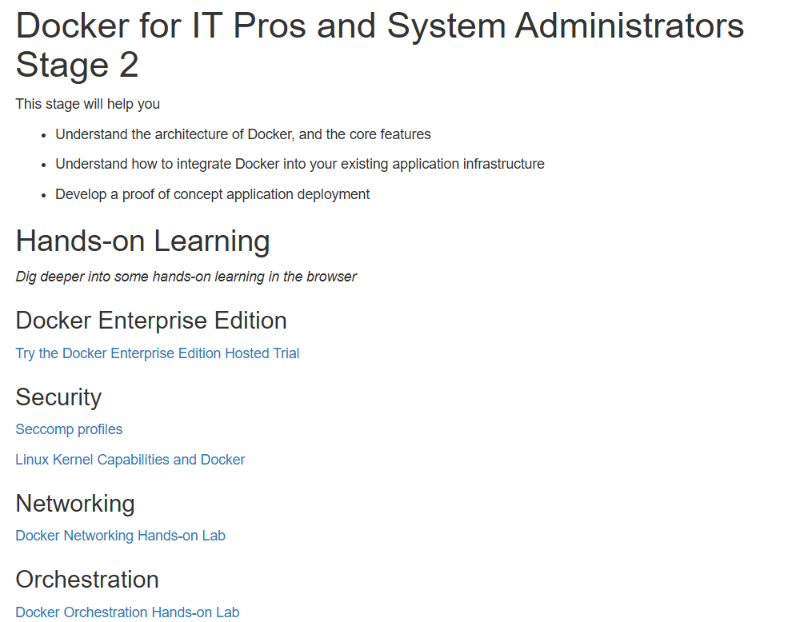

# Stage 2 Play with Docker

Debido a que hay errores con la parte de Stage 2 de los laboratorios de Desarrolladores hare el Stage 2 de los laboratorios de IT



# Stage 2

> ***Laboratorio de Seguridad: Seccomp***
> 

Seccomp es una función de sandboxing en el núcleo Linux que actúa como un cortafuegos para las llamadas al sistema (syscalls). Utiliza reglas de Berkeley Packet Filter (BPF) para filtrar las llamadas al sistema y controlar cómo se manejan. Estos filtros pueden limitar significativamente el acceso de un contenedor al núcleo Linux del host Docker, especialmente para contenedores/aplicaciones simples.

## ✅Prerrequisitos

- Un host Docker basado en Linux con seccomp habilitado
- Docker 1.10 o superior (preferiblemente 1.12 o superior)

Los siguientes comandos le muestran cómo verificar si seccomp está habilitado en el kernel del sistema:

Comprobar desde Docker 1.12 o superior

```bash
$ docker info | grep seccomp  
```


Si la salida anterior no devuelve una línea, `seccomp`entonces el sistema no tiene seccomp habilitado en su kernel.

Comprobar desde la línea de comandos de Linux

```bash
$ grep SECCOMP /boot/config-$(uname -r)
```


## **Seccomp and Docker**

Docker ha utilizado seccomp desde la versión 1.10 de Docker Engine.

Docker emplea seccomp en modo de filtro y cuenta con un lenguaje de dominio específico (DSL) basado en JSON para definir perfiles, los cuales se convierten en filtros seccomp compilables. Al ejecutar un contenedor, se aplica el perfil seccomp predeterminado a menos que se especifique lo contrario utilizando el indicador `--security-opt` al comando `docker run.` 

## ✅**Paso 1: Clonar el repositorio de GitHub de los laboratorios**

En este paso, clonaremos el repositorio de GitHub del laboratorio para tener los perfiles seccomp que usará durante el resto de este laboratorio.

1. Vamos a clonar el repositorio de GitHub de los laboratorios.
    
    ```bash
    git clone https://github.com/docker/labs
    ```
    
    
    
2. Cambiamos al directorio `labs/security/seccomp` .
    
    ```bash
    cd labs/security/seccomp
    ```
    
    
    

En los pasos restantes de este laboratorio, se asume que estás ejecutando comandos desde el directorio `labs/security/seccomp`. Esto será crucial al referirse a los perfiles seccomp en los diferentes comandos `docker run` del laboratorio.

## ✅**Paso 2: Probar un perfil seccomp**

En este paso, emplearemos el perfil seccomp `deny.json` que se encuentra en el repositorio de guías de laboratorio. Este perfil está configurado con una lista blanca de llamadas al sistema vacía, lo que resulta en el bloqueo de todas las llamadas al sistema. Como parte de la demostración, activaremos todas las capacidades y desactivaremos **apparmor** para confirmar que solo el perfil seccomp está restringiendo las llamadas al sistema.

1. Intentó iniciar un nuevo contenedor utilizando el comando `docker run` con todas las capacidades agregadas, apparmor desactivado y aplicando el perfil seccomp `seccomp-profiles/deny.json`.
    
    ```bash
    docker run --rm -it --cap-add ALL --security-opt apparmor=unconfined --security-opt seccomp=seccomp-profiles/deny.json alpine sh
    ```
    
    
    

En este escenario, ¡Docker ha iniciado correctamente!

1. Inspeccionamos el contenido del perfil `seccomp-profiles/deny.json`.
    
    ```bash
    cat seccomp-profiles/deny.json
    ```
    
    
    
    Tengo en cuenta que no hay **llamadas al sistema** en la lista blanca. Esto significa que no se permitirán llamadas al sistema desde contenedores iniciados con este perfil.
    

En este paso, eliminé las interferencias de las capacidades y la protección de aplicaciones, y comencé un nuevo contenedor con un perfil seccomp que no tenía llamadas al sistema en su lista blanca. Observé cómo esto impidió todas las llamadas al sistema desde dentro del contenedor o permitió que se iniciara en primer lugar.

## ✅**Paso 3: Ejecutar un contenedor sin perfil seccomp**

A menos que se especifique un perfil diferente, Docker aplica el perfil seccomp predeterminado a todos los contenedores nuevos. En este paso, se observará cómo se puede forzar la ejecución de un contenedor nuevo sin un perfil seccomp.

1. Se inició un nuevo contenedor utilizando la bandera `--security-opt seccomp=unconfined` para evitar la aplicación de cualquier perfil seccomp.
    
    ```bash
    docker run --rm -it --security-opt seccomp=unconfined debian:jessie sh
    ```
    
    
    
2. Desde la terminal del contenedor, ejecuté el comando `whoami` para confirmar que el contenedor está funcionando y puede realizar llamadas al sistema al host Docker.
    
    ```bash
    whoami
    ```
    
    
    
3. Para demostrar que no estamos ejecutando el perfil seccomp predeterminado, intentamos ejecutar un comando `unshare` que inicia un proceso de shell en un nuevo espacio de nombres.
    
    ```bash
    unshare --map-root-user --user
     whoami
    ```
    
    
    
4. Salí del nuevo shell y del contenedor.
    
    ```bash
    exit
    exit
    ```
    
    
    
5. Ejecute el siguiente comando `strace` desde su host Docker para ver una lista de las llamadas al sistema utilizadas por el programa `whoami`.
El host Docker deberá tener instalado el paquete `strace` para ejecutar el comando correctamente.
    
    ```bash
    apk add --update strace
    strace -c -f -S name whoami 2>&1 1>/dev/null | tail -n +3 | head -n -2 | awk '{print $(NF)}'
    ```
    
    
    

También podemos ejecutar el siguiente comando más simple y obtener una salida más detallada.

```bash
strace whoami
```


Podemos sustituir **whoami** por cualquier otro programa
En este paso, se inició un nuevo contenedor sin perfil seccomp y se verificó que el programa seleccionado pudiera ejecutarse. Además, se utilizó el programa `strace` para listar las llamadas al sistema realizadas por una ejecución específica del programa sustituido.

## ✅**Paso 4: eliminar llamadas al sistema de forma selectiva**

En este paso, se observará cómo modificar el perfil `default.json` puede ser una forma efectiva de ajustar qué llamadas al sistema están disponibles para los contenedores.

El perfil `default-no-chmod.json` es una variante del perfil `default.json` donde se han eliminado las llamadas al sistema `chmod()`, `fchmod()`, y `chmodat()` de su lista blanca.

1. Inicié un nuevo contenedor utilizando el perfil `default-no-chmod.json` y traté de ejecutar el comando `chmod 777 / -v.`
    
    ```bash
    docker run --rm -it --security-opt seccomp=./seccomp-profiles/default-no-chmod.json alpine sh
    ```
    
    
    
    y luego desde el interior del contenedor:
    
    ```bash
    chmod 777 / -v
    ```
    
    
    

El comando falla porque `chmod 777 / -v` utiliza algunas de las llamadas al sistema `chmod()`, `fchmod()` y `chmodat()` que han sido eliminadas de la lista blanca del perfil `default-no-chmod.json`.

1. Salimos del contenedor
    
    ```bash
    exit
    ```
    
    
    
2. Inicié otro contenedor nuevo utilizando el perfil `default.json` y ejecuté el mismo comando `chmod 777 / -v.` 
    
    ```bash
    docker run --rm -it --security-opt seccomp=./seccomp-profiles/default.json alpine sh
    ```
    
    
    
    y luego desde el interior del contenedor:
    
    ```bash
    chmod 777 / -v
    ```
    
    
    

El comando tiene éxito esta vez porque el perfil `default.json` incluye las llamadas al sistema `chmod()`, `fchmod()` y `chmodat()` en su lista blanca.

1. Salimos del contenedor
    
    ```bash
    exit
    ```
    
    
    
2. Verifique ambos perfiles para detectar la presencia de las llamadas al sistema `chmod()`, `fchmod()`y `chmodat()`.
    
    Me Asegure de ejecutar estos comandos desde la línea de comandos de su Docker Host y no desde dentro del contenedor creado en el paso anterior.
    
    ```bash
    cat ./seccomp-profiles/default.json | grep chmod
    ```
    
    
    
    ```bash
    cat ./seccomp-profiles/default-no-chmod.json | grep chmod
    ```
    
    
    
    El resultado anterior indica que el perfil `default-no-chmod.json` no incluye llamadas al sistema relacionadas con **chmod** en su lista blanca.
    

En este paso, se observó cómo eliminar llamadas al sistema específicas del perfil `default.json` puede ser una forma poderosa de comenzar a ajustar la seguridad de los contenedores.

## ✅**Paso 5: Escribe un perfil seccomp**

Es posible crear perfiles de seccomp de Docker desde cero o editar perfiles existentes. En este paso, se aprenderá sobre la sintaxis y el comportamiento de los perfiles de seccomp de Docker.

El diseño de un perfil seccomp de Docker se ve así:

```bash
{
    "defaultAction": "SCMP_ACT_ERRNO",
    "architectures": [
        "SCMP_ARCH_X86_64",
        "SCMP_ARCH_X86",
        "SCMP_ARCH_X32"
    ],
    "syscalls": [
        {
            "name": "accept",
            "action": "SCMP_ACT_ALLOW",
            "args": []
        },
        {
            "name": "accept4",
            "action": "SCMP_ACT_ALLOW",
            "args": []
        },
        ...
    ]
}
```

En la siguiente tabla se enumeran las posibles *acciones* en orden de precedencia. Las acciones de mayor jerarquía prevalecen sobre las de menor jerarquía.

| Acción | Descripción |
| --- | --- |
| SCMP_ACT_KILL | Matar con un estado de salida de 0x80 + 31 (SIGSYS) = 159 |
| Trampa SCMP_ACT | Enviar una SIGSYS señal sin ejecutar la llamada al sistema |
| Error SCMP_ACT_ERRNO | Establecer errno sin ejecutar la llamada del sistema |
| Seguimiento de acciones de SCMP | Invocar un ptracer para tomar una decisión o errno establecerla -ENOSYS |
| SCMP_ACT_PERMITIR | Permitir |

Las acciones más importantes para los usuarios de Docker son `SCMP_ACT_ERRNO`y `SCMP_ACT_ALLOW`.

Los perfiles pueden contener filtros más granulares basados en el valor de los argumentos de la llamada del sistema.

```bash
{
    ...
    "syscalls": [
        {
            "name": "accept",
            "action": "SCMP_ACT_ALLOW",
            "args": [
                {
                    "index": 0,
                    "op": "SCMP_CMP_MASKED_EQ",
                    "value": 2080505856,
                    "valueTwo": 0
                }
            ]
        }
    ]
}
```

- `index` :es el índice del argumento de llamada del sistema
- `op` :es la operación que se debe realizar sobre el argumento. Puede ser una de las siguientes:
    - SCMP_CMP_NE - no es igual
    - SCMP_CMP_LT - menos de
    - SCMP_CMP_LE - menor o igual a
    - SCMP_CMP_EQ - igual a
    - SCMP_CMP_GE - mayor o igual a
    - SCMP_CMP_GT - mayor que
    - SCMP_CMP_MASKED_EQ - enmascarado igual: verdadero si`(value & arg == valueTwo)`
- `value` :es un parámetro para la operación
- `valueTwo` :se utiliza únicamente para SCMP_CMP_MASKED_EQ

La regla solo coincide si **todos** los argumentos coinciden. Tenemos que agregar varias reglas para lograr el efecto de un OR.

`strace`se puede utilizar para obtener una lista de todas las llamadas al sistema realizadas por un programa. Es un muy buen punto de partida para escribir políticas de seccomp. Aquí hay un ejemplo de cómo podemos enumerar todas las llamadas al sistema realizadas por `ls`:

```bash
strace -c -f -S name ls 2>&1 1>/dev/null | tail -n +3 | head -n -2 | awk '{print $(NF)}'
```


El resultado anterior muestra las llamadas al sistema que deben habilitarse para que un contenedor que ejecute el programa `ls` funcione, además de las llamadas al sistema necesarias para iniciar un contenedor.
⛳En este paso, se exploró el formato y la sintaxis de los perfiles seccomp de Docker. También se abordó el orden de preferencia de las acciones, así como la metodología para determinar las llamadas al sistema necesarias para programas individuales.

---

> ***Laboratorio: Capacidades***
> 

En este laboratorio, se explorarán los conceptos básicos de las capacidades del núcleo de Linux. Se aprenderá cómo estas capacidades funcionan con Docker, se revisarán algunos comandos básicos para visualizar y administrarlas, y se entenderá cómo agregar y eliminar capacidades en contenedores nuevos.

## ✅**Paso 1: Introducción a las capacidades**

En este paso se aprenderán los conceptos básicos sobre las capacidades del núcleo de Linux.

El núcleo de Linux divide los privilegios del usuario root en unidades más pequeñas conocidas como capacidades. Por ejemplo, la capacidad CAP_CHOWN permite al usuario root realizar cambios arbitrarios en los UID y GID de los archivos, mientras que CAP_DAC_OVERRIDE permite a root eludir las comprobaciones de permisos del núcleo en operaciones de lectura, escritura y ejecución de archivos. Casi todos los poderes especiales asociados con el usuario root de Linux se descomponen en estas capacidades individuales.

Esta división de los privilegios de root en capacidades granulares permite:

- Eliminar capacidades individuales de la cuenta de usuario root, lo que reduce su poder y riesgo.
- Agregar privilegios a usuarios que no son root de manera muy específica y controlada.

En un entorno sin capacidades basadas en archivos, las aplicaciones tienen restricciones en cómo pueden aumentar sus privilegios más allá de un conjunto definido de límites. Docker gestiona este conjunto de límites antes de iniciar un contenedor, permitiendo agregar o quitar capacidades mediante comandos específicos.

Por defecto, Docker sigue un enfoque de lista blanca donde descarta todas las capacidades excepto aquellas estrictamente necesarias para el funcionamiento del contenedor. Esto asegura un entorno más seguro, limitando el potencial de una aplicación para acceder a privilegios innecesarios y reduciendo así los riesgos de seguridad.

## ✅**Paso 2: Trabajar con Docker y sus capacidades**

En este paso, se explorará el enfoque básico para administrar capacidades mediante Docker. Además, se aprenderán los comandos de Docker empleados para gestionar las capacidades de la cuenta root dentro de un contenedor.

A partir de Docker 1.12, tenemos 3 opciones de alto nivel para usar capacidades:

- Se ejecutan contenedores como root con un amplio conjunto de capacidades e intentan administrarlas manualmente dentro del contenedor.
- Se ejecutan contenedores como root con capacidades limitadas y nunca se modifican dentro del contenedor.
- Se ejecutan contenedores como un usuario sin privilegios y sin capacidades.

En los siguientes comandos, se utilizará `$CAP` para indicar una o más capacidades individuales. Estas capacidades se probarán en la siguiente sección.

1. Para eliminar capacidades de la `root`cuenta de un contenedor.
    
    ```bash
    docker run --rm -it --cap-drop $CAP alpine sh
    ```
    
2. Para agregar capacidades a la `root`cuenta de un contenedor.
    
    ```bash
    docker run --rm -it --cap-add $CAP alpine sh
    ```
    
3. Eliminar todas las capacidades y luego agregar explícitamente capacidades individuales a la `root`cuenta de un contenedor.
    
    ```bash
    docker run --rm -it --cap-drop ALL --cap-add $CAP alpine sh
    ```
    

El núcleo de Linux antepone "CAP_" a todas las constantes de capacidad, como CAP_CHOWN, CAP_NET_ADMIN, CAP_SETUID, CAP_SYSADMIN, entre otras. Las constantes de capacidad en Docker no tienen el prefijo "CAP_", pero coinciden con las constantes del núcleo.

## ✅**Paso 3: Probar las capacidades de Docker**

En este paso, se iniciarán varios contenedores nuevos. En cada uno de ellos, se emplearán los comandos aprendidos anteriormente para ajustar las capacidades asociadas con la cuenta utilizada para ejecutar el contenedor.

1. Iniciamos un nuevo contenedor y demostramos que la cuenta root del contenedor puede cambiar la propiedad de los archivos.
    
    ```bash
    docker run --rm -it alpine chown nobody /
    ```
    
    
    
    El comando no devuelve ningún código que indique que la operación se realizó correctamente. Funciona porque, por defecto, los contenedores nuevos se inician con un usuario root, el cual tiene la capacidad `CAP_CHOWN` activada de manera predeterminada.
    
2. Se inició otro contenedor nuevo y se eliminaron todas las capacidades de la cuenta root del contenedor, excepto la capacidad asociada con cambiar la propiedad de los archivos (`CAP_CHOWN`). Es importante recordar que Docker no utiliza el prefijo **"CAP_"** al referirse a las constantes de capacidad.
    
    ```bash
    docker run --rm -it --cap-drop ALL --cap-add CHOWN alpine chown nobody /
    ```
    
    
    
    Este comando tampoco devuelve ningún código de retorno, lo que indica que la operación se ejecutó correctamente. La operación se lleva a cabo con éxito porque, aunque se eliminaron todas las capacidades de la cuenta root del contenedor, se volvió a agregar la capacidad `CHOWN`. La capacidad `CHOWN` es todo lo que se necesita para cambiar la propiedad de un archivo.
    
3. Iniciamos otro contenedor nuevo y elimine solo la capacidad `CHOWN` desde su cuenta raíz.
    
    ```bash
    docker run --rm -it --cap-drop CHOWN alpine chown nobody /
    ```
    
    
    
    Esta vez, el comando devuelve un código de error que indica un fallo. Esto se debe a que la cuenta root del contenedor no tiene la capacidad `CHOWN` y, por lo tanto, no puede cambiar la propiedad de un archivo o directorio.
    
4. Se creó otro contenedor nuevo e intentó agregar la capacidad `CHOWN` al usuario no root llamado `nobody`. Como parte del mismo comando, se intentó cambiar la propiedad de un archivo o carpeta.
    
    ```bash
    docker run --rm -it --cap-add chown -u nobody alpine chown nobody /
    ```
    
    
    
    El comando anterior falla porque Docker actualmente no admite agregar capacidades a usuarios que no sean root.
    

⛳En este paso, se han añadido y eliminado capacidades en varios contenedores nuevos. Se ha observado que las capacidades pueden ser gestionadas desde el usuario root de un contenedor de manera muy específica. Además, se ha confirmado que Docker no permite la adición de capacidades a usuarios que no sean root en la actualidad.

## ✅**Paso 4: Extra para expertos**

El resto de este laboratorio se presentará herramientas adicionales para trabajar con las capacidades en el shell de Linux.

Hay dos conjuntos principales de herramientas para gestionar capacidades:

- **libcap:** se centra en manipular capacidades.
- **libcap-ng:** tiene algunas herramientas útiles para la auditoría.

### **Captura de la libélula**

- `capsh` :le permite realizar pruebas de capacidad y depuración limitada
- `setcap` :establecer bits de capacidad en un archivo
- `getcap` :obtener los bits de capacidad de un archivo

### **libcap-ng**

- `pscap` :enumerar las capacidades de los procesos en ejecución
- `filecap` :enumerar las capacidades de los archivos
- `captest` :capacidades de prueba, así como capacidades de lista para el proceso actual

El resto de este paso se mostrará algunos ejemplos de `libcap`y `libcap-ng`.

### **Listado de todas las capacidades**

El siguiente comando iniciará un nuevo contenedor utilizando Alpine Linux, instalará el paquete `libcap` y luego listarán las capacidades.

```bash
 docker run --rm -it alpine sh -c 'apk add -U libcap; capsh --print'
```


**Current** son conjuntos múltiples separados por espacios. Las capacidades múltiples dentro del mismo conjunto se separan con comas `,`. Las letras que siguen `+`al final de cada conjunto son las siguientes:

- `e` :es efectiva
- `i` :es heredable
- `p` :esta permitido

### **Experimentando con capacidades**

El comando `capsh` puede ser útil para experimentar con capacidades. `capsh --help` muestra cómo utilizar el comando.

```bash
docker run --rm -it alpine sh -c 'apk add -U libcap;capsh --help'
```


### **Modificación de capacidades**

Tanto libcap como libcap-ng se pueden utilizar para modificar capacidades.

1. Se puede utilizar libcap para modificar las capacidades de un archivo
El siguiente comando ilustra cómo establecer la capacidad CAP_NET_RAW como efectiva y permitida en el archivo representado por `$file`. El comando `setcap` invoca libcap para llevar a cabo esta acción.
    
    ```bash
    setcap cap_net_raw=ep $file
    ```
    
2. Se puede utilizar libcap-ng para establecer las capacidades de un archivo.
El comando `filecap` invoca libcap-ng para esta tarea.
    
    ```bash
    filecap /absolute/path net_raw
    ```
    
    **Nota:** `filecap` se requieren nombres de ruta absolutos. `./`No se permiten atajos como .
    

### **Revisión de cuentas**

Hay varias formas de leer las capacidades de un archivo.

1. Usando libcap:
    
    ```bash
    getcap $file
    
    $file = cap_net_raw+ep
    ```
    
2. Usando libcap-ng:
    
    ```bash
    $ filecap /absolue/path/to/file
    ```
    
    ```bash
    file                     capabilities
    /absolute/path/to/file        net_raw
    ```
    
3. Uso de atributos extendidos (paquete attr):
    
    ```bash
    getfattr -n security.capability $file
    ```
    
    ```bash
    # file: $file
    security.capability=0sAQAAAgAgAAAAAAAAAAAAAAAAAAA=
    ```
    

Las imágenes de Docker no pueden contener archivos con bits de capacidad configurados. Esto se hace para reducir el riesgo de que los contenedores de Docker utilicen capacidades para escalar privilegios. Sin embargo, es posible montar volúmenes que contengan archivos con bits de capacidad configurados en contenedores. Por lo tanto, se debe tener precaución al hacerlo.

1. Podemos auditar directorios en busca de bits de capacidad con los siguientes comandos:
    
    ```bash
    # with libcap
    getcap -r /
    
    # with libcap-ng
    filecap -a
    ```
    
2. Para eliminar bits de capacidad puedes utilizar
    
    ```bash
    # with libcap
    setcap -r $file
    
    # with libcap-ng
    filecap /path/to/file none
    ```
    

---

> ***Laboratorio práctico sobre redes Docker***
> 

En este laboratorio, se explorarán conceptos clave de redes Docker. Se revisarán ejemplos de algunos conceptos básicos de redes, se aprenderá sobre redes Bridge y también sobre redes Overlay.

## 🖊️**Sección n.° 1: Conceptos básicos de redes**

### ✅**Paso 1: El comando Docker Network**

El comando principal para configurar y administrar redes de contenedores es el `docker network`. Se debe ejecutar este comando desde la primera terminal.

```bash
docker network
```


El resultado del comando muestra cómo utilizar el comando y todos los subcomandos de `docker network`. Como se puede observar en el resultado, el comando `docker network` permite crear nuevas redes, listar redes existentes, inspeccionar redes y eliminar redes. Además, posibilita conectar y desconectar contenedores de las redes.

### ✅**Paso 2: Enumere las redes**

Se debe ejecutar un comando `docker network ls` para visualizar las redes de contenedores existentes en el host Docker actual.

```bash
docker network ls
```


La salida anterior muestra las redes de contenedores que se crean como parte de una instalación estándar de Docker.

Las redes nuevas que se creen también se mostrarán en la salida del comando `docker network ls`.

Es posible observar que cada red tiene un ID y un nombre únicos. Cada red también está asociada con un único controlador. Se puede notar que las redes "bridge" y "host" tienen el mismo nombre que sus respectivos controladores.

### **Paso 3: Inspeccionar una red**

El comando `docker network inspect` se emplea para visualizar los detalles de configuración de una red. Estos detalles incluyen el nombre, ID, controlador, controlador IPAM, información de subred, contenedores conectados, entre otros.

Se debe utilizar `docker network inspect <network>` para examinar los detalles de configuración de las redes de contenedores en el host Docker. A continuación, se muestra cómo ver los detalles de la red denominada "bridge".

```bash
docker network inspect bridge
```


**Nota:** La sintaxis del comando `docker network inspect` es `docker network inspect <network>`, donde `<network>` puede ser el nombre o el ID de la red. En el ejemplo anterior, se mostraron los detalles de configuración de la red llamada "bridge". Es importante no confundir esto con el controlador "bridge".

### ✅**Paso 4: Enumere los complementos del controlador de red**

El comando `docker info` proporciona una gran cantidad de información interesante sobre una instalación de Docker.

Se debe ejecutar el comando `docker info` y localizar la lista de complementos de red.

```bash
docker info
```


La salida anterior muestra los controladores **de puente** , **host** , **macvlan** , **null** y **superposición .**

## 🖊️**Sección n.° 2: Redes de puentes**

### ✅**Paso 1: Los conceptos básicos**

Cada instalación limpia de Docker incluye una red predefinida llamada "bridge". Esto se puede verificar ejecutando el comando `docker network ls`

```bash
docker network ls
```


El resultado anterior indica que la red **"bridge"** está asociada con el controlador **"bridge"**. Es importante destacar que la red y el controlador están interrelacionados pero no son idénticos. En este caso, ambos tienen el mismo nombre, pero representan entidades distintas.

Además, el resultado muestra que la red **"bridge"** tiene un alcance local, lo que significa que existe únicamente en este host de Docker. Este es el comportamiento estándar para todas las redes que utilizan el controlador **"bridge"**, ya que proporciona redes que son específicas a un solo host.

Todas las redes creadas con el controlador **"bridge"** están basadas en un puente Linux (también conocido como un switch virtual).

Se debe instalar el comando `brctl` y utilizarlo para listar los puentes Linux en el host Docker. Esto se logra ejecutando `sudo apt-get install bridge-utils`.

```bash
apk update
apk add bridge
```


Luego, enumeramos los puentes en nuestro host Docker ejecutando `brctl show`.

```bash
brctl show
```


El resultado anterior indica la presencia de un único puente Linux llamado `docker0`. Este puente fue creado automáticamente para la red de puentes. Es posible observar que actualmente no tiene interfaces conectadas a él.

También podemos utilizar el comando `ip a`para ver los detalles del puente **docker0** .

```bash
ip a
```


### ✅**Paso 2: Conectar un contenedor**

La red puente es la red predeterminada para los contenedores nuevos. Esto implica que, a menos que se especifique una red diferente, todos los contenedores nuevos se conectarán automáticamente a la red puente.

Se debe crear un nuevo contenedor ejecutando `docker run -dt ubuntu sleep infinity`.

```bash
docker run -dt ubuntu sleep infinity
```


Este comando crea un nuevo contenedor basado en la imagen ubuntuy ejecuta el comando sleep para mantener el contenedor en ejecución en segundo plano. Se puede verificar que el contenedor de ejemplo está activo ejecutando `docker ps` .

```bash
docker ps
```


Como no se especificó ninguna red en el comando `docker run`, el contenedor se añadió automáticamente a la red bridge.

Para verificar esto, se debe ejecutar nuevamente el comando `brctl show`.

```bash
brctl show
```


Se puede observar cómo el puente docker0 ahora tiene una interfaz conectada. Esta interfaz conecta el puente docker0 al nuevo contenedor que ha sido creado recientemente.

Para verificar esto, se puede inspeccionar la red del puente nuevamente ejecutando `docker network inspect bridge`, y así observar el nuevo contenedor adjunto a ella.

```bash
docker network inspect bridge
```


### ✅**Paso 3: Probar la conectividad de la red**

La salida del comando `docker network inspect` anterior muestra la dirección IP del nuevo contenedor. En el ejemplo anterior, es "172.17.0.2", pero puede variar en diferentes entornos.

Para realizar un ping a la dirección IP del contenedor desde el indicador de shell del host Docker, ejecute `ping -c5 <IPv4 Address>`, asegurándose de utilizar la IP del contenedor específica de su entorno.


Las respuestas anteriores indican que el host de Docker puede hacer ping al contenedor a través de la red bridge. Sin embargo, también es importante verificar si el contenedor puede conectarse al mundo exterior. Para hacer esto, se debe iniciar sesión en el contenedor, instalar el programa `ping` y luego ejecutar `ping www.github.com`.

Para obtener el ID del contenedor que se inició en el paso anterior, se puede ejecutar `docker ps`.

```bash
docker ps
```


A continuación, ejecutemos un shell dentro de ese contenedor de Ubuntu, ejecutando `docker exec -it <CONTAINER ID> /bin/bash`.


A continuación, tenemos que instalar el programa ping. Ejecutémoslo `apt-get update && apt-get install -y iputils-ping`.

```bash
apt-get update && apt-get install -y iputils-ping
```


Hagamos ping a www.github.com ejecutando`ping -c5 www.github.com`

```bash
 ping -c5 www.github.com
```


Por último, desconectemos nuestro shell del contenedor, ejecutando `exit`.

```bash
exit
```


También es necesario detener el contenedor para limpiar los recursos de esta prueba. Esto se puede lograr ejecutando `docker stop <CONTAINER ID>`.

### ✅**Paso 4: Configurar NAT para conectividad externa**

En este paso, se iniciará un nuevo contenedor NGINX y se asignará el puerto 8080 del host Docker al puerto 80 dentro del contenedor. Esto implica que cualquier tráfico dirigido al host Docker en el puerto 8080 será redirigido al puerto 80 dentro del contenedor.

**Nota:** Si se inicia un nuevo contenedor desde la imagen oficial de NGINX sin especificar un comando para ejecutar, el contenedor ejecutará un servidor web básico en el puerto 80.

Para iniciar un nuevo contenedor basado en la imagen oficial de NGINX, se debe ejecutar `docker run --name web1 -d -p 8080:80 nginx`. Esto asigna el puerto 8080 del host Docker al puerto 80 del contenedor NGINX, permitiendo que el servidor web NGINX dentro del contenedor sea accesible desde el puerto 8080 del host.

```bash
docker run --name web1 -d -p 8080:80 nginx
```


Para verificar el estado del contenedor y las asignaciones de puertos, se debe ejecutar `docker ps`.

```bash
docker ps
```


Para verificar el estado del contenedor y las asignaciones de puertos, ejecute `docker ps`. En la salida, se observará el contenedor web1 ejecutando NGINX. Tome nota del comando que está ejecutando el contenedor, así como de la asignación de puertos: `0.0.0.0:8080->80/tcp` asigna el puerto 8080 en todas las interfaces del host al puerto 80 dentro del contenedor web1. Esta configuración de puerto permite que el servicio web del contenedor sea accesible desde fuentes externas a través de la dirección IP del host de Docker en el puerto 8080.

Una vez que el contenedor esté en ejecución y asignado a un puerto en la interfaz del host, se puede probar la conectividad al servidor web NGINX.

Para completar la tarea siguiente, se necesitará la dirección IP del host de Docker. Esta dirección IP debe ser accesible, por ejemplo, la IP pública de la instancia si el entorno está alojado en Azure y se conecta por SSH. Simplemente dirija un navegador web a la dirección IP seguida del puerto 8080 de su host de Docker. Intentar acceder a la misma dirección IP en un puerto diferente resultará en un error de conexión.

Si por alguna razón no es posible abrir una sesión desde un navegador web, se puede conectar desde el host Docker utilizando el comando `curl 127.0.0.1:8080`.

```bash
curl 127.0.0.1:8080
```


Si intentamos copiar la dirección IP a un número de puerto diferente, fallará.

## 🖊️**Sección n.° 3: Redes superpuestas**

### ✅**Paso 1: Los conceptos básicos**

En este paso, se inicializará un nuevo enjambre (swarm), se unirá a un solo nodo de trabajo y se verificará que las operaciones hayan funcionado correctamente.

Se ejecutará `docker swarm init --advertise-addr $(hostname -i)`.

```bash
docker swarm init --advertise-addr $(hostname -i)
```


En la primera terminal, se debe copiar el comando completo `docker swarm join ...` que aparece en la salida de la terminal. Luego, ese comando copiado debe pegarse en la segunda terminal.


Se debe ejecutar `docker node ls` para verificar que ambos nodos sean parte del enjambre.

```bash
docker node ls
```


Los valores de `ID` y `HOSTNAME` pueden variar en su entorno. Lo crucial es verificar que ambos nodos se hayan unido al enjambre y estén listos y activos.

### ✅**Paso 2: Crear una red superpuesta**

Ahora que se ha inicializado un enjambre, es el momento de crear una red superpuesta.

Se puede crear una nueva red superpuesta llamada “overnet” ejecutando `docker network create -d overlay overnet`.

```bash
docker network create -d overlay overnet
```


Se debe utilizar el comando `docker network ls` para verificar que la red se haya creado correctamente.

```bash
docker network ls
```


La nueva red "overnet" se muestra en la última línea del resultado anterior. Se observa cómo está asociada con el **controlador de superposición** y su alcance abarca todo el enjambre.

Ejecutamos el mismo comando `docker network ls` desde la segunda terminal para verificar la existencia de la red "overnet".

```bash
docker network ls
```


Tengamos en cuenta que la red "overnet" no aparece en la lista. Esto se debe a que Docker extiende las redes superpuestas a los hosts solo cuando es necesario, como cuando un host ejecuta una tarea desde un servicio creado en esa red. 

Para obtener información más detallada sobre la red "overnet", utilice el comando `docker network inspect overnet`. Este comando debe ejecutarse desde la primera terminal.

```bash
docker network inspect overnet
```


La salida indica la presencia de un contenedor en ejecución, aunque deberían haber dos réplicas en esta red específica. Esto se debe a que el comando anterior solo presenta los contenedores activos en ese nodo en particular, que en este caso es el nodo2.

### ✅**Paso 3: Crear un servicio**

Una vez que el Swarm ha sido inicializado y se dispone de una red superpuesta, se llega al momento de crear un servicio que haga uso de dicha red.

Se recomienda ejecutar el siguiente comando desde una terminal para establecer un nuevo servicio denominado "myservice" en la red denominada "overnet", configurando dos tareas o réplicas:

```bash
docker service create --name myservice \
--network overnet \
--replicas 2 \
ubuntu sleep infinity
```


Verifiquemos que el servicio esté creado y que ambas réplicas estén activas ejecutando `docker service ls`.

```bash
docker service ls
```


En la columna de `REPLICAS` `2/2` se indica que ambas tareas del servicio están en funcionamiento.

Para verificar que una sola tarea (réplica) se está ejecutando en cada uno de los dos nodos del enjambre, ejecute el siguiente comando:

```bash
docker service ps myservice
```


Los valores de `ID` y `NODE` pueden variar en el resultado. Lo crucial es observar que cada tarea o réplica se está ejecutando en nodos diferentes.

Una vez que el segundo nodo esté ejecutando una tarea en la red "overnet", puede verificar esto ejecutando el siguiente comando desde la segunda terminal:

```bash
docker network ls
```


También es posible ejecutar el siguiente comando en la segunda terminal para obtener información detallada sobre la red "overnet" y obtener la dirección IP de la tarea que se ejecuta en ese nodo:

```bash
docker network inspect overnet
```

```bash

[
    {
        "Name": "overnet",
        "Id": "xwiq0op60wh5cnag8n1x2oaf9",
        "Created": "2024-07-02T20:41:50.160097837Z",
        "Scope": "swarm",
        "Driver": "overlay",
        "EnableIPv6": false,
        "IPAM": {
            "Driver": "default",
            "Options": null,
            "Config": [
                {
                    "Subnet": "10.0.1.0/24",
                    "Gateway": "10.0.1.1"
                }
            ]
        },
        "Internal": false,
        "Attachable": false,
        "Ingress": false,
        "ConfigFrom": {
            "Network": ""
        },
        "ConfigOnly": false,
        "Containers": {
            "143d95c7aaff6e341ab5933dfbeb868bab71422542b7ac55bddda2b0f1330568": {
                "Name": "myservice.1.9aevaxa1kvu3eewxs6e608mx0",
                "EndpointID": "cb6175ef47144caa1e5117f4ceb7c9e4a405e8fa15c958b55295cb76de0c6067",
                "MacAddress": "02:42:0a:00:01:03",
                "IPv4Address": "10.0.1.3/24",
                "IPv6Address": ""
            },
            "61ab1a45d2a42d1a11b9ab23599e0a57f952414a07d5291c91c5c87571dee639": {
                "Name": "myservice.2.ku22fqla6fzw0d126n6a0rvg9",
                "EndpointID": "394ac371f329e04bab3675fe1c114e7c665e4821060f3b14a3e1ca669b5029bc",
                "MacAddress": "02:42:0a:00:01:04",
                "IPv4Address": "10.0.1.4/24",
                "IPv6Address": ""
            },
            "lb-overnet": {
                "Name": "overnet-endpoint",
                "EndpointID": "c4625d17ec89130e07d7878f37f8e2c64e7894f40aff2fe52516bf98d4207868",
                "MacAddress": "02:42:0a:00:01:05",
                "IPv4Address": "10.0.1.5/24",
                "IPv6Address": ""
            }
        },
        "Options": {
            "com.docker.network.driver.overlay.vxlanid_list": "4097"
        },
        "Labels": {},
        "Peers": [
            {
                "Name": "8c158485d344",
                "IP": "192.168.0.18"
            }
        ]
    }
]
```

A partir de Docker 1.12, el comando `docker network inspect` mostrará únicamente los contenedores o tareas que se ejecutan en el nodo local. Por lo tanto, para obtener la dirección IPv4 del contenedor que se está ejecutando en el segundo nodo en la red "overnet", puede ejecutar el siguiente comando y observar la dirección IP correspondiente:

En este caso, la dirección IP que debe anotar es la que corresponde al contenedor ejecutándose en el segundo nodo. En su laboratorio, esta dirección IP puede ser diferente a la que se muestra en este ejemplo de guía.

### ✅**Paso 4: Probar la red**

Para completar este paso, se necesitará la dirección IP de la tarea de servicio que está ejecutándose en el nodo 2, como se observó anteriormente (por ejemplo, 10.0.0.3).

Luego, desde la primera terminal, se pueden ejecutar los siguientes comandos utilizando esa dirección IP específica:

```bash
docker network inspect overnet
```


Codigo completo:

```bash
[
    {
        "Name": "overnet",
        "Id": "wlqnvajmmzskn84bqbdi1ytuy",
        "Created": "2017-04-04T09:35:47.362263887Z",
        "Scope": "swarm",
        "Driver": "overlay",
        "EnableIPv6": false,
        "IPAM": {
            "Driver": "default",
            "Options": null,
            "Config": [
                {
                    "Subnet": "10.0.0.0/24",
                    "Gateway": "10.0.0.1"
                }
            ]
        },
        "Internal": false,
        "Attachable": false,
        "Containers": {
            "d676496d18f76c34d3b79fbf6573a5672a81d725d7c8704b49b4f797f6426454": {
                "Name": "myservice.2.nlozn82wsttv75cs9vs3ju7vs",
                "EndpointID": "36638a55fcf4ada2989650d0dde193bc2f81e0e9e3c153d3e9d1d85e89a642e6",
                "MacAddress": "02:42:0a:00:00:04",
                "IPv4Address": "10.0.0.4/24",
                "IPv6Address": ""
            }
        },
        "Options": {
            "com.docker.network.driver.overlay.vxlanid_list": "4097"
        },
        "Labels": {},
        "Peers": [
            {
                "Name": "node1-f6a6f8e18a9d",
                "IP": "10.0.0.5"
            },
            {
                "Name": "node2-507a763bed93",
                "IP": "10.0.0.6"
            }
        ]
    }
]
```

Se debe tener en cuenta que la dirección IP mencionada para la tarea de servicio (contenedor) en ejecución es distinta de la dirección IP de la tarea de servicio que se ejecuta en el segundo nodo. Ambas están conectadas a la misma red "overnet".

Para obtener el ID de la tarea de servicio y poder iniciar sesión en ella en el siguiente paso, se puede ejecutar el siguiente comando `docker ps` desde la terminal:

```bash
docker ps
```


Para iniciar sesión en la tarea de servicio, hay que asegurar de utilizar el `ID` del contenedor específico de su entorno, ya que será diferente del ejemplo que se muestra a continuación. Puede lograrlo ejecutando el siguiente comando desde la terminal:

```bash
docker exec -it <CONTAINER ID> /bin/bash
```


Se recomienda instalar el comando `ping` dentro del contenedor de la tarea de servicio que se está ejecutando en el segundo nodo, utilizando la dirección IP que se obtuvo previamente (por ejemplo, 10.0.0.3 según el resultado del comando `docker network inspect overnet`).

```bash
apt-get update && apt-get install -y iputils-ping
```


Ahora, hagamos ping `10.0.0.3`.


El resultado anterior muestra que ambas tareas del servicio **myservice** están en la misma red superpuesta que abarca ambos nodos y que pueden usar esta red para comunicarse.

### ✅**Paso 5: Probar el descubrimiento del servicio**

Ahora que tiene un servicio en funcionamiento que utiliza una red superpuesta, probemos el descubrimiento de servicios.

Si aún no estoy dentro del contenedor, debo volver a iniciar sesión utilizando el comando `docker exec -it <CONTAINER ID> /bin/bash`.

Una vez dentro del contenedor, ejecutaré el siguiente comando para ver el contenido del archivo `/etc/resolv.conf`:

```bash
cat /etc/resolv.conf
```


Una vez dentro del contenedor, verificaré el contenido del archivo `/etc/resolv.conf` para asegurarme de que el valor `nameserver 127.0.0.11` esté presente. Este valor indica que todas las consultas DNS del contenedor se envían a un solucionador DNS integrado que funciona en la dirección `127.0.0.11:53`. Todos los contenedores Docker ejecutan un servidor DNS integrado en esta dirección para la resolución de nombres dentro del entorno del contenedor.

Intentemos hacer ping al nombre “myservice” desde dentro del contenedor ejecutando `ping -c5 myservice`.


El resultado muestra claramente que mi contenedor puede hacer ping al servicio `myservice` por nombre. Es importante notar que la dirección IP devuelta es 10.0.0.2. En los próximos pasos, verificaré que esta dirección sea la IP virtual (VIP) asignada al servicio `myservice`.

Para salir de la sesión del contenedor y regresar al indicador de shell de mi host Docker, simplemente escribiré el siguiente comando:

```bash
exit
```


El siguiente paso es inspeccionar la configuración del servicio "myservice" mediante el comando `docker service inspect myservice`. Verificaré que el valor VIP (IP virtual) coincida con el valor devuelto por el comando anterior `ping -c 5 myservice`,

```bash
docker service inspect myservice
```


Ponermos la salida completa:

```bash
[
    {
        "ID": "ov30itv6t2n7axy2goqbfqt5e",
        "Version": {
            "Index": 19
        },
        "CreatedAt": "2017-04-04T09:35:47.009730798Z",
        "UpdatedAt": "2017-04-04T09:35:47.05475096Z",
        "Spec": {
            "Name": "myservice",
            "TaskTemplate": {
                "ContainerSpec": {
                    "Image": "ubuntu:latest@sha256:dd7808d8792c9841d0b460122f1acf0a2dd1f56404f8d1e56298048885e45535",
                    "Args": [
                        "sleep",
                        "infinity"
                    ],
<Snip>
        "Endpoint": {
            "Spec": {
                "Mode": "vip"
            },
            "VirtualIPs": [
                {
                    "NetworkID": "wlqnvajmmzskn84bqbdi1ytuy",
                    "Addr": "10.0.0.2/24"
                }
            ]
        },
<Snip>
```

Hacia la parte inferior del resultado, se encuentra el VIP (IP virtual) del servicio mencionado. El VIP que aparece en el resultado anterior es 10.0.0.2, aunque este valor puede variar según su configuración específica. Es crucial destacar que este VIP debe coincidir con el valor devuelto por el comando anterior `ping -c 5 myservice`.

Para asegurarme de la consistencia, procederé a ejecutar el comando `exit` para salir de la sesión del contenedor y regresar al prompt de mi shell en el host Docker. En caso de ser necesario, puedo crear una nueva sesión `docker exec` para la tarea de servicio (contenedor) que se ejecuta en el nodo 2 y repetir el mismo comando `ping -c 5 myservice`. Esto debería devolver una respuesta con el mismo VIP, validando así la configuración del servicio.

## 🖊️Limpiar

Ahora procederé a limpiar el servicio que creamos y los contenedores que iniciamos. Finalmente, desactivaré el modo Swarm.

Ejecutaré el siguiente comando para eliminar el servicio llamado `myservice`:

```bash
docker service rm myservice
```


Ejecutamos el `docker ps`comando para obtener una lista de contenedores en ejecución.

```bash
docker ps
```


Podemos usar el comando `docker kill <CONTAINER ID ...>` para matar los contenedores ubunut y nginx que iniciamos al principio.


Por último, eliminemos los nodos 1 y 2 del enjambre. Podemos usar el comando `docker swarm leave --force` para hacerlo.

Vamos a ejecutarlo `docker swarm leave --force`en el nodo1.

```bash
docker swarm leave --force
```


También podemos ejecutarlo `docker swarm leave --force`en el nodo 2.


---

> ***Laboratorio práctico de orquestación de Docker***
> 

En este laboratorio, voy a experimentar con las características de orquestación de contenedores de Docker. Primero, implementaré una aplicación simple en un solo host y aprenderé cómo funciona este proceso. Después, configuraré el modo Docker Swarm y aprenderé a desplegar la misma aplicación en varios hosts. Finalmente, exploraré cómo escalar la aplicación y transferir la carga de trabajo entre diferentes hosts de manera eficiente.

## ✅**Sección 1: ¿Qué es la orquestación?**

La orquestación implica automatizar la implementación, gestión y escalado de aplicaciones en múltiples máquinas para garantizar alta disponibilidad y resistencia. Sin orquestación, desplegar aplicaciones puede volverse tedioso y propenso a errores, ya que requiere acceder manualmente a cada máquina y monitorear constantemente el estado de la aplicación. Con herramientas como Docker Swarm, este proceso puede automatizarse, permitiendo desplegar aplicaciones en varios hosts con un solo comando. Además, si un nodo falla, otros nodos pueden tomar automáticamente la carga, manteniendo la aplicación en funcionamiento. Docker Compose y Docker Swarm facilitan esta orquestación.

Por ejemplo, imagina una aplicación con alto tráfico y necesidades de alta disponibilidad. Para cumplir con estos requisitos, generalmente se desearía implementarla en al menos tres máquinas, de manera que si una falla, la aplicación seguiría siendo accesible desde al menos otras dos. Sin utilizar orquestación, esta configuración manual sería propensa a errores y costosa en términos de tiempo y recursos.

## ✅**Sección 2: Configurar el modo enjambre**

Un ejemplo de ejecución manual de tareas en un único host sería iniciar un nuevo contenedor en el nodo 1 utilizando el comando `docker run -dt ubuntu sleep infinity`.

```bash
docker run -dt ubuntu sleep infinity
```


Este comando creará un nuevo contenedor utilizando la imagen ubuntu

y ejecutará el comando sleep para mantener el contenedor en segundo plano. Podemos verificar que nuestro contenedor de ejemplo está activo ejecutando docker ps en el nodo 1.

```bash
docker ps
```


⚠️¿Qué sucede si este nodo falla? En ese caso, la aplicación simplemente se detiene y no se reinicia automáticamente. Para restaurar el servicio, sería necesario iniciar sesión manualmente en esa máquina y realizar ajustes para ponerla en funcionamiento nuevamente.

En esta sección, voy a configurar Swarm Mode, un modo opcional en el que múltiples hosts Docker forman un grupo auto-orquestado de motores llamado swarm. Swarm Mode habilita nuevas funcionalidades como servicios y bundles que facilitan el despliegue y la gestión de aplicaciones con múltiples contenedores en varios hosts Docker.

Un swarm consta de uno o más nodos gestores y uno o más nodos trabajadores. Los nodos gestores mantienen el estado del swarm y gestionan la programación de los contenedores de la aplicación, mientras que los nodos trabajadores ejecutan esos contenedores. A partir de Docker 1.12, no es necesario utilizar un backend externo ni componentes de terceros para tener un swarm completamente funcional.

En esta parte de la demostración, utilizaré los tres nodos disponibles en el laboratorio. node1 actuará como gestor del Swarm, mientras que node2 y node3 funcionarán como nodos trabajadores. Aunque el modo Swarm soporta la redundancia de nodos gestores para alta disponibilidad, en este laboratorio desplegaré únicamente un nodo gestor con fines demostrativos.

### ✅**Paso 2.1 - Crear un nodo de administrador**

En este paso, iniciaré un nuevo swarm, me uniré a un solo nodo trabajador y luego verificaré que todo haya funcionado correctamente ejecutando `docker swarm init` en el nodo1.

```bash
docker swarm init --advertise-addr $(hostname -i)
```


La imagen indica que el nodo1 funcionará como un nodo manager.

Puedo ejecutar el comando `docker info` para verificar que el nodo1 se haya configurado correctamente como nodo gestor del Swarm.

```bash
docker info
```


Salida completa:

```bash
Client:
 Version:    24.0.7
 Context:    default
 Debug Mode: false
 Plugins:  buildx: Docker Buildx (Docker Inc.)
    Version:  v0.11.2
    Path:     /usr/local/libexec/docker/cli-plugins/docker-buildx  compose: Docker Compose (Docker Inc.)
    Version:  v2.23.0
    Path:     /usr/local/libexec/docker/cli-plugins/docker-compose
  scout: Docker Scout (Docker Inc.)
    Version:  v1.0.9
    Path:     /usr/lib/docker/cli-plugins/docker-scout

Server:
 Containers: 0
  Running: 0
  Paused: 0
  Stopped: 0
 Images: 0
 Server Version: 24.0.7
 Storage Driver: overlay2
  Backing Filesystem: xfs
  Supports d_type: true
  Using metacopy: false
  Native Overlay Diff: true
  userxattr: false
 Logging Driver: json-file
 Cgroup Driver: cgroupfs
 Cgroup Version: 1
 Plugins:
  Volume: local
  Network: bridge host ipvlan macvlan null overlay
  Log: awslogs fluentd gcplogs gelf journald json-file local logentries splunk syslog
 Swarm: active
  NodeID: kk7t002qhivqruxfx6toydoau
  Is Manager: true
  ClusterID: rhvrb8x5hmvx20z1lk4oocekg
  Managers: 1
  Nodes: 1
  Default Address Pool: 10.0.0.0/8
  SubnetSize: 24
  Data Path Port: 4789
  Orchestration:
   Task History Retention Limit: 5
  Raft:
   Snapshot Interval: 10000
   Number of Old Snapshots to Retain: 0
   Heartbeat Tick: 1
   Election Tick: 10
  Dispatcher:
   Heartbeat Period: 5 seconds
  CA Configuration:
   Expiry Duration: 3 months
   Force Rotate: 0
  Autolock Managers: false
  Root Rotation In Progress: false
  Node Address: 192.168.0.22
  Manager Addresses:
   192.168.0.22:2377
 Runtimes: io.containerd.runc.v2 runc
 Default Runtime: runc
 Init Binary: docker-init
 containerd version: 091922f03c2762540fd057fba91260237ff86acb
 runc version: v1.1.9-0-gccaecfc
 init version: de40ad0
 Security Options:
  apparmor
  seccomp
   Profile: builtin
 Kernel Version: 4.4.0-210-generic
 Operating System: Alpine Linux v3.18 (containerized)
 OSType: linux
 Architecture: x86_64
 CPUs: 8
 Total Memory: 31.42GiB
 Name: node1
 ID: 27a5c1d5-3479-45d8-b4a5-dcfb394edf61
 Docker Root Dir: /var/lib/docker
 Debug Mode: true
  File Descriptors: 40
  Goroutines: 160
  System Time: 2024-07-04T00:56:15.931378536Z
  EventsListeners: 0
 Experimental: true
 Insecure Registries:
  127.0.0.1
  127.0.0.0/8
 Live Restore Enabled: false
 Product License: Community Engine
```

Ahora el Swarm está inicializado con el nodo 1 como único gestor. En la siguiente parte, añadiré el nodo 2 y el nodo 3 como nodos trabajadores.

### ✅**Paso 2.2 - Unir los nodos de trabajo al enjambre**

Voy a realizar el siguiente procedimiento en el nodo 2 y el nodo 3. Al finalizar, regresaré al nodo 1.

Ahora, tomaré el comando completo `docker swarm join ...` que copié previamente desde node1, el cual se mostró como salida en la terminal. Necesito pegar este comando copiado en la terminal de **node2** y **node3.**

El aspecto debería ser similar al siguiente para el **nodo 2**. 

```bash
docker swarm join --token SWMTKN-1-18hyqb54wxvzh79m5nei4q72afdhxvy1xoqzvapmn3j1cmg35d-6gz6yj4oqg0jelfh0zotr0zz2 192.168.0.12:2377
```


Una vez que haya ejecutado esto en node2 y node3, vuelvo a node1 y ejecuto `docker node ls` para verificar que ambos nodos sean parte del swarm. Debería ver tres nodos en total: node1 como nodo gestor, y node2 y node3 como nodos trabajadores.

```bash
docker node ls
```


El comando `docker node ls` muestra todos los nodos que están en el swarm, junto con sus roles. *Identifica el nodo desde el que estás emitiendo el comando.

## ✅**Sección 3: Implementar aplicaciones en varios hosts**

Ahora que tenemos un enjambre en funcionamiento, es hora de implementar nuestra aplicación realmente sencilla.

Realizaremos el siguiente procedimiento desde **el nodo1** .

### ✅**Paso 3.1: Implementar los componentes de la aplicación como servicios Docker**

Vamos a utilizar el concepto de servicios para facilitar el escalado de la aplicación y gestionar todos los contenedores asociados como una entidad única.

Los servicios operan dentro de swarms, que son grupos de contenedores Docker que trabajan juntos para distribuir la carga.

Voy a desplegar el comando sleep como un servicio en Docker Swarm.

```bash
docker service create --name sleep-app ubuntu sleep infinity
```


Verificaré que el administrador del Swarm haya recibido el comando `service create`.

```bash
docker service ls
```


El estado del servicio puede cambiar algunas veces antes de ejecutarse. La imagen se descarga desde Docker Store en los demás motores del enjambre. Una vez que la imagen está descargada, el contenedor entra en estado de ejecución en uno de los tres nodos.

En este punto, puede parecer que no hemos hecho algo muy diferente a ejecutar un `docker run ...`. Sin embargo, hemos desplegado un único contenedor en un solo host. La distinción aquí es que este contenedor ha sido orquestado dentro de un clúster de enjambre.

## ✅**Sección 4: Escalar la aplicación**

Una de las ventajas de los servicios es que pueden escalar según la demanda, es decir, son escalables.

Ahora veremos que tenemos ejecutando una sola réplica de nuestro contenedor con el siguiente comando.

Vamos a aumentar el número de contenedores en el servicio `sleep-app` a 7 utilizando el comando `docker service update --replicas 7 sleep-app`. "Réplicas" es el término que usamos para describir contenedores idénticos que proporcionan el mismo servicio.

```bash
docker service update --replicas 7 sleep-app
```


El gestor de Swarm organiza la ejecución de 7 contenedores `sleep-app` en el clúster. Estos contenedores se distribuirán uniformemente entre los nodos del Swarm.

Voy a utilizar el comando `docker service ps sleep-app`. Si lo ejecutas justo después de usar la opción `--replicas`, podrás observar cómo los contenedores aparecen en tiempo real.

```bash
docker service ps sleep-app
```


Salida Completa:

```bash
ID             NAME              IMAGE           NODE      DESIRED STATE   CURREN
T STATE             ERROR                              PORTS
ie1uih1o4wpr   sleep-app.1       ubuntu:latest   node2     Running         Runnin
g 7 minutes ago
vlfyvkfteyqw   sleep-app.2       ubuntu:latest   node2     Running         Runnin
g 44 seconds ago
v54q647twhkn   sleep-app.3       ubuntu:latest   node1     Running         Runnin
g 44 seconds ago
1bnx6vgrj1pf   sleep-app.4       ubuntu:latest   node3     Running         Runnin
g 38 seconds ago
br9bdgqzhwvl   sleep-app.5       ubuntu:latest   node1     Running         Runnin
g 45 seconds ago
ylotamlxjb5x   sleep-app.6       ubuntu:latest   node3     Running         Running 38 seconds ago
2r14ty0ed2wx   sleep-app.7       ubuntu:latest   node1     Running         Running 38 seconds ago
tto2fi3vj9wj    \_ sleep-app.7   ubuntu:latest   node3     Shutdown        Rejected 45 seconds ago   "No such image: ubuntu:latest@…"
```

Observamos que ahora hay 7 contenedores listados. Puede tomar unos segundos para que todos los nuevos contenedores del servicio aparezcan como RUNNING. La columna NODE nos indica en qué nodo se está ejecutando cada contenedor.
Reduciré el servicio a solo cuatro contenedores utilizando el comando `docker service update --replicas 4 sleep-app`.

```bash
docker service update --replicas 4 sleep-ap
```


Verificaré que el número de contenedores se haya reducido a 4 utilizando el comando `docker service ps sleep-app`.

```bash
docker service ps sleep-app
```


## ✅**Sección 5: Vaciar un nodo y reprogramar los contenedores**

Mi aplicación de "sleep" ha tenido un éxito sorprendente después de aparecer en Reddit y HN. ¡Ahora ocupa el primer lugar en la App Store! He aumentado la capacidad durante las vacaciones y la he reducido durante la temporada baja. Ahora estoy llevando a cabo labores de mantenimiento en uno de mis servidores, por lo que necesito retirarlo del enjambre sin interrumpir el servicio a mis clientes.

Echemos un vistazo al estado de nuestros nodos nuevamente ejecutando  `docker node ls`en **node1** .

```bash
docker node ls
```


Voy a poner fuera de servicio el **nodo 2** para realizar tareas de mantenimiento.

Vamos a verificar los contenedores que están en ejecución en el nodo 2.

```bash
docker ps
```


Podemos ver que tenemos uno de los contenedores `sleep-app` ejecutándose aquí .

Ahora, volvamos al nodo 1 (el administrador de Swarm) y retiremos al nodo 2 del servicio. Para ello, ejecutaré `docker node ls` de nuevo.

```bash
docker node ls
```


Tomaremos el ID del nodo 2 y ejecutaremos `docker node update --availability drain yournodeid`. Utilizaremos el ID del host del nodo 2 como entrada en nuestro comando. Reemplazamos `yournodeid` con el ID del nodo 2.

```bash
docker node update --availability drain yournodeid
```


Comprobamos el estado de los nodos

```bash
docker node ls
```


El nodo **node2** ahora está en el estado `Drain`.

Regresamos al **nodo 2** y veamos qué se está ejecutando allí ejecutando `docker ps`.

```bash
docker ps
```


En el nodo 2 no hay ningún contenedor en ejecución.

Finalmente, volveré a verificar el servicio en el **nodo 1** para asegurarme de que el contenedor haya sido reprogramado. Debería ver los cuatro contenedores en ejecución distribuidos entre los dos nodos restantes.

```bash
docker service ps sleep-app
```


salida completa:

```bash
$ docker service ps sleep-app
ID             NAME              IMAGE           NODE      DESIRED STATE   CURRENT STATE             ERROR                              PORTS
ldk490pqwkle   sleep-app.1       ubuntu:latest   node3     Running         Running 55 seconds 
ie1uih1o4wpr    \_ sleep-app.1   ubuntu:latest   node2     Shutdown        Shutdown 56seconds ago
y4gq65191s6y   sleep-app.2       ubuntu:latest   node1     Running         Running 55 seconds ago
vlfyvkfteyqw    \_ sleep-app.2   ubuntu:latest   node2     Shutdown        Shutdown 56seconds ago
v54q647twhkn   sleep-app.3       ubuntu:latest   node1     Running         Running 21 minutes ago
1bnx6vgrj1pf   sleep-app.4       ubuntu:latest   node3     Running         Running 21 minutes ago
tto2fi3vj9wj   sleep-app.7       ubuntu:latest   node3     Shutdown        Rejected 21minutes ago   "No such image: ubuntu:latest@…"
```

## ✅**Limpiar**

Voy a ejecutar el comando `docker service rm sleep-app` en el nodo1 para eliminar el servicio llamado `sleep-app`.

```bash
docker service rm sleep-app
```


Voy a ejecutar el comando `docker ps` en el nodo1 para obtener una lista de contenedores en ejecución.

```bash
docker ps
```


Puedo utilizar el comando `docker kill <CONTAINER ID>` en el nodo1 para detener el contenedor de suspensión que iniciamos al principio. Hay que asegurar de reemplazar `<CONTAINER ID>` con el ID real del contenedor que deseamos detener.

```bash
docker kill yourcontainerid
```

Por último, eliminemos los nodos 1, 2 y 3 del enjambre. Podemos usar el comando `docker swarm leave --force` para hacerlo.

Vamos a ejecutar `docker swarm leave --force`en **el nodo1** .

```bash
docker swarm leave --force
```


Luego ejecutaremos el mismo comando para ambos nodos


♟️Completamos el Stage 2