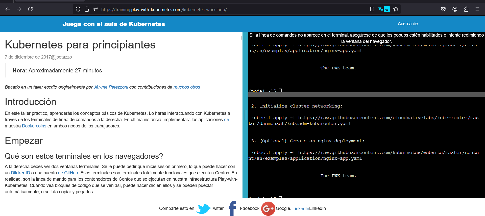

# Actividad Play with Kubernetes

## ☝️Objetivos:

- Comprender los conceptos básicos de contenedores como Docker y su orquestación a gran escala.
- Utilizar Kubernetes para desplegar y gestionar aplicaciones en múltiples nodos de un clúster.
- Aprender a diseñar aplicaciones que escalen horizontalmente y manejen fallos de manera eficiente.
- Familiarizarse con prácticas de Infraestructura como Código (IaC) para gestionar configuraciones de forma reproducible y automatizada.
- Integrar prácticas de DevOps para mejorar la colaboración y eficiencia en el desarrollo y operación de software.

Play with Kubernetes Classroom es una plataforma de Docker que permite obtener experiencia práctica con Kubernetes de forma accesible y eficiente, directamente desde el navegador, sin necesidad de instalar software adicional. El taller en "Play with Kubernetes Classroom" guía a los usuarios a través de módulos que abarcan tanto los conceptos básicos como los avanzados de Kubernetes. Para una comprensión completa de Kubernetes en esta actividad realizare el laboratorio de Kubernetes Hands-on Workshop. el cual se encuentra en la siguiente pagina: [https://training.play-with-kubernetes.com/kubernetes-workshop/](https://training.play-with-kubernetes.com/kubernetes-workshop/)

# ⚠️Observaciones

🔴Algunos comandos del laboratorio no se ejecutaron correctamente. Para abordar esto, he explicado las razones detrás de estos problemas utilizando las salidas de las consolas como evidencia. 

🔴Debido a que algunas salidas son extensas y no son legibles en una simple captura de pantalla, las he mostrado en formato de código en el archivo README.

Nos dirigimos al laboratorio Kubernets for begiineners: [link del laboratorio](https://training.play-with-kubernetes.com/kubernetes-workshop/)



# ✅Introduccion

En este taller práctico, exploraremos los fundamentos de Kubernetes mediante la interacción con la plataforma a través de la línea de comandos. También desplegaremos la aplicación de ejemplo Dockercoins en dos nodos de trabajo: **nodo1 y nodo2**.

# ✅Primeros Pasos

¿Qué son estos terminales en el navegador?

En el panel derecho, tengo abiertas dos terminales. Inicié sesión utilizando el comando docker login, ingresando con mi Docker ID o una cuenta de GitHub. Ambos terminales están completamente operativos. Cuando encuentro bloques de código, puedo interactuar con ellos haciendo clic para autocompletarlos o copiándolos y pegándolos. Ahora ejecuté el comando ls y noté que existe un archivo llamado anaconda-ks.cfg.

```bash
ls
```


## ✅**Paso1 : Iniciar el Clúster**

Inicializamos el clúster en el primer terminal:

```bash
kubeadm init --apiserver-advertise-address $(hostname -i)
```


```bash
Your Kubernetes control-plane has initialized successfully!

To start using your cluster, you need to run the following as a regular user:

  mkdir -p $HOME/.kube
  sudo cp -i /etc/kubernetes/admin.conf $HOME/.kube/config
  sudo chown $(id -u):$(id -g) $HOME/.kube/config

Alternatively, if you are the root user, you can run:

  export KUBECONFIG=/etc/kubernetes/admin.conf

You should now deploy a pod network to the cluster.
Run "kubectl apply -f [podnetwork].yaml" with one of the options listed at:
  https://kubernetes.io/docs/concepts/cluster-administration/addons/

Then you can join any number of worker nodes by running the following on each as root:

kubeadm join 192.168.0.18:6443 --token nk8zwv.hxgo3xb7odfhtpwf \
        --discovery-token-ca-cert-hash sha256:68b75f61d5e5eaee2a58e237a57c5608c49ff0903b139cd22a2cadcf30ecf22c 
Waiting for api server to startup
Warning: resource daemonsets/kube-proxy is missing the kubectl.kubernetes.io/last-applied-configuration annotation which is required by kubectl apply. kubectl apply should only be used on resources created declaratively by either kubectl create --save-config or kubectl apply. The missing annotation will be patched automatically.
daemonset.apps/kube-proxy configured
No resources 
```

👉 Utilizo el comando `kubeadm init --apiserver-advertise-address $(hostname -i)` para inicializar un nodo maestro en un clúster de Kubernetes, configurando la dirección IP anunciada del servidor API.

Copio toda la línea que comienza con `kubeadm join` del primer terminal y lo pego en el segundo terminal.

```bash
kubeadm join 192.168.0.18:6443 --token nk8zwv.hxgo3xb7odfhtpwf \
        --discovery-token-ca-cert-hash sha256:68b75f61d5e5eaee2a58e237a57c5608c49ff0903b139cd22a2cadcf30ecf22c 
```

Se nos mostrara como salida :


```bash
Initializing machine ID from random generator.
W0702 20:21:54.146831    4804 initconfiguration.go:120] Usage of CRI endpoints without URL scheme is deprecated and can cause kubelet errors in the future. Automatically prepending scheme "unix" to the "criSocket" with value "/run/docker/containerd/containerd.sock". Please update your configuration!
[preflight] Running pre-flight checks
        [WARNING Swap]: swap is enabled; production deployments should disable swap unless testing the NodeSwap feature gate of the kubelet
[preflight] The system verification failed. Printing the output from the verification:
KERNEL_VERSION: 4.4.0-210-generic
OS: Linux
CGROUPS_CPU: enabled
CGROUPS_CPUACCT: enabled
CGROUPS_CPUSET: enabled
CGROUPS_DEVICES: enabled
CGROUPS_FREEZER: enabled
CGROUPS_MEMORY: enabled
CGROUPS_PIDS: enabled
CGROUPS_HUGETLB: enabled
CGROUPS_BLKIO: enabled
        [WARNING SystemVerification]: failed to parse kernel config: unable to load kernel module: "configs", output: "", err: exit status 1
        [WARNING FileContent--proc-sys-net-bridge-bridge-nf-call-iptables]: /proc/sys/net/bridge/bridge-nf-call-iptables does not exist
[preflight] Reading configuration from the cluster...
[preflight] FYI: You can look at this config file with 'kubectl -n kube-system get cm kubeadm-config -o yaml'
[kubelet-start] Writing kubelet configuration to file "/var/lib/kubelet/config.yaml"
[kubelet-start] Writing kubelet environment file with flags to file "/var/lib/kubelet/kubeadm-flags.env"
[kubelet-start] Starting the kubelet
[kubelet-start] Waiting for the kubelet to perform the TLS Bootstrap...

This node has joined the cluster:
* Certificate signing request was sent to apiserver and a response was received.
* The Kubelet was informed of the new secure connection details.

Run 'kubectl get nodes' on the control-plane to see this node join the cluster.

[node2 ~]$ 
```

👉 Durante la inicialización, se genera un ID de máquina aleatorio. Se muestra una advertencia sobre el uso obsoleto de los puntos finales de CRI sin un esquema de URL, que ahora se corrige automáticamente al añadir "unix" al valor de "criSocket". Se realizan comprobaciones previas al vuelo y se advierte sobre la activación del intercambio de memoria, que debe desactivarse en entornos de producción a menos que se esté probando la función NodeSwap del kubelet. Una vez completado el proceso, se informa que este nodo se ha unido al clúster y se puede verificar su inclusión ejecutando `kubectl get nodes` en el plano de control.

Esto indica que estamos casi listos. Finalmente, vamos a inicializar la red de mi clúster en el primer terminal.

```bash
kubectl apply -n kube-system -f "https://cloud.weave.works/k8s/net?k8s-version=$(kubectl version | base64 | tr -d '\n')"
```

Al ejecutar este comando en la terminal del **nodo 1** obtengo la siguiente salida:


👉La salida del comando `kubectl apply` intenta configurar Weave Net en Kubernetes, específicamente en el espacio de nombres kube-system. Sin embargo, el proceso no se completa debido a un problema de conexión con el servidor de Kubernetes. El error "Unable to connect to the server" indica que Kubernetes no pudo resolver la dirección cloud.weave.works, probablemente debido a un fallo en la resolución DNS dentro del entorno de Kubernetes en el nodo node1. No pude resolver este problema, pero aún así explicaré lo que se esperaría obtener al ejecutar ese comando según lo proporcionado en el taller.

Tenemos que ver una salida como esta:

```bash
kubectl apply -n kube-system -f \
  >     "https://cloud.weave.works/k8s/net?k8s-version=$(kubectl version | base64 |tr -d '\n')"
  serviceaccount "weave-net" created
  clusterrole "weave-net" created
  clusterrolebinding "weave-net" created
  role "weave-net" created
  rolebinding "weave-net" created
  daemonset "weave-net" created
```

👉 El comando `kubectl apply` se emplea para implementar la configuración de Weave Net en el espacio de nombres kube-system, obtenida dinámicamente desde [https://cloud.weave.works/k8s/net](https://cloud.weave.works/k8s/net). Este URL incluye el parámetro `k8s-version`, el cual se genera codificando en base64 la versión de Kubernetes utilizando `kubectl version`. Los recursos necesarios para Weave Net, como serviceaccounts, clusterroles, clusterrolebindings, roles, rolebindings y un daemonset específico, han sido creados satisfactoriamente.

## ❓**¿Qué es esta aplicación?**

La aplicaicon DockerCoins funciona de la aiguietne manera:

- el trabajador solicita al rng que genere algunos bytes aleatorios
- el trabajador alimenta estos bytes al hasher y repite el proceso indefinidamente
- cada segundo, el trabajador actualiza redis para indicar cuántos bucles se han completado
- la interfaz web consulta redis, calcula y muestra la "velocidad de hash" en tu navegador

👉 DockerCoins utiliza un trabajador que solicita al generador de números aleatorios (rng) que cree bytes aleatorios. Estos bytes son procesados por un hasher en un ciclo continuo. Cada segundo, el trabajador actualiza Redis con el número de ciclos completados. Después, una interfaz web consulta Redis, calcula y muestra la velocidad de hash en el navegador del usuario.

## ✅**Obtener el código fuente de la aplicación**

El taller tiene una aplicación de ejemplo para partes del taller. La aplicación está en el repositorio `dockercoins`.


👉 El comando `git clone` se utiliza para copiar un repositorio Git desde la URL especificada. En este caso, se está clonando el repositorio dockercoins desde [https://github.com/dockersamples/dockercoins](https://github.com/dockersamples/dockercoins). Durante la ejecución, se muestra el progreso del clonado, que incluye la enumeración de objetos, el conteo y la compresión de objetos, seguido de la recepción exitosa de los objetos.

## ✅**Ejecutar la aplicación**

Voy al directorio `dockercoins` en el repositorio clonado:

```bash
cd ~/dockercoins
```


👉El comando `cd ~/dockercoins` se usa para mover el directorio actual del usuario a `dockercoins`, que se encuentra en su directorio personal (`~`). La salida indica que el directorio actual ha cambiado de `~/` (directorio personal) a `~/dockercoins/`, lo que confirma que ahora estás trabajando dentro del directorio `dockercoins` en el nodo node1.

Utilizo Compose para construir y ejecutar todos los contenedores:

```bash
docker-compose up
```


👉Cuando intento ejecutar `docker-compose up`, surge un problema con el contenedor `worker_1`, que no puede resolver el nombre `hasher` para establecer una conexión HTTP en el puerto 80. Este error indica dificultades en la resolución de nombres dentro de la red de contenedores. No he podido resolver este problema, por lo que continuaré con el taller basándome únicamente en las instrucciones proporcionadas para la ejecución de esta aplicación.

Docker Compose debería indicar a Docker que construya todas las imágenes de contenedor (descargando las imágenes base necesarias), luego iniciar todos los contenedores y mostrar los registros combinados.

## ✅**Generación de muchos registros**

La aplicación debería estar generando registros continuamente. En estos registros, debería ver cómo el servicio de trabajador realiza solicitudes al generador de números aleatorios (**rng**) y al **hasher**. Para mantener la vista principal organizada y evitar saturarla, encuentro útil ejecutar estos procesos en segundo plano.

## ✅**Conexión a la interfaz web**

El contenedor de la interfaz web debe ofrecerme un panel de control accesible. Para verlo, solo necesito abrir un navegador web y conectarme al nodo1 en el puerto 8000, que se configuró al ejecutar la aplicación.

## ✅**Limpieza**

Antes de continuar, apaguemos todo presionando **Ctrl-C.**


## 📚**Conceptos de Kubernetes**

Kubernetes es un sistema de gestión de contenedores que ejecuto y administro aplicaciones en contenedores dentro de mi clúster. Esto significa que Kubernetes me proporciona una plataforma sólida para escalar, gestionar y mantener aplicaciones distribuidas en entornos de producción. Me permite automatizar el despliegue, la escalabilidad y la gestión de recursos de mis aplicaciones, asegurando que funcionen de manera eficiente y confiable en todo momento.

## **Cosas básicas podemos pedirle a Kubernetes que haga**

- Podemos instruir a Kubernetes para llevar a cabo tareas esenciales como iniciar 5 contenedores utilizando la imagen `atseashop/api:v1.3` y establecer un balanceador de carga interno para gestionar el tráfico hacia estos contenedores.
- También podemos iniciar 10 contenedores utilizando la imagen `atseashop/webfront.:v1.3` y configurar un balanceador de carga público para distribuir las solicitudes entrantes.
- En días de alto tráfico, como durante el Black Friday o la Navidad, podemos escalar nuestro clúster agregando más contenedores. Además, podemos actualizar a una nueva versión reemplazando los contenedores existentes con la imagen `atseashop/webfront:v1.4`, asegurando que el procesamiento de solicitudes continúe sin interrupciones al actualizar los contenedores uno a uno.

## **Otras cosas que Kubernetes puede hacer por nosotros**

- Kubernetes ofrece varias funcionalidades adicionales, como el autoscaling básico que ajusta automáticamente los recursos según la demanda.
- También permite implementar despliegues blue/green y canarios para lanzar nuevas versiones de aplicaciones de manera controlada y segura. Facilita la ejecución de servicios de larga duración y trabajos por lotes, así como la optimización del clúster mediante la sobrecomisión y el desalojo de trabajos de baja prioridad para mejorar la eficiencia de los recursos.
- Además, Kubernetes es capaz de manejar servicios con datos persistentes, como bases de datos, y proporciona un control detallado de acceso para gestionar los permisos de usuarios en los recursos.
- Facilita la integración con servicios de terceros a través de un catálogo de servicios y permite la automatización de tareas complejas mediante operadores especializados.

## 👨‍💻**Arquitectura de Kubernetes**

La arquitectura de Kubernetes se fundamenta en un conjunto de servicios que conforman su "cerebro": el servidor de API, que actúa como el punto de entrada para todas las operaciones; servicios críticos como el scheduler y el controlador; y etcd, un almacén de datos clave/valor altamente disponible que sirve como la "base de datos" de Kubernetes. Estos servicios se agrupan para formar lo que se denomina el "master". Pueden ejecutarse directamente en un host o dentro de contenedores, y existe la opción de ejecutar etcd en máquinas separadas o en la misma infraestructura. Para asegurar la alta disponibilidad, es posible configurar más de un master, aunque al menos uno es necesario para las operaciones básicas.

### **Arquitectura de Kubernetes: los nodos**

Los nodos que alojan nuestros contenedores están equipados con varios servicios adicionales: un motor de contenedores (normalmente **Docker**), **kubelet** (el agente del nodo) y **kube-proxy** (un componente de red esencial pero no completo). Anteriormente, estos nodos solían llamarse **"minions"**. Es común evitar ejecutar aplicaciones en el nodo o nodos que también manejan componentes del master, excepto en entornos de desarrollo con clústeres pequeños.

## 👨‍💻**Recursos de Kubernetes**

La API de Kubernetes define una amplia gama de objetos conocidos como recursos, los cuales se organizan por tipo o **"Kind"** en la API. Entre los tipos de recursos más comunes se incluyen: **nodo** (una máquina física o virtual dentro del clúster), **pod** (un grupo de contenedores que se ejecutan conjuntamente en un nodo), **servicio** (un punto de acceso estable para conectarse a uno o varios contenedores), **namespace** (un grupo más o menos aislado de recursos), **secret** (un conjunto de datos sensibles destinados a ser utilizados por un contenedor), y muchos otros más. La lista completa de recursos disponibles se puede consultar utilizando el comando `kubectl get`.

## ⚔️**Declarativo vs imperativo**

En Kubernetes, se prefiere utilizar principalmente un enfoque declarativo. En este enfoque, se describe qué resultado se desea alcanzar sin especificar los pasos individuales para lograrlo. Por ejemplo, sería como decir *"Quiero una taza de té".* En contraste, el enfoque imperativo detalla los pasos específicos necesarios para alcanzar el objetivo, como *"Hierve agua, viértela en una tetera, añade hojas de té, deja reposar y sirve en una taza"*. El enfoque declarativo puede parecer más simple siempre que se conozcan los pasos requeridos para obtener el resultado deseado.

### ❓**¿Qué sería realmente declarativo?**

En el contexto de Kubernetes, adoptar un enfoque verdaderamente declarativo implica describir el resultado deseado sin detallar los pasos individuales para lograrlo. Por ejemplo, sería como decir *"Quiero una taza de té, preparada vertiendo una infusión de hojas de té en una taza. Para obtener la infusión, se deja reposar el objeto en agua caliente durante unos minutos. El agua caliente se obtiene vertiéndola en un recipiente adecuado y calentándola en una estufa".* Este método permite que Kubernetes automatice los procesos necesarios para alcanzar el estado deseado, asegurando coherencia y eficiencia en el despliegue y gestión de aplicaciones.

### 🐎Resumen

En Kubernetes, los sistemas imperativos se destacan por su simplicidad y la necesidad de reiniciar desde cero si una tarea se ve interrumpida. Por otro lado, los sistemas declarativos permiten recuperarse de interrupciones o de tareas incompletas al identificar lo que falta y ejecutar únicamente las acciones necesarias para alcanzar el estado deseado. Esto implica la capacidad crucial de observar el sistema y calcular una **"diferencia"** entre el estado actual y el estado deseado, garantizando así una gestión eficiente y adaptable de los recursos de la aplicación en Kubernetes.

### ⚔️**Declarativo vs imperativo en Kubernetes**

En Kubernetes, la mayoría de las configuraciones se definen a partir de una especificación. Al trabajar con archivos **YAML**, nos enfocamos en los campos de especificación que describen cómo queremos que sea el recurso. Kubernetes se encarga automáticamente de ajustar el estado actual del recurso conforme a la especificación mediante diversos controladores. Cuando necesitamos modificar algún recurso, simplemente actualizamos la especificación y Kubernetes se encarga de adaptar ese recurso según los nuevos parámetros definidos. Este enfoque posibilita una administración coherente y automatizada de los recursos en Kubernetes, simplificando la gestión y escalabilidad de las aplicaciones en entornos de producción.

## 💻**Modelo de red de Kubernetes**

En Kubernetes, nuestro clúster, formado por nodos y pods, funciona como una red IP plana unificada. Esto significa que todos los nodos deben poder comunicarse entre sí sin necesidad de NAT (traducción de direcciones de red), al igual que todos los pods entre sí y los pods con los nodos. Cada pod tiene conocimiento de su propia dirección IP sin necesidad de NAT. Kubernetes no prescribe una implementación específica para la red, lo que ofrece flexibilidad para configurar y optimizar la red según las necesidades del entorno y las aplicaciones desplegadas.

### **Modelo de red de Kubernetes: lo bueno**

En el modelo de red de Kubernetes, todos los componentes pueden comunicarse directamente entre sí sin necesidad de traducción de direcciones ni de puertos. Esto implica que los pods y los nodos pueden interactuar sin restricciones adicionales de protocolos. Sin embargo, es importante tener en cuenta que los pods no pueden conservar su dirección IP al moverse de un nodo a otro, y estas direcciones IP no necesariamente tienen que ser "portátiles" entre nodos. La especificación del modelo de red es lo suficientemente flexible como para admitir una variedad de implementaciones, lo que facilita la configuración y optimización de la red según los requisitos específicos del entorno y las aplicaciones desplegadas en Kubernetes.

### **Modelo de red de Kubernetes: lo menos bueno**

En el modelo de red de Kubernetes, aunque todos los componentes pueden comunicarse directamente entre sí, se necesitan políticas de red adicionales para asegurar la seguridad. Esto implica que la implementación de red utilizada debe ser compatible con estas políticas. Existen varias implementaciones disponibles (Kubernetes menciona 15 en su documentación), lo que puede hacer difícil elegir la más adecuada. Aunque el modelo parece ofrecer una red de nivel 3, en realidad proporciona características equivalentes a nivel 4, ya que la especificación requiere soporte para UDP y TCP pero no para rangos de puertos o paquetes IP arbitrarios. Además, kube-proxy, al estar en la trayectoria de los datos al conectarse a pods o contenedores, puede afectar el rendimiento debido a su dependencia de técnicas como proxying en userland o iptables.

### **Modelo de red de Kubernetes: en práctica**

En la práctica, hemos configurado nuestros nodos para utilizar Weave como solución de red sin un respaldo específico hacia esta elección, simplemente porque hemos encontrado que funciona bien para nuestras necesidades particulares. No hay necesidad de preocuparse por la advertencia sobre el rendimiento de kube-proxy, a menos que estemos constantemente saturando interfaces de red de 10G, manejando millones de paquetes por segundo, operando plataformas de VOIP o juegos de alto tráfico, o realizando operaciones especializadas que involucren millones de conexiones simultáneas. En esos casos, es probable que ya estemos familiarizados con la configuración avanzada del kernel para optimizar el rendimiento de la red en Kubernetes.

## **Primer contacto con kubectl**

Kubectl es la herramienta principal que utilizaremos para interactuar con Kubernetes. Es una potente utilidad de línea de comandos que simplifica el acceso y la administración a través de la API de Kubernetes. Todo lo que se puede realizar con kubectl también puede ejecutarse directamente mediante la API. Además, puedo configurar kubectl utilizando el flag `--kubeconfig` para especificar un archivo de configuración, o directamente usando flags como `--server`, `--user`, entre otros. La pronunciación de kubectl puede variar y comúnmente se la puede escuchar como **"Cube C T L"**, **"Cube cuttle"** o **"Cube cuddle"**, según la preferencia del usuario.

### **kubectl get**

Utilizo `kubectl get` para explorar los recursos de nodo en el clúster Kubernetes.


👉 Cuando ejecuto `kubectl get node`, veo una lista de nodos en el clúster Kubernetes. En este caso, los nodos node1 y node2 están etiquetados como "NotReady", lo que indica que no están completamente disponibles para ejecutar cargas de trabajo. Ambos nodos desempeñan el rol de "control-plane" y están ejecutando la versión v1.27.2 de Kubernetes.

Puedo obtener esta información de varias maneras equivalentes:

- `kubectl get no`
- `kubectl get nodes`


### **Obtención de salida en formato legible por máquina**

`kubectl get` me permite obtener resultados en formatos como JSON, YAML o formateados directamente:

Para información detallada de los nodos en formato ancho YAML:

```bash
kubectl get nodes -o wide
```


👉El comando proporciona una descripción completa de los nodos en el clúster, mostrando su estado actual, roles asignados, tiempo transcurrido desde su inicio, versión de Kubernetes, direcciones IP internas y externas, imagen del sistema operativo, versión del kernel y el entorno de ejecución de contenedores. Se observa que tanto el nodo `node1` como el `node2` están marcados como NotReady, con direcciones IP internas de `192.168.0.22` y `192.168.0.23` respectivamente, ejecutando CentOS Linux 7 y utilizando containerd como su runtime de contenedores.

Reviso la informacion de los nodos en el cluster en formato yaml:


```bash
[node1 ~]$ kubectl get no -o yaml
apiVersion: v1
items:
- apiVersion: v1
  kind: Node
  metadata:
    annotations:
      kubeadm.alpha.kubernetes.io/cri-socket: unix:///run/docker/containerd/containerd.sock
      node.alpha.kubernetes.io/ttl: "0"
      volumes.kubernetes.io/controller-managed-attach-detach: "true"
    creationTimestamp: "2024-07-03T02:32:50Z"
    labels:
      beta.kubernetes.io/arch: amd64
      beta.kubernetes.io/os: linux
      kubernetes.io/arch: amd64
      kubernetes.io/hostname: node1
      kubernetes.io/os: linux
      node-role.kubernetes.io/control-plane: ""
      node.kubernetes.io/exclude-from-external-load-balancers: ""
    name: node1
    resourceVersion: "800"
    uid: 3d2317d1-095a-475a-90e5-339fa0ecf42d
  spec:
    taints:
    - effect: NoSchedule
      key: node-role.kubernetes.io/control-plane
    - effect: NoSchedule
      key: node.kubernetes.io/not-ready
  status:
    addresses:
    - address: 192.168.0.22
      type: InternalIP
    - address: node1
      type: Hostname
    allocatable:
      cpu: "8"
      ephemeral-storage: 65504Mi
      hugepages-1Gi: "0"
      hugepages-2Mi: "0"
      memory: 32946972Ki
      pods: "110"
    capacity:
      cpu: "8"
      ephemeral-storage: 65504Mi
      hugepages-1Gi: "0"
      hugepages-2Mi: "0"
      memory: 32946972Ki
      pods: "110"
    conditions:
    - lastHeartbeatTime: "2024-07-03T02:37:46Z"
      lastTransitionTime: "2024-07-03T02:32:49Z"
      message: kubelet has sufficient memory available
      reason: KubeletHasSufficientMemory
      status: "False"
      type: MemoryPressure
    - lastHeartbeatTime: "2024-07-03T02:37:46Z"
      lastTransitionTime: "2024-07-03T02:32:49Z"
      message: kubelet has no disk pressure
      reason: KubeletHasNoDiskPressure
      status: "False"
      type: DiskPressure
    - lastHeartbeatTime: "2024-07-03T02:37:46Z"
      lastTransitionTime: "2024-07-03T02:32:49Z"
      message: kubelet has sufficient PID available
      reason: KubeletHasSufficientPID
      status: "False"
      type: PIDPressure
    - lastHeartbeatTime: "2024-07-03T02:37:46Z"
      lastTransitionTime: "2024-07-03T02:32:49Z"
      message: 'container runtime network not ready: NetworkReady=false reason:NetworkPluginNotReady
        message:Network plugin returns error: cni plugin not initialized'
      reason: KubeletNotReady
      status: "False"
      type: Ready
    daemonEndpoints:
      kubeletEndpoint:
        Port: 10250
    images:
    - names:
      - registry.k8s.io/etcd@sha256:51eae8381dcb1078289fa7b4f3df2630cdc18d09fb56f8e56b41c40e191d6c83
      - registry.k8s.io/etcd:3.5.7-0
      sizeBytes: 101639218
    - names:
      - registry.k8s.io/kube-apiserver@sha256:bbbc0eb287dbb7507948b1c05ac8f221d1a504e04572e61d4700ff18b2a3afd0
      - registry.k8s.io/kube-apiserver:v1.27.15
      sizeBytes: 34094789
    - names:
      - registry.k8s.io/kube-controller-manager@sha256:9ff408d91018df95a8505149e778bc7815b261ba8798497ae9319beb2b73304a
      - registry.k8s.io/kube-controller-manager:v1.27.15
      sizeBytes: 31536477
    - names:
      - registry.k8s.io/kube-proxy@sha256:23c54b01075318fe6991b224192faf6d65e9412b954b335efe326977deb30332
      - registry.k8s.io/kube-proxy:v1.27.15
      sizeBytes: 27495464
    - names:
      - registry.k8s.io/kube-scheduler@sha256:9a7746f46e126b23098a844b5e3df34ee44b14b666d540a1e92a21ca7bbaac99
      - registry.k8s.io/kube-scheduler:v1.27.15
      sizeBytes: 18124766
    - names:
      - registry.k8s.io/pause@sha256:7031c1b283388d2c2e09b57badb803c05ebed362dc88d84b480cc47f72a21097
      - registry.k8s.io/pause:3.9
      sizeBytes: 321520
    - names:
      - registry.k8s.io/pause@sha256:3d380ca8864549e74af4b29c10f9cb0956236dfb01c40ca076fb6c37253234db
      - registry.k8s.io/pause:3.6
      sizeBytes: 301773
    nodeInfo:
      architecture: amd64
      bootID: ddf52b2b-0a45-4aa1-a34d-c9f704ef0f0f
      containerRuntimeVersion: containerd://1.6.21
      kernelVersion: 4.4.0-210-generic
      kubeProxyVersion: v1.27.2
      kubeletVersion: v1.27.2
      machineID: 535f290836d14b56adc84e2e6447d691
      operatingSystem: linux
      osImage: CentOS Linux 7 (Core)
      systemUUID: 6E717E48-761F-6640-AA8F-878704CE72ED
- apiVersion: v1
  kind: Node
  metadata:
    annotations:
      kubeadm.alpha.kubernetes.io/cri-socket: /run/docker/containerd/containerd.sock
      node.alpha.kubernetes.io/ttl: "0"
      volumes.kubernetes.io/controller-managed-attach-detach: "true"
    creationTimestamp: "2024-07-03T02:33:10Z"
    labels:
      beta.kubernetes.io/arch: amd64
      beta.kubernetes.io/os: linux
      kubernetes.io/arch: amd64
      kubernetes.io/hostname: node2
      kubernetes.io/os: linux
    name: node2
    resourceVersion: "891"
    uid: 2485971c-5e95-4318-b0ee-12e1341c727b
  spec:
    taints:
    - effect: NoSchedule
      key: node.kubernetes.io/not-ready
  status:
    addresses:
    - address: 192.168.0.23
      type: InternalIP
    - address: node2
      type: Hostname
    allocatable:
      cpu: "8"
      ephemeral-storage: 65504Mi
      hugepages-1Gi: "0"
      hugepages-2Mi: "0"
      memory: 32946972Ki
      pods: "110"
    capacity:
      cpu: "8"
      ephemeral-storage: 65504Mi
      hugepages-1Gi: "0"
      hugepages-2Mi: "0"
      memory: 32946972Ki
      pods: "110"
    conditions:
    - lastHeartbeatTime: "2024-07-03T02:38:47Z"
      lastTransitionTime: "2024-07-03T02:33:10Z"
      message: kubelet has sufficient memory available
      reason: KubeletHasSufficientMemory
      status: "False"
      type: MemoryPressure
    - lastHeartbeatTime: "2024-07-03T02:38:47Z"
      lastTransitionTime: "2024-07-03T02:33:10Z"
      message: kubelet has no disk pressure
      reason: KubeletHasNoDiskPressure
      status: "False"
      type: DiskPressure
    - lastHeartbeatTime: "2024-07-03T02:38:47Z"
      lastTransitionTime: "2024-07-03T02:33:10Z"
      message: kubelet has sufficient PID available
      reason: KubeletHasSufficientPID
      status: "False"
      type: PIDPressure
    - lastHeartbeatTime: "2024-07-03T02:38:47Z"
      lastTransitionTime: "2024-07-03T02:33:10Z"
      message: 'container runtime network not ready: NetworkReady=false reason:NetworkPluginNotReady
        message:Network plugin returns error: cni plugin not initialized'
      reason: KubeletNotReady
      status: "False"
      type: Ready
    daemonEndpoints:
      kubeletEndpoint:
        Port: 10250
    images:
    - names:
      - registry.k8s.io/kube-proxy@sha256:23c54b01075318fe6991b224192faf6d65e9412b954b335efe326977deb30332
      - registry.k8s.io/kube-proxy:v1.27.15
      sizeBytes: 27495464
    - names:
      - registry.k8s.io/pause@sha256:3d380ca8864549e74af4b29c10f9cb0956236dfb01c40ca076fb6c37253234db
      - registry.k8s.io/pause:3.6
      sizeBytes: 301773
    nodeInfo:
      architecture: amd64
      bootID: ddf52b2b-0a45-4aa1-a34d-c9f704ef0f0f
      containerRuntimeVersion: containerd://1.6.21
      kernelVersion: 4.4.0-210-generic
      kubeProxyVersion: v1.27.2
      kubeletVersion: v1.27.2
      machineID: b3385e01068743c993f2d70f39c625a2
      operatingSystem: linux
      osImage: CentOS Linux 7 (Core)
      systemUUID: 6E717E48-761F-6640-AA8F-878704CE72ED
kind: List
metadata:
  resourceVersion: ""
[node1 ~]$ 
```

👉Cuando uso el comando `kubectl get no -o yaml`, obtengo la información detallada de los nodos en el clúster en formato YAML. Este comando despliega todos los metadatos, anotaciones y configuraciones de cada nodo. Por ejemplo, el resultado muestra la versión de la API, el tipo de recurso (Node), y las anotaciones específicas del nodo.

### **Uso de jq con kubectl**

Es posible generar informes personalizados utilizando `kubectl` en combinación con `jq`. Por ejemplo, para mostrar la capacidad de todos los nodos como objetos JSON:

```bash
kubectl get nodes -o json | jq ".items[] | {name:.metadata.name} + .status.capacity"
```

```bash
[node1 ~]$ kubectl get nodes -o json |
>       jq ".items[] | {name:.metadata.name} + .status.capacity"
{
  "name": "node1",
  "cpu": "8",
  "ephemeral-storage": "65504Mi",
  "hugepages-1Gi": "0",
  "hugepages-2Mi": "0",
  "memory": "32946972Ki",
  "pods": "110"
}
{
  "name": "node2",
  "cpu": "8",
  "ephemeral-storage": "65504Mi",
  "hugepages-1Gi": "0",
  "hugepages-2Mi": "0",
  "memory": "32946972Ki",
  "pods": "110"
}
[node1 ~]$ 
```

👉Cuando ejecuto `kubectl get nodes -o json | jq ".items[] | {name:.metadata.name} + .status.capacity"`, obtengo información en formato JSON sobre los nodos en el clúster y la proceso con jq para extraer y mostrar el nombre del nodo junto con su capacidad. El resultado indica que los nodos node1 y node2 tienen 8 CPUs, 65504Mi de almacenamiento efímero, y así sucesivamente.

### **Exploración de recursos disponibles**

`kubectl` ofrece facilidades de introspección para listar todos los tipos de recursos disponibles y ver detalles específicos de un recurso:

- Listar todos los tipos de recursos:
    
    ```bash
    kubectl get
    ```
    
- Ver detalles de un recurso:
    
    ```bash
    kubectl describe type/name
    kubectl describe type name
    ```
    
- Ver la definición de un tipo de recurso:
    
    ```bash
    kubectl explain type
    ```
    

### **Servicios en Kubernetes**

Un servicio en Kubernetes proporciona un punto de acceso consistente para conectarse con otros componentes. Para ver la lista de servicios en nuestro clúster:

```bash
kubectl get services
```


Otra forma de hacerlo

```bash
kubectl get svc
```


👉 Ambos comandos muestran los servicios en el clúster de Kubernetes. En este caso, hay un servicio llamado `kubernetes` de tipo `ClusterIP` con la IP `10.96.0.1`, sin una IP externa asignada, que está escuchando en el puerto 443/TCP y ha estado activo durante 20 minutos.

### **Servicios ClusterIP**

Los servicios ClusterIP son internos y están disponibles solo dentro del clúster, siendo útiles para la introspección desde los contenedores.

Intento conectar al API con ClusterIP

```bash
curl -k https://10.96.0.1
```


👉Al ejecutar el comando `curl -k <https://10.96.0.1`>, intento acceder al servicio de Kubernetes utilizando la IP del clúster. La respuesta es un mensaje de error en formato JSON que indica que el acceso está prohibido.

### **Listado de contenedores en ejecución**

Los contenedores son gestionados mediante pods, que son conjuntos de contenedores que comparten recursos. Para enumerar los pods en nuestro conjunto:

```bash
kubectl get pods
```


👉El resultado del comando `kubectl get pods` indica que no hay recursos disponibles, es decir, que no hay pods actualmente en el espacio de nombres predeterminado de Kubernetes.

### **Namespaces**

Los namespaces facilitan la separación de recursos. Para mostrar una lista de los namespaces en el clúster:

```bash
kubectl get namespaces
```


```bash
kubectl get ns
```


👉Ambos comandos muestran una lista de namespaces en el clúster de Kubernetes. Indican que los namespaces default, kube-node-lease, kube-public y kube-system están activos y tienen una antigüedad de 25 minutos.

### **Acceso a namespaces**

Podemos cambiar al namespace deseado usando la opción `-n`:

```bash
kubectl -n kube-system get pods
```


👉El comando indica el estado actual de los pods dentro del namespace `kube-system`. Los pods `coredns-5d78c9869d-j2vmr` y `coredns-5d78c9869d-pfwcb` están en estado pendiente. Mientras tanto, otros pods críticos como `etcd-node1`, `kube-apiserver-node1`, `kube-controller-manager-node1`, `kube-proxy-9dqgb`, `kube-proxy-gdsnw` y `kube-scheduler-node1` están en ejecución sin reinicios y han estado activos durante los últimos 11 minutos.

### **Componentes en los pods**

Los pods incluyen varios componentes esenciales como `etcd`, `kube-apiserver`, `kube-controller-manager`, `kube-scheduler`, `kube-dns`, `kube-proxy`, y `weave`.

### **Ejecución de nuestro primer pod en Kubernetes**

Para lanzar un pod inicial y confirmar los recursos creados.

```bash
kubectl run pingpong --image alpine ping 8.8.8.8
```


👉El comando ha generado un pod llamado `pingpong` utilizando la imagen alpine, que ejecuta el comando ping dirigido a la dirección IP `8.8.8.8`. El pod `pingpong` se ha creado con éxito.

### **Detrás de kubectl run**

El comando `kubectl run` crea varios recursos como deployment (`deploy/pingpong`), replica set (`rs/pingpong-xxxx`), y pod (`po/pingpong-yyyy`).

Enumero la mayoría de los tipos de recursos:

```bash
kubectl get all
```


👉Intenté mostrar los registros del deployment llamado `pingpong`, pero recibí un error que indicaba que el deployment no se encontraba en el clúster.

### **¿Qué son estas cosas diferentes?**

Un **Deployment** en Kubernetes es una entidad de nivel superior diseñada para facilitar el escalado, las actualizaciones continuas y los retrocesos de aplicaciones. Puede delegar la gestión de los pods a conjuntos de réplicas (Replica Sets). Por otro lado, un Replica Set es un componente de nivel inferior que asegura que un número específico de pods idénticos esté en ejecución y facilita el escalado horizontal. El Replication Controller es su predecesor, pero ha quedado obsoleto en comparación con el Replica Set.

### **Nuestro despliegue pingpong**

Cuando uso `kubectl run`, estoy creando un Deployment llamado `pingpong`. Este Deployment genera un Replica Set (`rs/pingpong-xxxx`), el cual a su vez crea un pod (`po/pingpong-yyyy`). Estos elementos colaboran para escalar automáticamente, asegurar alta disponibilidad y facilitar actualizaciones continuas de la aplicación.

### **Visualización de la salida del contenedor**

Para visualizar la salida de un contenedor en Kubernetes, se utiliza el comando `kubectl logs`. Es posible especificar el nombre de un pod o utilizar un selector como deployment o replica set. Por omisión, este comando muestra los registros del primer contenedor dentro del pod.

```bash
kubectl logs deploy/pingpong
```


👉Intenté mostrar los registros del deployment llamado pingpong, pero recibí un error que indicaba que el deployment no se encontraba en el clúster.

### **Transmisión de registros en tiempo real**

Al igual que docker logs, kubectl logs incluye opciones como -f/--follow para observar registros en tiempo real y --tail para visualizar un número específico de líneas desde el final. Para ver los registros más recientes de manera continua, podemos utilizar kubectl logs --tail 1 --follow.

```bash
kubectl logs deploy/pingpong --tail 1 --follow
```


👉El comando intenta mostrar los registros del deployment llamado `pingpong`, solicitando únicamente la última línea y activando el seguimiento en tiempo real. No obstante, devuelve un error que indica que el deployment no se encontró en el clúster.

### **Escalado de nuestra aplicación**

Podemos ajustar la escala de los contenedores (o pods) utilizando `kubectl scale`. Por ejemplo, ejecutar `kubectl scale deploy/pingpong --replicas 8` incrementaría la cantidad de réplicas del `Deployment pingpong`.

```bash
kubectl scale deploy/pingpong --replicas 8
```


👉El comando intenta aumentar la escala del deployment llamado `pingpong` a 8 réplicas, pero muestra un error que indica que no se encontraron objetos válidos para realizar el escalado.

### **Resiliencia**

El `Deployment pingpong` monitorea su `Replica Set` para garantizar que el número adecuado de pods esté en funcionamiento. Si un pod desaparece, el sistema lo detectará y lo reemplazará automáticamente.

```bash
kubectl get pods -w
```


👉El comando se usa para verificar el estado actual de los pods en tiempo real en el clúster de Kubernetes. En esta situación, muestra un pod llamado `pingpong` que está en estado "Pending", lo cual indica que Kubernetes aún no ha podido asignar este pod a ningún nodo del clúster.

```bash
kubectl delete pod pingpong-yyyy
```


👉El comando intenta eliminar un pod específico llamado `pingpong-yyyy`. Sin embargo, el error "Error from server (NotFound): pods 'pingpong-yyyy' not found" indica que no se encontró ningún pod con ese nombre en el clúster de Kubernetes.

### **¿Qué pasa si queremos algo diferente?**

Si necesito ejecutar un contenedor de "uso único" que no se reinicie, puedo utilizar `kubectl run --restart=OnFailure` o `kubectl run --restart=Never`. Estos comandos crearían trabajos (Jobs) o pods en lugar de despliegues.

### **Visualización de registros de múltiples pods**

Cuando se menciona el nombre de un `Deployment`, `kubectl logs` visualiza los registros de un solo pod específico. Para acceder a los registros de varios pods, es necesario emplear un selector que utilice etiquetas. Por ejemplo, ejecutar `kubectl logs -l run=pingpong --tail 1` permitiría ver la última línea de registros de todos los pods etiquetados con `run=pingpong`.

```bash
kubectl logs -l run=pingpong --tail 1
```


👉Después de ejecutar el comando `kubectl logs -l run=pingpong --tail 1` y no obtener ningún resultado, esto podría indicar que no hay pods actualmente en ejecución que tengan la etiqueta específica `run=pingpong`.

### **Limpieza**

Para limpiar un despliegue, podemos eliminar con `kubectl delete deploy/pingpong`.

```bash
kubectl delete deploy/pingpong
```


👉Al intentar eliminar el deployment denominado "pingpong", se genera un error que indica que no se encontró el deployment con ese nombre. Esto podría deberse a que el deployment "pingpong" no existe en el namespace actual o que se ha especificado incorrectamente su nombre.

### **Exponiendo contenedores**

El comando `kubectl expose` crea un servicio para los pods existentes en Kubernetes, lo cual ofrece una dirección estable para conectarse a los pods. Se pueden utilizar diversos tipos de servicios como `ClusterIP`, `NodePort`, `LoadBalancer`, o `ExternalName` según los requisitos específicos de conectividad y acceso necesarios.

### **Ejecución de contenedores con puertos abiertos**

Para desplegar contenedores que requieren puertos abiertos en Kubernetes, como los de ElasticSearch, utilizo el comando `kubectl run` con la imagen específica y especifico el número de réplicas deseado. Puedo monitorear el estado de estos pods utilizando `kubectl get pods -w.`

### **Exponiendo nuestro despliegue**

Para habilitar el acceso a un despliegue, puedo crear un servicio ClusterIP por defecto utilizando `kubectl expose`. Por ejemplo, puedo exponer el puerto 9200 de la API HTTP de ElasticSearch utilizando el comando `kubectl expose deploy/elastic --port 9200`.

```bash
kubectl expose deploy/elastic --port 9200
```


👉El comando intenta exponer el servicio asociado al deployment denominado "elastic", pero devuelve un error que indica que no se encontró el deployment con ese nombre.

Dirección IP que se debio asignar:


👉El comando lista los servicios desplegados en el clúster actual de Kubernetes. En este caso, solo se muestra el servicio "**kubernetes**", el cual es utilizado internamente por Kubernetes para la comunicación entre sus componentes.

### **Los servicios son constructos de capa 4**

Puedo configurar direcciones IP para los servicios, pero estos siguen estando definidos por capa 4, lo que implica que un servicio no se reduce únicamente a una dirección IP; también incluye un protocolo específico y un puerto. Esta limitación se debe a cómo está implementado kube-proxy actualmente, utilizando mecanismos que no permiten operar a nivel de capa 3. Por lo tanto, necesito especificar el número de puerto para mi servicio.

### **Probando nuestro servicio**

Envio algunas solicitudes HTTP a los pods de ElasticSearch:

```bash
IP=$(kubectl get svc elastic -o go-template --template '{{ .spec.clusterIP }}')
```


👉El comando trató de obtener detalles del servicio llamado "elastic" en el clúster Kubernetes, pero recibió un error que indica que el servicio no pudo ser encontrado. Esto sugiere que actualmente no hay un servicio llamado "elastic" desplegado en el namespace o contexto de Kubernetes desde donde se ejecutó el comando.

Trato de enviar algunas solicitudes:

```bash
curl http://$IP:9200/
```


👉El comando trata de realizar una solicitud HTTP a la dirección IP especificada en el entorno de Kubernetes, pero devuelve un error que indica que no se pudo encontrar el servidor host.

### **Limpieza**

Termino con el despliegue de ElasticSearch, así que voy a limpiarlo:

```bash
kubectl delete deploy/elastic
```


👉El comando intentó eliminar el despliegue llamado "elastic", pero recibió un error que indica que no se encontró ningún despliegue con ese nombre.

## **Nuestra aplicación en Kubernetes**

**¿Qué se tiene planeado?**

En esta parte, vamos a:

- Construir imágenes para la aplicación,
- Publicar estas imágenes en un registro,
- Ejecutar despliegues utilizando estas imágenes,
- Exponer estos despliegues para que puedan comunicarse entre sí,
- Exponer la interfaz web para acceder desde fuera.

**El plan**

1. Construir en nuestro nodo de control (node1),
2. Etiquetar las imágenes para que se nombren como $USERNAME/servicename,
3. Subirlas a Docker Hub,
4. Crear despliegues utilizando las imágenes,
5. Exponer (con un ClusterIP) los servicios que necesitan comunicarse,
6. Exponer (con un NodePort) la interfaz web.

### **Configuración**

En mi primer terminal, voy a configurar una variable de entorno para mi nombre de usuario de Docker Hub. Antes, debo asegurarme de estar ubicado en el directorio dockercoins.

```bash
export USERNAME=TU_USUARIO
pwd
```


👉El comando establece una variable de entorno llamada USERNAME con el valor "andrewrubel". Esta variable estará disponible para cualquier comando o script que se ejecute en esa sesión de terminal, permitiendo que el valor "andrewrubel" sea utilizado como referencia en diversas operaciones dentro del entorno de trabajo actual.


👉El comando pwd me muestra la ruta completa del directorio actual en el que me encuentro actualmente. En este caso, el resultado indica que el directorio actual es /root, que es el directorio raíz del usuario root.

### **Una nota sobre los registros**

Para este taller, usare Docker Hub. También hay otras opciones, como Docker Trusted Registry y Docker Open Source Registry.

### **Docker Hub**

Docker Hub es el registro predeterminado para Docker. Los nombres de imagen en Docker Hub siguen el formato `$USERNAME/$IMAGENAME` o `$ORGANIZATIONNAME/$IMAGENAME`.

Para utilizar Docker Hub, es necesario tener una cuenta. Después, se debe ejecutar el comando `docker login` en el terminal e iniciar sesión con el nombre de usuario y la contraseña de la cuenta de Docker Hub.


👉Cuando ejecuté el comando docker login, inicié sesión con mi Docker ID para poder descargar y subir imágenes desde Docker Hub. Proporcioné mi nombre de usuario y contraseña cuando se me solicitó, y Docker validó estas credenciales correctamente.

### **Construcción y subida de nuestras imágenes**

Utilizare una función conveniente de Docker Compose. Voy al directorio `stacks`, construyo y subo las imágenes:

```bash
cd ~/dockercoins/stacks
docker-compose -f dockercoins.yml build
docker-compose -f dockercoins.yml push
```


👉Cuando se ejecutan estos comandos en el directorio actual (./), no se encuentra y muestra un error del tipo FileNotFoundError. Esto indica que el archivo YAML necesario para la configuración de Docker Compose no está presente en el directorio desde donde se está ejecutando el comando.

### **Despliegue de todas las cosas**

Ahora voy a tratar de desplegar el código (así como una instancia de redis). Despleguo redis y todo lo demás:

```bash
kubectl run redis --image=redis

for SERVICE in hasher rng webui worker; do
  kubectl run $SERVICE --image=$USERNAME/$SERVICE -l app=$SERVICE
done
```


👉Al ejecutar el comando, se despliega un nuevo pod en Kubernetes utilizando la imagen de Redis desde el registro de contenedores por defecto.


👉Al ejecutar estos comandos, se están creando varios pods en Kubernetes de manera automatizada.

### **¿Está funcionando?**

Después de esperar a que se complete el despliegue, reviso los registros. Utilizo `kubectl get deploy -w` para observar los eventos de despliegue y `kubectl logs` para revisar los registros de los pods "rng" y "worker".


👉Cuando intento obtener los registros de los despliegues "rng" y "worker" utilizando el comando `kubectl logs`, se genera un error que indica que los despliegues especificados no fueron encontrados.

### **Internamente**

Expongo cada despliegue, especificando el puerto correcto:

```bash
kubectl expose deployment redis --port 6379
kubectl expose deployment rng --port 80
kubectl expose deployment hasher --port 80
```


👉Cuando intenté exponer los despliegues de redis, rng y hasher utilizando el comando `kubectl expose deployment`, recibí un error que indicaba que los despliegues especificados no fueron encontrados.

### **¿Está funcionando ya?**

El worker tiene un bucle infinito que se reintentará cada 10 segundos después de un error. Transmite los registros del worker para verlo funcionar:

```bash
kubectl logs deploy/worker --follow
```


👉Al intentar ver los registros del despliegue llamado "worker" utilizando `kubectl logs deploy/worker --follow`, recibo un error que indica que no se encontró ese despliegue con ese nombre en el clúster de Kubernetes.

### **Para acceso externo**

Ahora quiero acceder a la interfaz web. La expondre con un NodePort. Creo un servicio NodePort para la interfaz web:

```bash
kubectl create service nodeport webui --tcp=80 --node-port=30001
```


👉Cuando ejecuto el comando, estoy creando un nuevo servicio en Kubernetes llamado "webui" de tipo NodePort. Este servicio expone el puerto 80 de los pods seleccionados mediante el selector por defecto, permitiendo acceder a ellos desde fuera del clúster a través del puerto 30001 en cada nodo del clúster.

Verificar que el puerto que fue asignado:


### **Acceso a la interfaz web**

Ahora se deberia conectar cualquier nodo al puerto asignado para ver la interfaz web.

### **Implicaciones de seguridad de kubectl apply**

Cuando utilizo `kubectl apply -f <URL>`, estoy creando recursos que pueden ser maliciosos. Por ejemplo, un despliegue podría:

- Iniciar mineros de Bitcoin en todo el clúster.
- Esconderse en un espacio de nombres no predeterminado.
- Montar enlaces al sistema de archivos de nuestros nodos.
- Insertar claves SSH en la cuenta raíz del nodo.
- Encriptar nuestros datos y hacerlos inaccesibles.

kubectl apply es el equivalente moderno de "curl | sh". Usar "curl | sh" es conveniente y seguro cuando se utilizan URLs HTTPS de fuentes confiables. Del mismo modo, `kubectl apply -f` también es conveniente y seguro bajo estas condiciones, pero introduce nuevos posibles puntos de fallo.

### **Escalando un despliegue**

Voy a empezar con algo sencillo: el despliegue del worker.

```bash
kubectl get pods
kubectl get deployments
kubectl scale deploy/worker --replicas=10
```


👉Cuando ejecuto el comando, indica que no se encontraron recursos en el namespace por defecto (default), lo que sugiere que no hay despliegues activos en este momento en ese namespace.

👉Al intentar escalar el deployment llamado "worker" a 10 réplicas utilizando el comando `kubectl scale`, se devuelve un error que indica "no objects passed to scale". Esto significa que el comando no pudo encontrar el despliegue llamado "worker" en el clúster Kubernetes.

Después de unos segundos, el gráfico en la interfaz web debería aparecer (y alcanzar hasta 10 hashes/segundo, igual que cuando estaba ejecutando en uno solo).

### **Daemon sets**

¿Qué sucede si deseo tener una instancia (y solo una) del pod "rng" por nodo? Si simplemente aumento la escala del despliegue "rng" a 2, no hay garantía de que se distribuyan adecuadamente. En lugar de utilizar un despliegue, optaré por un daemon set.

### **Creando un daemon set**

Desafortunadamente, a partir de Kubernetes 1.9, la CLI no puede crear daemon sets. Sin embargo, cualquier tipo de recurso siempre se puede crear proporcionando una descripción YAML:

```bash
kubectl apply -f foo.yaml
```

### **Creando el archivo YAML para nuestro daemon set**

Empiezo con el archivo YAML para el recurso `rng` actual.

```bash
kubectl get deploy/rng -o yaml --export > rng.yml
```


👉El comando intenta exportar la configuración del despliegue llamado "rng" a un archivo YAML llamado rng.yml. Sin embargo, se muestra un error de "unknown flag: --export", lo cual indica que la versión de kubectl utilizada no admite el flag --export en la operación kubectl get.

### **"Lanzar" un recurso a otro**

¿Qué pasa si simplemente cambio el campo `kind`?

```bash
vi rng.yml
```

Cambio `kind: Deployment` a `kind: DaemonSet`, guardo y salgo.

Intento crear mi nuevo recurso:

```bash
kubectl apply -f rng.yml
```


👉El comando trata de aplicar las configuraciones especificadas en el archivo YAML rng.yml, pero muestra un error que indica la ausencia de objetos para realizar la aplicación.

### **Usando el --force, Luke**

Puedo tratar de decirle Kubernetes que ignore estos errores y lo intente de todos modos.

```bash
kubectl apply -f rng.yml --validate=false
```


👉El comando intenta aplicar la configuración del archivo rng.yml al clúster Kubernetes, desactivando la validación de recursos. El mensaje de error "no objects passed to apply" indica que el archivo rng.yml no contiene ningún objeto válido de Kubernetes para aplicar.

### **Comprobando lo que hemos hecho**

¿Transforme el despliegue en un daemon set?

```bash
kubectl get all
```


👉El comando muestra el estado actual de todos los recursos desplegados en el clúster Kubernetes. En la salida se observa que varios pods (hasher, pingpong, redis, rng, webui, worker) están en estado "Pending", lo que indica que aún no han sido asignados a ningún nodo del clúster para su ejecución.

### **¿Qué están haciendo todos estos pods?**

Verifico los registros de todos estos pods `rng`. Todos estos pods tienen una etiqueta `run=rng`.

```bash
kubectl logs -l run=rng --tail 1
```


👉Intenté mostrar los registros del último contenedor que ejecutaba la etiqueta run=rng utilizando el comando. Sin embargo, en este caso, no se encontraron recursos en el espacio de nombres predeterminado que coincidieran con esa etiqueta. Esto sugiere que actualmente no hay ningún pod desplegado que tenga esa etiqueta específica.

### **Removiendo el primer pod del balanceador de carga**

¿Qué sucedería si elimino ese pod con `kubectl delete pod ...`?

- El replicaset lo recrearía inmediatamente.

¿Qué pasaría si elimino la etiqueta `run=rng` de ese pod?

- El replicaset lo recrearía inmediatamente.

Porque lo que importa para el replicaset es el número de pods que coinciden con ese selector.

### **Profundizando en los selectores**

Voy a ver los selectores para el despliegue `rng` y el replicaset asociado.

Muestro información detallada sobre el despliegue `rng`:

```bash
kubectl describe deploy rng
```


👉El comando intenta describir los detalles del despliegue llamado "rng", pero devuelve un error que indica que no se pudo encontrar ningún despliegue con ese nombre en el clúster.

Muestro información detallada sobre el replicaset `rng-yyyy`:

```bash
kubectl describe rs rng-yyyy
```


👉El comando intenta describir los detalles de un conjunto de réplicas con el nombre "rng-yyyy", pero muestra un error que indica que no se pudo encontrar ningún conjunto de réplicas con ese nombre en el clúster.

El selector del replicaset también debe tener un `pod-template-hash`, a diferencia de los pods en mi daemon set.

### **Actualizando un servicio a través de etiquetas y selectores**

¿Qué pasa si quiero quitar el despliegue `rng` del balanceador de carga?

Opción 1:

- Destruirlo.

Opción 2:

- Agregar una etiqueta adicional al daemon set
- Actualizar el selector del servicio para que se refiera a esa etiqueta.

**Agregar una etiqueta adicional al daemon set**

Voy a actualizar la especificación del daemon set.

Opción 1:

- Editar el archivo `rng.yml` que usamos antes.
- Cargar la nueva definición con `kubectl apply`.

Opción 2:

- Usar `kubectl edit`.

Actualizo el daemon set para agregar `isactive: "yes"` a la etiqueta del selector y de la plantilla:

```bash
kubectl edit daemonset rng
```


👉Intenté abrir y editar el daemonset llamado "rng" con el comando, pero recibí un error que dice que no se pudo encontrar ningún daemonset con ese nombre en el clúster actual.

```bash
kubectl edit service rng
```


👉El comando intenta abrir y editar el servicio llamado "rng", pero el error indica que no se pudo encontrar ningún servicio con ese nombre en el clúster actual.

### **Verificando lo que hemos hecho**

Verifico los registros de todos los pods `run=rng` para confirmar que solo 2 de ellos están activos ahora:

```bash
kubectl logs -l run=rng
```


👉El comando intenta mostrar los registros de los pods que tienen la etiqueta run=rng, pero no se encontraron recursos que coincidan con esa etiqueta en el espacio de nombres por defecto.

Los sellos de tiempo deberían darme una pista sobre cuántos pods están recibiendo tráfico actualmente.

Miro los pods que tengo ahora:

```bash
kubectl get pods
```


### **Recuperándonos de un despliegue fallido**

Podria empujar alguna imagen v0.3 (la lógica de reintentos del pod eventualmente lo imagenturará y el despliegue continuará) o podria invocar un rollback manual.

Cancelar el despliegue y esperar a que el polvo se asiente:

```bash
kubectl rollout undo deploy worker
kubectl rollout status deploy worker
```


👉El comando intenta deshacer un despliegue previo del deployment denominado "worker", pero arroja un error que indica que el deployment especificado no fue encontrado.

### **Cambiar parámetros de rollout**

Nuestros objetivos son los siguientes:

1. Retroceder a la versión v0.1.
2. Mantener una alta disponibilidad (siempre tener el número deseado de workers disponibles).
3. Implementar los cambios rápidamente (actualizar más de un pod a la vez).
4. Permitir que los workers se "calienten" un poco antes de continuar con más actualizaciones.

### **Aplicar cambios a través de un parche YAML**

Podría utilizar `kubectl edit deployment worker` para realizar los cambios directamente en el deployment. Alternativamente, podría usar `kubectl patch` con el YAML exacto que se mostró antes para aplicar los cambios de manera específica.

Una vez aplicados todos mis cambios, debo esperar a que surtan efecto.


👉Estoy intentando aplicar los recursos que están definidos en el archivo rng.yml, pero me encuentro con un error que indica que no se encontraron objetos válidos para aplicar en el archivo especificado.

## **Próximos pasos**

Bien, ¿cómo empiezo a containerizar mis aplicaciones?

Lista de verificación sugerida para la containerización:

- Crear un Dockerfile para cada servicio de la aplicación.
- Escribir Dockerfiles para los otros servicios que puedan ser compilados.
- Elaborar un archivo Compose que abarque toda la aplicación.
- Garantizar que los desarrolladores puedan ejecutar la aplicación en contenedores localmente.
- Establecer la automatización de la construcción de imágenes de contenedores desde el repositorio de código.
- Configurar un flujo de integración continua utilizando estas imágenes.
- Configurar un flujo de entrega continua para entornos de staging o QA utilizando estas imágenes.

### **Espacios de nombres (Namespaces)**

Los espacios de nombres me permiten ejecutar múltiples pilas idénticas lado a lado.

Por ejemplo, puedo tener dos espacios de nombres, como azul y verde, cada uno con su propio servicio redis.

Cada servicio redis en estos espacios de nombres tiene su propio ClusterIP.

kube-dns crea dos entradas, mapeando estas direcciones IP de ClusterIP:

- redis.blue.svc.cluster.local
- redis.green.svc.cluster.local

Los pods en el espacio de nombres azul obtienen un sufijo de búsqueda de blue.svc.cluster.local.

Por lo tanto, al resolver "redis" desde un pod en el espacio de nombres azul, se obtiene el redis que está "local" a ese espacio de nombres.

Sin embargo, esto no proporciona aislamiento. Esa sería la función de las políticas de red.

### **Servicios persistentes (databases, etc.)**

Como primer paso, es más prudente mantener los servicios persistentes fuera del clúster.

Existen varias soluciones para exponerlos a los pods:

1. Utilizar Servicios ExternalName (por ejemplo, redis.blue.svc.cluster.local se convierte en un registro CNAME).
2. Emplear Servicios ClusterIP con Endpoints explícitos en lugar de que Kubernetes genere los endpoints a partir de un selector.
3. Implementar Servicios Ambassador, que son proxies a nivel de aplicación capaces de proporcionar inyección de credenciales y otras funcionalidades adicionales.

### **Manejo del tráfico HTTP**

Los servicios son construcciones de capa 4.

HTTP es un protocolo de capa 7.

Es gestionado por ingresses (un recurso separado).

Los ingresses permiten:

- Enrutamiento virtual basado en hosts.
- Persistencia de sesión.
- Mapeo de URI.
- ¡Y muchas otras funcionalidades adicionales!

### **Registro y métricas**

El registro es gestionado por el motor de contenedores.

Las métricas suelen ser manejadas con Prometheus.

### **Manejo de la configuración de nuestras aplicaciones**

Dos recursos son especialmente útiles: secrets y config maps.

Estos recursos permiten proporcionar información arbitraria a nuestros contenedores.

Es crucial evitar almacenar la configuración dentro de las imágenes de los contenedores (aunque hay excepciones a esta regla, por lo general no es recomendable).

Nunca se debe almacenar información sensible en las imágenes de los contenedores, ya que esto equivale a tener contraseñas escritas en notas adhesivas en la pantalla.

### **Federación de clústeres**

La efectividad de Kubernetes se basa en el funcionamiento de etcd.

etcd opera con el protocolo Raft.

Raft sugiere mantener baja latencia entre los nodos.

**¿Qué pasa si el clúster se extiende a múltiples regiones?**

Debe implementarse en clústeres locales.

Unirlos en una federación de clústeres.

Sincronizar recursos entre los clústeres.

Descubrir recursos entre los clústeres.

### **Experiencia del desarrollador**

❓¿Cómo integras a un nuevo desarrollador?

✅Cuando se incorpora a un nuevo desarrollador al equipo, es crucial que configure Docker y Kubernetes en su máquina local para ejecutar la pila de desarrollo de manera consistente. Esto garantiza que todos los miembros del equipo trabajen en un entorno reproducible y uniforme. Además, es fundamental que el nuevo desarrollador se familiarice con los Dockerfiles y los archivos Compose, ya que esto facilita la comprensión de la estructura y la interacción de los servicios dentro del entorno Kubernetes.

❓¿Qué necesitan instalar para obtener una pila de desarrollo?

✅Para establecer una pila de desarrollo efectiva, los nuevos desarrolladores deben instalar varias herramientas esenciales. Esto incluye configurar Docker en sus máquinas para gestionar contenedores que alojen cada servicio de la aplicación. Además, es fundamental configurar un entorno local de Kubernetes utilizando herramientas como minikube o Docker Desktop, junto con kubectl para interactuar con el clúster Kubernetes local. Esta configuración permite a los desarrolladores ejecutar y probar la aplicación en un entorno que se asemeje al de producción, facilitando el desarrollo y la depuración de problemas antes de desplegar el código en entornos críticos.

❓¿Cómo se hace que un cambio de código pase de dev a producción?

✅Los cambios de código se trasladan de desarrollo a producción a través de un pipeline de CI meticulosamente configurado. Durante este proceso, el código se convierte en contenedores Docker y se somete a pruebas automatizadas para verificar su funcionalidad. Después de pasar exitosamente las pruebas en entornos de staging o QA, el pipeline de CD despliega automáticamente los contenedores probados en producción. Este enfoque controlado y automatizado minimiza el riesgo de fallos en producción y asegura que las nuevas versiones se desplieguen de manera segura y eficiente.

❓¿Cómo alguien añade un componente a una pila?

✅Incorporar un nuevo componente a la pila implica la creación de un Dockerfile para el servicio adicional y la actualización del archivo Compose correspondiente. Estos ajustes se integran en el pipeline de CI/CD, donde el nuevo componente se construye, prueba y despliega automáticamente en los entornos de desarrollo y producción. Este proceso garantiza que la integración del nuevo componente sea uniforme y eficaz, manteniendo la estabilidad del sistema mientras se amplía la infraestructura según sea necesario.