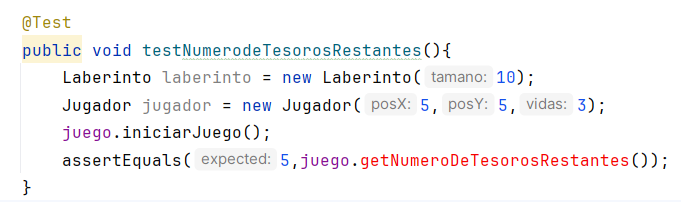

# Sprint 3

Empezamos con la **pregunta 1**

El cual nos pide lo siguiente:

**Descripción:** Implementa la funcionalidad para que el jugador pueda ver cuántos tesoros le faltan por recolectar.

Empezaremos creando la prueba para verificar al iniciar el juego, el número de tesoros restantes se muestra correctamente.

Ahora vamos a ejecutar la prueba

Como vemos la prueba no pasa por lo que ahora toca refactorizar el codigo de la clase `Juego` para hacer pasar la prueba.

Para lo cual haremos las siguientes modificaciones;

- Modificamos el metodo `verificarVictoriaODerrota()` para delegar la responsabilidad de contar la cantidad de tesoros al metodo `getNumeroDeTesorosRestantes()`.

Ahora ejecutaremos las pruebas que creamos para ver que si logramos hacerlas pasar sin haber roto nada.

 

Como vemos logramos hacer pasar las pruebas.

Ahora para implementar todo lo que hemos hecho y ejecutar el juego creamos una clase `Main`

Ejecutemos para ver como va el juego:

Ahora vamos con la **pregunta 2**

Calculamos el factor de acoplamiento (CF)

Observando el diagrama de dependecias tenemos que e es 5, a es 5 y n es 5

Entonces en la ecuacion CF = 5/5(5-1) = 0.25 → CF = 0.25

# LCOM

Para calcular el LCOM de cada Clase usaremos el codigo que se hizo en la actividad de Metricas de Calidad.

## Clase Juego

Primero empezamos calculando LCOM para la esta clase

Obtenemos un valor de LCOM = 6 lo cual nos dice que esta clase tiene una baja cohesion, ahora veamos para las otras.

## Clase Jugador

Calculemos el LCOM

Obtenemos un valor de LCOM = 9, la clase `Jugador` tiene una baja cohesion.

## Clase Laberinto

Calculemos su LCOM

Obtenemos un valor de LCOM = -2 por lo que la clase `Laberinto` tiene una alta cohesion.

## Clase Salidas

Calculemos su LCOM

Obtenemos un valor de LCOM = 4 por lo que la clase `Salidas` tiene un cohesion alta.

# LCOM 4

Ahora calcularemos el LCOM4 para cada una de las clases del juego del laberinto utilizando el codigo que se realizo en la actividad de Metricas de Calidad

## Clase Juego

Calculamos el LCOM 4 de la clase `Juego`

Vemos que nos da como resultado LCOM4 = 3, esto indica que la clase `Juego` tiene 3 componentes conectados independientes.

## Clase Jugador

Calculamos el LCOM4 de la clase `Jugador`

Vemos que nos da como resultado LCOM4 = 4, esto nos indica que la clase Jugador tiene 4 componentes conectados independientes por lo que hay niveles de separaciones que se pueden mejorar.

 

## Clase Laberinto

Calculamos el LCOM4 de la clase `Laberinto`

Vemos que nos da como resultado LCOM4 = 2, esto nos indica que la clase Jugador tiene 2 componentes conectados aunque no hay una cantidad excesiva de fragmentación, aún hay un nivel de separación que podría mejorarse.

La separación en dos componentes podría indicar que la clase tiene más de una responsabilidad, aunque no de manera tan crítica como en el caso de valores más altos de LCOM4.

## Clase Salidas

Calculamos el LCOM4 de la clase `Salidas`

Vemos que nos da como resultado LCOM4 = 3, esto nos indica que la clase Salidas tiene 3 componentes que están conectados internamente pero no entre sí, esto se puede mejorar con la refactorizacion. 

# CAMC

Ahora vamos a calcular el CAMC para cada uno de las clases

## Clase Juego

- Tipos de parámetros únicos por método:
• `procesarComandos()` utiliza **String** (1 tipo único)
• `getNumeroDeTesorosRestantes()` utiliza **int** (1 tipo único)
- Suma de tipos de parámetros únicos:
• 1(method1)+1(method2)=2
- Número total de métodos: 6
- Número máximo de parámetros por método: 1
Aplicando la fórmula:
CAMC=2/6 *1 =2/6 =0.333

Este valor nos indica una baja cohesion porque esta cercano a 0 los metodos podrian estar realizando funciones no relacionadas.

## Clase Jugador

- Tipos de parámetros únicos por método:
• `actualizarPos()` utiliza **Int** (1 tipo único)
• `mover()` utiliza **char** (1 tipo único)
    
    • `verificarTrampa()` utiliza **Celda** (1 tipo único)
    • `verificarColisiones()` utiliza **Celda** (1 tipo único)
    
    • `recogerTesaro()` utiliza **Celda** (1 tipo único)
    
- Suma de tipos de parámetros únicos:
• 1(method1)+1(method2)+1(method3)+1(method4)+1(method5)=5
- Número total de métodos: 6
- Número máximo de parámetros por método: 1
Aplicando la fórmula:
CAMC=5/6 *1 =5/6 =0.8333

Este valor nos indica alta cohesion debido a que esta cercano a 1, por lo que los metodos estan estrechamente relacionados en los tipos de datos que manejan. 

## Clase Laberinto

- Tipos de parámetros únicos por método:
• `colocarTesorosYTrampas()` utiliza **int** (1 tipo único)
• `colocarElemento()` utiliza **char, int y Random** (3 tipo único)
    
    • `actualizarCelda()` utiliza **char y int** (2 tipo único)
    
- Suma de tipos de parámetros únicos:
• 1(method1)+3(method2)+2(method3)=6
- Número total de métodos: 5
- Número máximo de parámetros por método: 3
Aplicando la fórmula:
CAMC=6/5 *3 =6/15 =0.4

Este valor nos indica una baja cohesion porque esta cercano a 0 los metodos de la clase `Laberinto` podrian estar realizando funciones no relacionadas.

## Clase Salidas

- Tipos de parámetros únicos por método:
• `permitirMovimiento()` utiliza **String** (1 tipo único)
- Suma de tipos de parámetros únicos:
• 1(method1)=1
- Número total de métodos: 5
- Número máximo de parámetros por método: 1
Aplicando la fórmula:
CAMC=1/5 *1 =6/15 =0.2

Este valor nos indica una muy baja cohesion porque esta cercano a 0 los metodos de la clase `Laberinto` podrian estar realizando funciones no relacionadas.