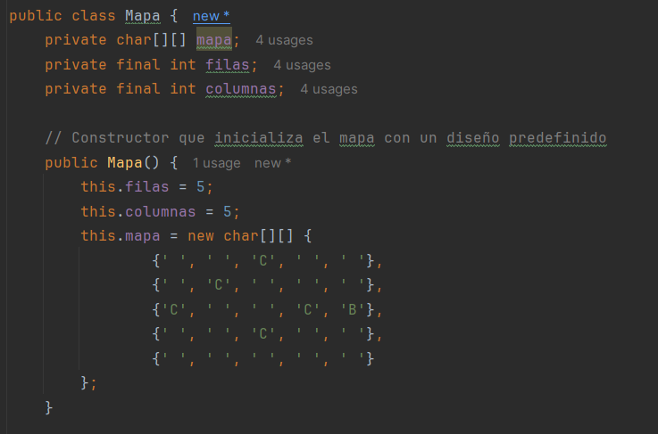

# Practica Calificada 4

Preguntas de Diseño e implementacion:

# Construimos la logica del Juego

Vamos construyendo clase por clase.

• ¿Cómo implementarías la clase Map para representar el mapa del juego, asegurando que se puedan agregar y verificar posiciones de torres y caminos?

# Clase Map

Empezamos creando los atributos y el constructor



Ahora creamos los metodos:


• Implementa un método en la clase Map llamado isValidPosition(int x, int y) que verifique si una posición es válida para colocar una torre.


Con este metodo implementado podemos refactorizar el metodo `insertarTower()`


Ahora vamos con la siguiente clase.

# Clase Enemy

Esta clase va a representar a los enemigos del Juego

Empezamos por crear los atributos y el constructor.


Ahora los Getters y setters


Ahora crearemos los metodos:


• Diseña e implementa una clase SpeedyEnemy que herede de Enemy y tenga una velocidad mayor pero menos vida.

Ahora crearemos clases derivadas para cada tipo de Enemigo


# Clase Tower

Empezaremos creando los atributos y el constructor.


Ahora crearemos los getters y setters


• ¿Cómo implementarías el método attack(List enemies) en la clase Tower para atacar a los enemigos dentro de su alcance?

Ahora crearemos los metodos 


• Implementa una clase SniperTower que tenga un daño alto y un alcance muy largo pero una velocidad de disparo baja.

Ahora creamos las clases derivadas para cada tipo de Torre:


# Clase Wave

Empezaremos creando los atributos y el constructor.


• ¿Cómo diseñarías la generación de oleadas para que cada oleada sea progresivamente más difícil?

Ahora creamos los metodos:


• Implementa un método en la clase Wave llamado spawnEnemies() que genere los enemigos de la oleada y los coloque en el mapa.


Para implementar este metodo tenemos que hacer una refactorizacion a las clases `Wave`, `Map` y `Enemy` 

En la clase `Wave` se añaden los siguientes atributos


Para la Clase `Map` se añade el siguiente metodo


Para la Clase `Enemy` se añaden los siguientes atributos y sus getters


Y el siguiente setter para devolver la posicion 


# Clase Player

Empezaremos creando los atributos y el constructor.


Ahora creamos los getters:


- ¿Cómo actualizarías la puntuación del jugador y la salud de la base cuando un enemigo es derrotado o alcanza la base?

Ahora creamos los metodos:


# Clase Game

Empezaremos creando los atributos y el constructor.


Ahora creamos los metodos:


Ahora creamos las Interfaces y clases de Mocking:

# Interfaz EnemyFactory

Creamos la interfaz


Creamos las clases:

## Clase BasicEnemyFactory


## Clase FastEnemyFactory


## Clase BossEnemyFactory


# Interfaz TowerFactory

Creamos la interfaz


## Clase CannonTowerFactory


## Clase LaserTowerFactory


## Clase ArrowTowerFactory


## Ejecucion:


# Implementacion de Pruebas

## Mocks

Primero hacemos la configuracion para poder usar Mockito


### Ejemplo de mock para la clase Enemy

En esta parte coloco el ejemplo usando Mocks para realizar el testing de la clase Enemy.

```java
public class EnemyTest {

    @Mock
    private Enemy ejemploMockEnemy;

    @BeforeEach
    public void setUp() {
        MockitoAnnotations.openMocks(this);
        ejemploMockEnemy = mock(Enemy.class);
    }

    @Test
    public void testReceiveDamage() {
        // Configuro el mock para devolver una salud inicial de 100
        when(ejemploMockEnemy.getHealth()).thenReturn(100);

        // Verifico la salud inicial del mock
        assertEquals(100, ejemploMockEnemy.getHealth());

        // Aplico daño al mock
        ejemploMockEnemy.receiveDamage(20);

        // Configuro el mock para devolver una salud actualizada después del daño
        when(ejemploMockEnemy.getHealth()).thenReturn(80);

        // Verifico la salud después de recibir daño
        assertEquals(80, ejemploMockEnemy.getHealth());

        // Aplico más daño al mock
        ejemploMockEnemy.receiveDamage(80);

        // Configuro el mock para devolver una salud actualizada después del daño adicional
        when(ejemploMockEnemy.getHealth()).thenReturn(0);

        // Verifico la salud después de recibir más daño
        assertEquals(0, ejemploMockEnemy.getHealth());
    }

    @Test
    public void testIsDefeated() {
        // Configuro el mock para devolver una salud inicial de 100
        when(ejemploMockEnemy.getHealth()).thenReturn(100);

        // Verifico que el enemigo no esté derrotado inicialmente
        when(ejemploMockEnemy.isDefeated()).thenReturn(false);
        assertFalse(ejemploMockEnemy.isDefeated());

        // Aplico daño al mock
        ejemploMockEnemy.receiveDamage(100);

        // Configuro el mock para devolver una salud actualizada y estado de derrota
        when(ejemploMockEnemy.getHealth()).thenReturn(0);
        when(ejemploMockEnemy.isDefeated()).thenReturn(true);

        // Verifico que el enemigo esté derrotado después de recibir suficiente daño
        assertTrue(ejemploMockEnemy.isDefeated());
    }

    @Test
    public void testSetPosition() {
        // Establece una posición
        ejemploMockEnemy.setPosition(5, 10);

        // Configuro el mock para devolver la posición establecida
        when(ejemploMockEnemy.getX()).thenReturn(5);
        when(ejemploMockEnemy.getY()).thenReturn(10);

        // Verifico la posición
        assertEquals(5, ejemploMockEnemy.getX());
        assertEquals(10, ejemploMockEnemy.getY());
    }

    @Test
    public void testSetAndGetSpeed() {
        // Establece una nueva velocidad
        ejemploMockEnemy.setSpeed(3);

        // Configuro el mock para devolver la nueva velocidad
        when(ejemploMockEnemy.getSpeed()).thenReturn(3);

        // Verifico la nueva velocidad
        assertEquals(3, ejemploMockEnemy.getSpeed());
    }

    @Test
    public void testSetAndGetReward() {
        // Establece una nueva recompensa
        ejemploMockEnemy.setReward(20);

        // Configuro el mock para devolver la nueva recompensa
        when(ejemploMockEnemy.getReward()).thenReturn(20);

        // Verifico la nueva recompensa
        assertEquals(20, ejemploMockEnemy.getReward());
    }
}
```

Al momento de ejecutar esta clase obtengo:


### Ejemplo de mock para la clase Tower

En esta seccion coloco un ejemplo usando Mocks para realizar el testing de la clase Tower.

```java
public class TowerTest {

    @Mock
    private Tower ejemploMockTower;//Mock de ejemplo para la clase Tower

    @Mock
    private List<Enemy> mockEnemies;//Mock de ejemplo para los enemigos

    @Mock
    private Map mockMap;

    @BeforeEach
    public void setUp() {
        MockitoAnnotations.openMocks(this);
        ejemploMockTower = mock(Tower.class);
    }

    @Test
    public void testTowerAttack() {
        // Configura el mock para simular el ataque
        doNothing().when(ejemploMockTower).attack(mockEnemies, mockMap);

        // Llama al método attack() en el mock
        ejemploMockTower.attack(mockEnemies, mockMap);

        // Verifica que el método attack() fue llamado exactamente una vez
        verify(ejemploMockTower, times(1)).attack(mockEnemies, mockMap);
    }

    @Test
    public void testSetAndGetDamage() {
        // Configura el mock para devolver y establecer el daño
        when(ejemploMockTower.getDamage()).thenReturn(50);

        // Verifica que el método getDamage() devuelve el valor esperado
        assertEquals(50, ejemploMockTower.getDamage());

        // Establece un nuevo valor de daño
        ejemploMockTower.setDamage(100);

        // Verifica que el método setDamage() fue llamado exactamente una vez con el valor correcto
        verify(ejemploMockTower, times(1)).setDamage(100);
    }

    @Test
    public void testSetAndGetRange() {
        // Configura el mock para devolver y establecer el rango
        when(ejemploMockTower.getRange()).thenReturn(3);

        // Verifica que el método getRange() devuelve el valor esperado
        assertEquals(3, ejemploMockTower.getRange());

        // Establece un nuevo valor de rango
        ejemploMockTower.setRange(5);

        // Verifica que el método setRange() fue llamado exactamente una vez con el valor correcto
        verify(ejemploMockTower, times(1)).setRange(5);
    }

    @Test
    public void testSetAndGetFireRate() {
        // Configura el mock para devolver y establecer la tasa de fuego
        when(ejemploMockTower.getFireRate()).thenReturn(1);

        // Verifica que el método getFireRate() devuelve el valor esperado
        assertEquals(1, ejemploMockTower.getFireRate());

        // Establece un nuevo valor de tasa de fuego
        ejemploMockTower.setFireRate(2);

        // Verifica que el método setFireRate() fue llamado exactamente una vez con el valor correcto
        verify(ejemploMockTower, times(1)).setFireRate(2);
    }

    @Test
    public void testTowerAreEnemiesWithinRange() {
        // Configura el mock para simular que hay enemigos dentro del rango
        when(ejemploMockTower.areEnemiesWithinRange(mockMap)).thenReturn(true);

        // Verifica que el método areEnemiesWithinRange() devuelve el valor esperado
        assertTrue(ejemploMockTower.areEnemiesWithinRange(mockMap));

        // Verifica que el método areEnemiesWithinRange() fue llamado exactamente una vez con el mapa correcto
        verify(ejemploMockTower, times(1)).areEnemiesWithinRange(mockMap);
    }
}
```

Al momento de ejecutar las pruebas obtenemos que todas pasaron:


## Stubs

Ahora crearemos los stubs para metodos que devuelven enemigos o torres especificas.

```java
public class FactoryTest {

    // Mocks de las fábricas
    @Mock
    private EnemyFactory ejemploMockFactory;

    @Mock
    private TowerFactory ejemploMockTowerFactory;

    // Mocks de tipos específicos de enemigos
    @Mock
    private BasicEnemy mockBasicEnemy;

    @Mock
    private BossEnemy mockBossEnemy;

    @Mock
    private SpeedyEnemy mockFastEnemy;

    // Mocks de tipos específicos de torres
    @Mock
    private LaserTower mockLaserTower;

    @Mock
    private CannonTower mockCannonTower;

    @Mock
    private ArrowTower mockArrowTower;

    @BeforeEach
    public void setUp() {
        // Inicializa los mocks
        MockitoAnnotations.openMocks(this);

        // Configura stubs para EnemyFactory para que devuelvan los mocks específicos de enemigos
        when(ejemploMockFactory.createEnemy()).thenReturn(mockBasicEnemy);
        when(ejemploMockFactory.createEnemy()).thenReturn(mockBossEnemy);
        when(ejemploMockFactory.createEnemy()).thenReturn(mockFastEnemy);

        // Configura stubs para TowerFactory para que devuelvan los mocks específicos de torres
        when(ejemploMockTowerFactory.createTower()).thenReturn(mockLaserTower);
        when(ejemploMockTowerFactory.createTower()).thenReturn(mockArrowTower);
        when(ejemploMockTowerFactory.createTower()).thenReturn(mockCannonTower);
    }

    // Prueba para la creación de un BasicEnemy
    @Test
    public void testCreateBasicEnemy() {
        Enemy basicEnemy = ejemploMockFactory.createEnemy();
        assertNotNull(basicEnemy); // Verifico que el enemigo no sea nulo
        assertEquals(mockBasicEnemy, basicEnemy); // Verifico que el enemigo sea el mock esperado
        verify(ejemploMockFactory, times(1)).createEnemy(); // Verifico que el método se llame una vez
    }

    // Prueba para la creación de un BossEnemy
    @Test
    public void testCreateBossEnemy() {
        Enemy bossEnemy = ejemploMockFactory.createEnemy();
        assertNotNull(bossEnemy); // Verifico que el enemigo no sea nulo
        assertEquals(mockBossEnemy, bossEnemy); // Verifico que el enemigo sea el mock esperado
        verify(ejemploMockFactory, times(1)).createEnemy(); // Verifico que el método se llame una vez
    }

    // Prueba para la creación de un FastEnemy
    @Test
    public void testCreateFastEnemy() {
        Enemy fastEnemy = ejemploMockFactory.createEnemy();
        assertNotNull(fastEnemy); // Verifico que el enemigo no sea nulo
        assertEquals(mockFastEnemy, fastEnemy); // Verifico que el enemigo sea el mock esperado
        verify(ejemploMockFactory, times(1)).createEnemy(); // Verifico que el método se llame una vez
    }

    // Prueba para la creación de una LaserTower
    @Test
    public void testCreateLaserTower() {
        Tower laserTower = ejemploMockTowerFactory.createTower();
        assertNotNull(laserTower); // Verifico que la torre no sea nula
        assertEquals(mockLaserTower, laserTower); // Verifico que la torre sea el mock esperado
        verify(ejemploMockTowerFactory, times(1)).createTower(); // Verifico que el método se llame una vez
    }

    // Prueba para la creación de una CannonTower
    @Test
    public void testCreateCannonTower() {
        Tower cannonTower = ejemploMockTowerFactory.createTower();
        assertNotNull(cannonTower); // Verifico que la torre no sea nula
        assertEquals(mockCannonTower, cannonTower); // Verifico que la torre sea el mock esperado
        verify(ejemploMockTowerFactory, times(1)).createTower(); // Verifico que el método se llame una vez
    }

    // Prueba para la creación de una ArrowTower
    @Test
    public void testCreateArrowTower() {
        Tower arrowTower = ejemploMockTowerFactory.createTower();
        assertNotNull(arrowTower); // Verifico que la torre no sea nula
        assertEquals(mockArrowTower, arrowTower); // Verifico que la torre sea el mock esperado
        verify(ejemploMockTowerFactory, times(1)).createTower(); // Verifico que el método se llame una vez
    }
}
```

Al momento de ejecutar las pruebas obtengo lo siguiente:


Las pruebas fallan debido a lo siguiente:
Las configuraciones de los stubs para los métodos de fábrica están sobrescribiéndose mutuamente. Esto ocurre porque estoy usando el mismo método (`createEnemy` y `createTower`) para diferentes tipos de enemigos y torres. Para solucionar esto, necesito métodos específicos para cada tipo de enemigo y torre en las interfaces de fábrica.

Vamos a hacer la siguiente refactorizacion a las Interfaces `EnemyFactory` y `TowerFactory` y las clases que implementan las interfaces. 

```java
public interface TowerFactory {
    Tower createLaserTower();
    Tower createArrowTower();
    Tower createCannonTower();
}
public class LaserTowerFactory implements TowerFactory{
    @Override
    public Tower createLaserTower() {
        return new LaserTower();
    }

    @Override
    public Tower createArrowTower() {
        return null; // No implementado
    }

    @Override
    public Tower createCannonTower() {
        return null; // No implementado
    }
}
public class ArrowTowerFactory implements TowerFactory{
    @Override
    public Tower createLaserTower() {
        return null; // No implementado
    }

    @Override
    public Tower createArrowTower() {
        return new ArrowTower();
    }

    @Override
    public Tower createCannonTower() {
        return null; // No implementado
    }
}
public class CannonTowerFactory implements TowerFactory{
    @Override
    public Tower createLaserTower() {
        return null; // No implementado
    }

    @Override
    public Tower createArrowTower() {
        return null; // No implementado
    }

    @Override
    public Tower createCannonTower() {
        return new CannonTower();
    }
}
public interface EnemyFactory {
    Enemy createBasicEnemy();
    Enemy createBossEnemy();
    Enemy createFastEnemy();
}
public class BasicEnemyFactory implements EnemyFactory{
    @Override
    public Enemy createBasicEnemy() {
        return new BasicEnemy();
    }

    @Override
    public Enemy createBossEnemy() {
        return null; // No implementado
    }

    @Override
    public Enemy createFastEnemy() {
        return null; // No implementado
    }
}
public class BossEnemyFactory implements EnemyFactory{
    @Override
    public Enemy createBasicEnemy() {
        return null; // No implementado
    }

    @Override
    public Enemy createBossEnemy() {
        return new BossEnemy();
    }

    @Override
    public Enemy createFastEnemy() {
        return null; // No implementado
    }
}
public class FastEnemyFactory implements EnemyFactory{
    @Override
    public Enemy createBasicEnemy() {
        return null; // No implementado
    }

    @Override
    public Enemy createBossEnemy() {
        return null; // No implementado
    }

    @Override
    public Enemy createFastEnemy() {
        return new SpeedyEnemy();
    }
}
```

Ahora hacelos la refactorizacion a la clase `FactoryTest`

```java
public class FactoryTest {

    // Mocks de las fábricas
    @Mock
    private EnemyFactory ejemploMockFactory;

    @Mock
    private TowerFactory ejemploMockTowerFactory;

    // Mocks de tipos específicos de enemigos
    @Mock
    private BasicEnemy mockBasicEnemy;

    @Mock
    private BossEnemy mockBossEnemy;

    @Mock
    private SpeedyEnemy mockFastEnemy;

    // Mocks de tipos específicos de torres
    @Mock
    private LaserTower mockLaserTower;

    @Mock
    private CannonTower mockCannonTower;

    @Mock
    private ArrowTower mockArrowTower;

    @BeforeEach
    public void setUp() {
        // Inicializa los mocks
        MockitoAnnotations.openMocks(this);

        // Configura stubs para EnemyFactory para que devuelvan los mocks específicos de enemigos
        when(ejemploMockFactory.createBasicEnemy()).thenReturn(mockBasicEnemy);
        when(ejemploMockFactory.createBossEnemy()).thenReturn(mockBossEnemy);
        when(ejemploMockFactory.createFastEnemy()).thenReturn(mockFastEnemy);

        // Configura stubs para TowerFactory para que devuelvan los mocks específicos de torres
        when(ejemploMockTowerFactory.createLaserTower()).thenReturn(mockLaserTower);
        when(ejemploMockTowerFactory.createArrowTower()).thenReturn(mockArrowTower);
        when(ejemploMockTowerFactory.createCannonTower()).thenReturn(mockCannonTower);
    }

    // Prueba para la creación de un BasicEnemy
    @Test
    public void testCreateBasicEnemy() {
        Enemy basicEnemy = ejemploMockFactory.createBasicEnemy();
        assertNotNull(basicEnemy); // Verifico que el enemigo no sea nulo
        assertEquals(mockBasicEnemy, basicEnemy); // Verifico que el enemigo sea el mock esperado
        verify(ejemploMockFactory, times(1)).createBasicEnemy(); // Verifico que el método se llame una vez
    }

    // Prueba para la creación de un BossEnemy
    @Test
    public void testCreateBossEnemy() {
        Enemy bossEnemy = ejemploMockFactory.createBossEnemy();
        assertNotNull(bossEnemy); // Verifico que el enemigo no sea nulo
        assertEquals(mockBossEnemy, bossEnemy); // Verifico que el enemigo sea el mock esperado
        verify(ejemploMockFactory, times(1)).createBossEnemy(); // Verifico que el método se llame una vez
    }

    // Prueba para la creación de un FastEnemy
    @Test
    public void testCreateFastEnemy() {
        Enemy fastEnemy = ejemploMockFactory.createFastEnemy();
        assertNotNull(fastEnemy); // Verifico que el enemigo no sea nulo
        assertEquals(mockFastEnemy, fastEnemy); // Verifico que el enemigo sea el mock esperado
        verify(ejemploMockFactory, times(1)).createFastEnemy(); // Verifico que el método se llame una vez
    }

    // Prueba para la creación de una LaserTower
    @Test
    public void testCreateLaserTower() {
        Tower laserTower = ejemploMockTowerFactory.createLaserTower();
        assertNotNull(laserTower); // Verifico que la torre no sea nula
        assertEquals(mockLaserTower, laserTower); // Verifico que la torre sea el mock esperado
        verify(ejemploMockTowerFactory, times(1)).createLaserTower(); // Verifico que el método se llame una vez
    }

    // Prueba para la creación de una CannonTower
    @Test
    public void testCreateCannonTower() {
        Tower cannonTower = ejemploMockTowerFactory.createCannonTower();
        assertNotNull(cannonTower); // Verifico que la torre no sea nula
        assertEquals(mockCannonTower, cannonTower); // Verifico que la torre sea el mock esperado
        verify(ejemploMockTowerFactory, times(1)).createCannonTower(); // Verifico que el método se llame una vez
    }

    // Prueba para la creación de una ArrowTower
    @Test
    public void testCreateArrowTower() {
        Tower arrowTower = ejemploMockTowerFactory.createArrowTower();
        assertNotNull(arrowTower); // Verifico que la torre no sea nula
        assertEquals(mockArrowTower, arrowTower); // Verifico que la torre sea el mock esperado
        verify(ejemploMockTowerFactory, times(1)).createArrowTower(); // Verifico que el método se llame una vez
    }
}
```

Ahora ejecutemos las pruebas para ver que si pasan:


## Fakes

Para realizar los fakes y simular una base de datos donde almacenaremos la puntuacion del jugador creare primero una interfaz.   

### Interfaz de la base de datos de la puntucion:

```java
public interface BaseDeDatosPuntuacion {
    void guardarPuntuacion(String nombreJugador, int puntuacion);
    int obtenerPuntuacion(String nombreJugador);
    Map<String, Integer> obtenerTodasLasPuntuaciones();
}
```

### Clase Fake de la base de datos de la puntuacion

```java
public class FakeBaseDeDatosPuntuacion implements BaseDeDatosPuntuacion{
    private Map<String, Integer> puntuaciones = new HashMap<>();

    //Guardo la puntuacion de un jugador en la base de datos
    @Override
    public void guardarPuntuacion(String nombreJugador, int puntuacion) {
        puntuaciones.put(nombreJugador, puntuacion);
    }

    //Obtengo la puntuacion de un jugador en la base da datos
    @Override
    public int obtenerPuntuacion(String nombreJugador) {
        return puntuaciones.getOrDefault(nombreJugador, 0);
    }

    // Obtengo todas las puntuaciones almacenadas en la base de datos
    @Override
    public Map<String, Integer> obtenerTodasLasPuntuaciones() {
        return new HashMap<>(puntuaciones);
    }
}
```

### Hacemos pruebas la los fakes

Creamos la clase `PruebasConFakes.`

```java
public class PruebasConFakes {

    private BaseDeDatosPuntuacion baseDeDatosDePuntuacion;

    //Configuro las bases de datos de puntuaciones antes de cada prueba y
    //e inicializo las instancias de la clase fake
    @BeforeEach
    public void setUp() {
        baseDeDatosDePuntuacion = new FakeBaseDeDatosPuntuacion();
    }

    //Prueba para verificar que se puede guardar y obtener la puntuación de un jugador
    @Test
    public void pruebaGuardarYObtenerPuntuacion() {
        baseDeDatosDePuntuacion.guardarPuntuacion("Jugador1", 100);
        int puntuacion = baseDeDatosDePuntuacion.obtenerPuntuacion("Jugador1");
        assertEquals(100, puntuacion);
    }

    //Prueba para verificar que se obtiene una puntuación de 0 para un jugador no existente
    @Test
    public void pruebaObtenerPuntuacionNoExistente() {
        int puntuacion = baseDeDatosDePuntuacion.obtenerPuntuacion("JugadorDesconocido");
        assertEquals(0, puntuacion);
    }
}
```

Ejecutamos las pruebas:
Y podemos observar que las pruebas han pasado.


## Pruebas de Mutacion

• Implementa pruebas de mutación para verificar la calidad de las pruebas unitarias.

Podemos realizar mutaciones en el código de `FakeBaseDeDatosPuntuacion` y ver si las pruebas fallan.

Mutación 1: Cambiar el Valor por Defecto en `obtenerPuntuacion`

```java
@Override
public int obtenerPuntuacion(String nombreJugador) {
    // Mutación: cambiar el valor por defecto de 0 a 1
    return puntuaciones.getOrDefault(nombreJugador, 1);
}
```

La prueba `pruebaObtenerPuntuacionNoExistente` debería fallar.

```java
 //Prueba para verificar que se obtiene una puntuación de 0 para un jugador no existente
    @Test
    public void pruebaObtenerPuntuacionNoExistente() {
        int puntuacion = baseDeDatosDePuntuacion.obtenerPuntuacion("JugadorDesconocido");
        assertEquals(0, puntuacion);
    }
```

Ejecutamos la prueba y vemos que la prueba fallo por lo que el mutante murio:


Mutación 2: No Guardar Puntuación en `guardarPuntuacion`

```java
@Override
public void guardarPuntuacion(String nombreJugador, int puntuacion) {
    // Mutación: comentar la línea que guarda la puntuación
    // puntuaciones.put(nombreJugador, puntuacion);
}
```

La prueba `pruebaGuardarYObtenerPuntuacion` debería fallar.

```java
//Prueba para verificar que se puede guardar y obtener la puntuación de un jugador
    @Test
    public void pruebaGuardarYObtenerPuntuacion() {
        baseDeDatosDePuntuacion.guardarPuntuacion("Jugador1", 100);
        int puntuacion = baseDeDatosDePuntuacion.obtenerPuntuacion("Jugador1");
        assertEquals(100, puntuacion);
    }
```

Ejecutamos la prueba y vemos que la prueba fallo por lo que el mutante murio:


Mutación 3: Devolver un Mapa Inmutable en `obtenerTodasLasPuntuaciones`

```java
@Override
public Map<String, Integer> obtenerTodasLasPuntuaciones() {
    // Mutación: devolver un mapa vacío en lugar del mapa real
    return new HashMap<>();
}
```

La prueba `pruebaObtenerTodasLasPuntuaciones` debería fallar.

```java
@Test
    public void pruebaObtenerTodasLasPuntuaciones() {
        baseDeDatosDePuntuacion.guardarPuntuacion("Jugador1", 100);
        baseDeDatosDePuntuacion.guardarPuntuacion("Jugador2", 200);
        Map<String, Integer> puntuaciones = baseDeDatosDePuntuacion.obtenerTodasLasPuntuaciones();
        assertEquals(2, puntuaciones.size());
        assertEquals(100, puntuaciones.get("Jugador1"));
        assertEquals(200, puntuaciones.get("Jugador2"));
    }
```

Ejecutamos la prueba y vemos que la prueba fallo por lo que el mutante murio:


• ¿Qué herramienta utilizarías para realizar pruebas de mutación en este proyecto, y cómo la configurarías? 

Para este tipo de tareas se utiliza la herramienta de Pitest, para configurarla seguimos los siguientes pasos:

1. Modificar el build.gradle

    
    ```java
    plugins {
        id 'java'
        id 'info.solidsoft.pitest' version '1.15.0'
    }
    
    group = 'org.example'
    version = '1.0-SNAPSHOT'
    
    repositories {
        mavenCentral()
    }
    
    dependencies {
        testImplementation 'org.junit.jupiter:junit-jupiter-api:5.7.0'
        testRuntimeOnly 'org.junit.jupiter:junit-jupiter-engine:5.7.0'
        testImplementation 'org.junit.jupiter:junit-jupiter'
        testImplementation 'org.assertj:assertj-core:3.25.3'
        testImplementation 'org.mockito:mockito-core:4.3.1'
        testImplementation 'org.mockito:mockito-junit-jupiter:4.3.1'
        pitest 'org.pitest:pitest-junit5-plugin:1.1.0'
    
    }
    
    test {
        useJUnitPlatform()
    }
    
    pitest {
        targetClasses = ['org.example.*'] // Paquete de clases a mutar
        mutators = ['DEFAULTS'] // Conjunto de mutadores [OLD_DEFAULTS, DEFAULTS, STRONGER, ALL]
        outputFormats = ['HTML'] // Formato de salida del informe
        timestampedReports = false // Deshabilitar informes con marca de tiempo para facilitar la navegación
        verbose = true
    }
    ```
    
2. Ejecuto el siguiente comando:
    
    ```java
    ./gradlew pitest
    ```
    
3. Abro el index.html que se encuentra en la carpeta pitest y observamos lo siguiente.
    
    
    
    
    
    • Configura la herramienta de pruebas de mutación para el proyecto y ejecuta un analisis de mutación en la clase Game.
    
    1. Comenzamos realizando 2 test para la clase Game:
        
        ```java
        public class GameTest {
        
            @Mock
            private Map mockMap;
        
            @Mock
            private Player mockPlayer;
        
            @Mock
            private Wave mockWave;
        
            @InjectMocks
            private Game game;
        
            @BeforeEach
            public void setUp() {
                MockitoAnnotations.openMocks(this);
                game.waves = new ArrayList<>(); // Reset waves list
            }
        
            @Test
            public void testPlaceTower_Cannon() {
                TowerFactory mockCannonTowerFactory = mock(CannonTowerFactory.class);
                Tower mockCannonTower = mock(Tower.class);
                when(mockCannonTowerFactory.createCannonTower()).thenReturn(mockCannonTower);
        
                // Inyectar el mock de factory en la instancia del juego
                game.placeTower("cannon", 1, 1);
        
                verify(mockMap, times(1)).insertarTower(any(Tower.class), eq(1), eq(1));
                System.out.println("Torre cannon colocada en (1, 1)");
            }
        
            @Test
            public void testStartWave() {
                // Asegúrar de que no hay olas inicialmente
                assertTrue(game.waves.isEmpty());
        
                // Iniciar la ola
                game.startWave();
        
                // Verificar que se añade y se inicia una nueva ola
                assertEquals(1, game.waves.size());
                assertEquals(1, game.currentWaveIndex);
                System.out.println("Oleada 1 iniciada");
            }
        }
        ```
        
        Ejecutamos los test
        
        
        
        1. Actualizamos el resporte de pitest y vemos lo siguiente:
        
        
        
        ## Evaluacion de cobertura de pruebas
        
        • ¿Cómo interpretarías los resultados de las pruebas de mutación y qué acciones tomarías para mejorar la cobertura de las pruebas?
        
        1. Como podemos apreciar en el reporte que nos hizo pitest nos indica el coverage de las pruebas, esto quiere decir el porcentaje del codigo total que fue recorrido por las pruebas, en total hay un 29% de coverage, 7% de coverage en las pruebas mutantes y 38% de pruebas de fuerza.
        2. En cada clase tiene su reporte en el cual se indica las pruebas mutantes que realizo pitest, por ejemplo para la clase Game.
            
            
            
            El reporte me indica las pruebas mutantes que sobrevivieron y la que fueron asesinadas por las pruebas. 
            
        3. Las acciones para mejorar la cobertura de las pruebas seria crear una mayor cantidad de pruebas que recorran las lineas de codigo faltamtes por recorrer y tambien que maten a la pruebas mutantes. A parte tambien modificar las pruebas existentes para matar a los mutantes que sobrevivieron.
        
        • Implementa mejoras en las pruebas unitarias basándote en los resultados de las pruebas de mutación y explica las razones de cada cambio.
        
        1. Para esto tomare de ejemplo a la clase BasicEnemyFactory 
        
        
        
         El resultado de la prueba de mutación muestra que la línea 6, que devuelve una instancia de `BasicEnemy`, no está cubierta. Esto indica que no tenemos pruebas que verifiquen la creación de un `BasicEnemy`.
        2. Codigo mejorado para las pruebas unitarias
        
        ```java
        public class BasicEnemyFactoryTest {
        
            private BasicEnemyFactory basicEnemyFactory;
        
            @BeforeEach
            public void setUp() {
                basicEnemyFactory = new BasicEnemyFactory();
            }
        
            @Test
            public void testCreateBasicEnemy() {
                Enemy enemy = basicEnemyFactory.createBasicEnemy();
                assertNotNull(enemy, "El enemigo creado no debería ser nulo");
                assertTrue(enemy instanceof BasicEnemy, "El enemigo creado debería ser una instancia de BasicEnemy");
            }
        
            @Test
            public void testCreateBossEnemy() {
                Enemy enemy = basicEnemyFactory.createBossEnemy();
                assertNull(enemy, "El método createBossEnemy debería devolver nulo");
            }
        
            @Test
            public void testCreateFastEnemy() {
                Enemy enemy = basicEnemyFactory.createFastEnemy();
                assertNull(enemy, "El método createFastEnemy debería devolver nulo");
            }
        }
        ```
        
        Ejecutamos las pruebas:
        
        
        
        1. Ahora vemos el nuevo reporte generado por pitest.
        
        
        
        Ahora una ves modificado el test tengo el 100% de cobertura de esta clase y la prueba mutante fue asesinada. De esta manera podemos mejorar tambien las demas clases, pero continuare con los siguientes ejercicios del examen.
        
        # Pruebas Estructurales
        
        ## Cobertura de ramas:
        
        • Ejercicio: Implementa pruebas para garantizar que todas las ramas del método  placeTower en la clase Game estén cubiertas.
        
        Realizamos los test mencionados implementando el pseudocodigo del examen:
        
        ```java
        public class GameTest2 {
        
            @Mock
            private Map mockMap;
        
            private Game game;
        
            @BeforeEach
            public void setUp() {
                MockitoAnnotations.openMocks(this);
                game = new Game();
                game.map = mockMap;  // Injectar el mock de Map en el juego
            }
        
            @Test
            public void testPlaceTower_ValidCannonTower() {
                // Configurar mock para posición válida
                when(mockMap.isValidPosition(3, 4)).thenReturn(true);
        
                game.placeTower("cannon", 3, 4);
        
                // Verificar que la torre se haya colocado
                verify(mockMap).insertarTower(any(CannonTower.class), eq(3), eq(4));
            }
        
            @Test
            public void testPlaceTower_ValidLaserTower() {
                // Configurar mock para posición válida
                when(mockMap.isValidPosition(3, 4)).thenReturn(true);
        
                game.placeTower("laser", 3, 4);
        
                // Verificar que la torre se haya colocado
                verify(mockMap).insertarTower(any(LaserTower.class), eq(3), eq(4));
            }
        
            @Test
            public void testPlaceTower_ValidArrowTower() {
                // Configurar mock para posición válida
                when(mockMap.isValidPosition(3, 4)).thenReturn(true);
        
                game.placeTower("arrow", 3, 4);
        
                // Verificar que la torre se haya colocado
                verify(mockMap).insertarTower(any(ArrowTower.class), eq(3), eq(4));
            }
        
            @Test
            public void testPlaceTower_InvalidPosition() {
                // Configurar mock para posición inválida
                when(mockMap.isValidPosition(3, 4)).thenReturn(false);
        
                game.placeTower("cannon", 3, 4);
        
                // Verificar que la torre no se haya colocado
                verify(mockMap, never()).insertarTower(any(Tower.class), eq(3), eq(4));
            }
        
            @Test
            public void testPlaceTower_InvalidTowerType() {
                // Configurar mock para cualquier posición
                when(mockMap.isValidPosition(anyInt(), anyInt())).thenReturn(true);
        
                game.placeTower("invalidType", 3, 4);
        
                // Verificar que la torre no se haya colocado
                verify(mockMap, never()).insertarTower(any(Tower.class), eq(3), eq(4));
            }
        }
        ```
        
        Ejecutamos los test ver si pasaron
        
        
        
        Vemos el reporte de cobertura de pitest actualizado
        
        Obtenemos un aumento de 5% de la cobertura de la clase Game.
        
        
        
        ## Cobertura de condiciones:
        
        • Ejercicio: Escribe pruebas unitarias para verificar todas las condiciones en el método attack de la clase Tower.
        
        Realizamos los test mencionados implementando el pseudocodigo del examen:
        
        ```java
        public class TowerTest2 {
            private Tower tower;
            private Map map;
        
            @BeforeEach
            public void setUp() {
                tower = new Tower(50, 2, 1);
                tower.setPosition(2, 1);
                map = new Map(); // Inicializa el mapa con el diseño predefinido
            }
        
            @Test
            public void testAttack_EnemyInRange() {
                List<Enemy> enemies = Arrays.asList(new Enemy(1, 100, 10));
                enemies.get(0).setPosition(2, 2); // Enemigo dentro del rango de la torre
                map.addEnemy(enemies.get(0)); // Agrega el enemigo al mapa
        
                tower.attack(enemies, map);
        
                // Verificar que el enemigo ha recibido daño
                assertEquals(50, enemies.get(0).getHealth());
            }
        
            @Test
            public void testAttack_EnemyOutOfRange() {
                List<Enemy> enemies = Arrays.asList(new Enemy(1, 100, 10));
                enemies.get(0).setPosition(4, 4); // Enemigo fuera del rango de la torre
                map.addEnemy(enemies.get(0)); // Agrega el enemigo al mapa
        
                tower.attack(enemies, map);
        
                // Verificar que el enemigo no ha recibido daño
                assertEquals(100, enemies.get(0).getHealth());
            }
        }
        ```
        
        Ejecutamos las pruebas:
        
        
        
        Ahora obtenemos que la cobertura aumento un 12 %
        
        
        
        ## Cobertura de rutas:
        
        • Ejercicio: Implementa pruebas para cubrir todos los caminos posibles en el método startWave de la clase TowerDefenseGame.
        
        Realizamos los test mencionados implementando el pseudocodigo del examen:
        
        1. Primero, vamos a implementar las clases mock que necesitaremos y luego las pruebas.
        
        ```java
        public class MockWave extends Wave {
            private List<Enemy> mockEnemies;
        
            public MockWave(int waveNumber, List<Enemy> mockEnemies) {
                super(waveNumber);
                this.mockEnemies = mockEnemies;
            }
        
            @Override
            public List<Enemy> getEnemies() {
                return mockEnemies;
            }
        
            @Override
            public void spawnEnemies(Map map) {
                for (Enemy enemy : mockEnemies) {
                    enemy.setPosition(0, 2); // Posición inicial fija
                    map.addEnemy(enemy);
                }
            }
        }
        ```
        
        1. Creamos los test
        
        ```java
        public class WaveTest {
            private Game game;
            private Map mockMap;
            private Player mockPlayer;
        
            @BeforeEach
            public void setUp() {
                game = new Game();
                mockMap = mock(Map.class);
                mockPlayer = mock(Player.class);
                game.map = mockMap;
                game.player = mockPlayer;
            }
        
            @Test
            public void testStartWave_WithEnemies() {
                Enemy enemy = mock(BasicEnemy.class);
                Wave wave = new MockWave(1, Arrays.asList(enemy));
                game.waves.add(wave);
        
                when(mockMap.isValidPosition(anyInt(), anyInt())).thenReturn(true);
        
                game.startWave();
        
                // Verificar que los enemigos han sido generados y la oleada ha comenzado
                assertFalse(game.waves.get(0).getEnemies().isEmpty());
                verify(mockMap, times(1)).addEnemy(enemy);
            }
        
            @Test
            public void testStartWave_NoEnemies() {
                Wave wave = new MockWave(1, Collections.emptyList());
                game.waves.add(wave);
        
                game.startWave();
        
                // Verificar que no se han generado enemigos
                assertTrue(game.waves.get(0).getEnemies().isEmpty());
                verify(mockMap, never()).addEnemy(any(Enemy.class));
            }
        
            @Test
            public void testStartWave_NewWaveAdded() {
                game.startWave();
        
                // Verificar que una nueva oleada ha sido añadida
                assertEquals(1, game.waves.size());
                assertEquals(1, game.currentWaveIndex);
            }
        
            @Test
            public void testStartWave_ExistingWaveContinued() {
                Wave existingWave = new MockWave(1, Arrays.asList(mock(BasicEnemy.class)));
                game.waves.add(existingWave);
        
                game.startWave();
        
                // Verificar que la oleada existente se ha continuado
                assertEquals(1, game.currentWaveIndex);
                assertEquals(existingWave, game.waves.get(0));
            }
        
            @Test
            public void testStartWave_EndOfWavesList() {
                game.waves.add(new MockWave(1, Arrays.asList(mock(BasicEnemy.class))));
        
                game.startWave();
                game.startWave();
        
                // Verificar que se añade una nueva oleada cuando se alcanzan los límites de la lista de oleadas
                assertEquals(2, game.waves.size());
                assertEquals(2, game.currentWaveIndex);
            }
        }
        ```
        
        Ejecutamos las pruebas:
        
        
        
        Ahora vemos que en el reporte de pitest la cobertura aumento en un 2%
        
        
        
        # Preguntas de pruebas con Mockito
        
        ## Mocking de dependencias:
        
        • ¿Cómo usarías Mockito para crear un mock del Map y probar la colocación de torres en la clase TowerDefenseGame?
        Para este ejercicio, crearemos un mock de la clase `Map` y lo inyectaremos en una instancia de `Game` utilizando la reflexión. Configuraremos el mock de `Map` para que el método `isValidPosition` devuelva `true` o `false` según el caso, y verificaremos con tests que el método `placeTower` permite colocar torres en posiciones válidas, llamando a `insertarTower` cuando es apropiado, y lanza un mensaje de error cuando se intenta colocar una torre en una posición inválida.
        
        • Implementa un test con Mockito para verificar que el método placeTower solo permite colocar torres en posiciones válidas del mapa.
        
        Creo las siguientes pruebas
        
        ```java
        public class GameTest3 {
            private Game game;
            private Map mockMap;
        
            @BeforeEach
            public void setUp() {
                // Crear el mock de Map
                mockMap = Mockito.mock(Map.class);
        
                // Inyectar el mock en Game
                game = new Game();
                game.map = mockMap;  // Asignamos el mockMap a la instancia de map en Game
            }
        
            @Test
            public void testPlaceTower_ValidPosition() {
                // Configurar el mock para devolver true para una posición válida
                when(mockMap.isValidPosition(2, 2)).thenReturn(true);
        
                // Llamar al método bajo prueba
                game.placeTower("cannon", 2, 2);
        
                // Verificar que insertarTower fue llamado con los parámetros correctos
                verify(mockMap, times(1)).insertarTower(any(Tower.class), eq(2), eq(2));
            }
        
            @Test
            public void testPlaceTower_InvalidPosition() {
                // Configurar el mock para devolver false para una posición inválida
                when(mockMap.isValidPosition(2, 2)).thenReturn(false);
        
                // Llamar al método bajo prueba
                game.placeTower("cannon", 2, 2);
        
                // Verificar que insertarTower no fue llamado
                verify(mockMap, never()).insertarTower(any(Tower.class), eq(2), eq(2));
            }
        }
        
        ```
        
        Ejecutamos las pruebas
        
        
        
        ## Stubbing de Metodos
        
        • ¿Cómo usarías stubs en Mockito para simular el comportamiento del método getEnemies en la clase Wave durante las pruebas?
        
        Primero crea el mock de Wave y una lista de enemigos simulada, despues configuro el mock para devolver la lista de enemigos simulada, luego creo una instancia de `Game` e inyecto el mockWave en la lista de waves luego creo la prueba para llamar al metodo `startWave`para iniciar la ola y obtener los enemigos y luego hago las verificaciones del metodo `getEnemies` y que los enemigos fueron creados correctamente.
        
        • Implementa un test que use un stub para verificar el comportamiento del método IniciarWaves en la clase Game.
        
        Creamos las pruebas:
        
        ```java
        public class GameTest4 {
            private Game game;
            private Wave mockWave;
        
            @BeforeEach
            public void setUp() {
                // Crear el mock de Wave
                mockWave = Mockito.mock(Wave.class);
        
                // Configurar el mock para devolver el número de oleada y los enemigos simulados
                when(mockWave.getWaveNumber()).thenReturn(1); // Número de la primera oleada
                when(mockWave.getEnemies()).thenReturn(List.of(new BasicEnemy(), new BasicEnemy())); // Dos enemigos simulados
        
                // Crear una instancia de Game e inyectar el mockWave en la lista de waves
                game = new Game();
                game.waves.clear(); // Asegurarse de que la lista de waves esté vacía
                game.waves.add(mockWave); // Agregar el mockWave a la lista de waves
            }
        
            @Test
            public void testStartWave() {
                // Llamar al método startWave en la instancia de Game
                game.startWave();
        
                // Verificar que se añadió correctamente una nueva oleada a la lista de waves
                assert(game.waves.size() == 1); // Debería haber una sola oleada en la lista
        
                // Verificar que el método getEnemies en el mockWave fue llamado exactamente una vez
                verify(mockWave, times(1)).getEnemies();
                
            }
        }
        ```
        
        Ejecutamos las pruebas:
        
        
        
        Ahora despues de haber creado todos estos test veamos el reporte de pitest para ver como de modifico la cobertura.
        
        